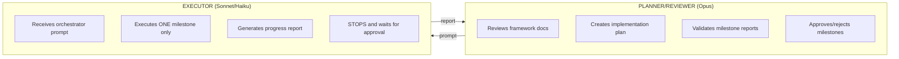

# CLAUDE.md

This file provides guidance to Claude Code (claude.ai/code) when working with code in this repository.

## Repository Purpose

This repository contains **workflow frameworks and tools for AI agents** to execute complex tasks with human oversight. It defines milestone-based orchestration patterns using a two-agent architecture (Planner/Reviewer + Executor).

**In plain terms:** You describe what you want to build. The Planner (Claude Opus) breaks it into milestones. The Executor (Claude Sonnet/Haiku) implements one milestone at a time. You review and approve between milestones. Repeat until done.

## Understanding Milestones

A **milestone** is a logical, reviewable chunk of work that produces a specific deliverable:

| Aspect | Details |
|--------|---------|
| **Scope** | 2-5 related tasks that fit in one agent response (typically 5-15 min work) |
| **Output** | Runnable code + tests. Not partially implemented features |
| **Review** | Human checks: requirements met, no bugs, architecture sound? |
| **Decision** | Approve → Continue to next milestone, or Request changes → Executor fixes |

**Example milestones for "Build user auth":**
- **M1:** Database schema + User model + migrations
- **M2:** Password hashing + registration endpoint + tests
- **M3:** Login endpoint + JWT token generation + auth middleware
- **M4:** Password reset + session management + error handling

Don't create milestones that can fail partway through—each one should be independently deliverable.

## Scoped Rules

- `AGENTS.md` files apply to their directory subtree (nearest wins)
- For `orchestrator-auto/` code changes, follow `orchestrator-auto/AGENTS.md`

## Development Commands

### orchestrator-auto (Python CLI)
```bash
# Setup (from orchestrator-auto/)
conda env create -f environment.yml && conda activate orchestrator-auto
pip install -e .                    # Production install
pip install -e ".[dev]"             # With dev dependencies (pytest)
pip install -e ".[telegram]"        # With Telegram support (httpx)

# Environment (choose one auth method)
export ANTHROPIC_API_KEY="your-key"            # API key (pay-as-you-go)
# OR
export CLAUDE_CODE_OAUTH_TOKEN="token"         # Claude Pro/Max subscription (recommended)

# CLI usage
orchestrator start -f "Feature description"                    # New workflow
orchestrator start -f "Feature" -pm sonnet -em haiku          # Custom models
orchestrator start -f "Feature" --plan docs/plan.md           # Import plan
orchestrator start -f "Feature" --auto-commit                 # Auto-commit on completion
orchestrator start -f "Feature" --telegram                    # With Telegram notifications
orchestrator start --queue plan1.md plan2.md                   # Queue mode (sequential)
orchestrator start --queue                                     # Resume existing queue
orchestrator list                                              # List sessions (current project)
orchestrator list --all-projects                               # List all sessions
orchestrator resume <session-id>                               # Resume session
orchestrator resume <session-id> --force                       # Force resume orphaned session
orchestrator reset <session-id>                                # Reset orphaned session
orchestrator respond <session-id> "Answer"                     # Answer blocker
orchestrator status <session-id>                               # Session details
orchestrator export <session-id> -o report.md                  # Export to markdown
orchestrator chat                                              # Direct chat mode (no orchestration)
orchestrator check                                             # Health check (auth, deps, API)
orchestrator telegram test                                     # Test Telegram config
orchestrator telegram listen                                   # Listen for blocker replies

# Testing (from orchestrator-auto/)
pytest tests/ -v                                               # All tests
pytest tests/test_engine.py -v                                 # Single file
pytest tests/test_engine.py::TestClass::test_method -v         # Single test
pytest -k "planner" -v                                         # Filter by name
pytest tests/test_integration.py::TestQueueWorkflows -v        # Queue integration tests
```

### Figma Screenshot Fetcher
```bash
pip install requests
export FIGMA_ACCESS_TOKEN="your-token"
python workflows/CLAUDE_fetch_figma_screenshot.py --url "https://figma.com/..." --output out.png
```

## Git Commit Rules

- Never add Co-authored-by attribution
- Never mention Claude/AI in commits
- Author is already in git metadata

## Architecture Overview



### Agent Communication Flow

1. **Planner Phase**: You describe the task → Planner reads docs → Creates 3-5 milestones → Sends to Executor
2. **Executor Phase**: Executor reads milestone → Writes code/tests → Generates progress report → Sends `[PROGRESS_REPORT]` tag
3. **Review Phase**: You review report → Approve or request changes
4. **Approval**:
   - ✅ **Approved** → Executor proceeds to next milestone
   - ❌ **Changes needed** → Executor fixes and regenerates report
   - 🛑 **ABORT** → Workflow stops, you fix the issue

Each milestone is **atomic**: the executor doesn't move forward until you explicitly approve.

### orchestrator-auto Modules
| Module | Purpose |
|--------|---------|
| `cli.py` | Click CLI interface (`orchestrator` command) |
| `engine.py` | Core orchestration loop & state machine |
| `agents.py` | Claude Agent SDK wrappers (PlannerAgent, ExecutorAgent) |
| `state.py` | Session state enum/transitions (StateMachine) |
| `parser.py` | Response tag parsing (`[PLAN_READY]`, `[BLOCKED]`, etc.) |
| `db.py` | SQLite persistence (`~/.claude_orchestrator/db.sqlite`) |
| `telegram.py` | Telegram notifications & blocker replies |
| `config.py` | Model aliases, config file loading |
| `auth.py` | Authentication source detection (API key, OAuth, cloud) |
| `git.py` | Auto-commit with smart commit messages |
| `commit_ai.py` | AI-generated commit messages (Conventional Commits) |
| `chat.py` | Direct chat mode implementation |
| `recovery.py` | Context recovery for compressed sessions |
| `prompts.py` | System prompts for planner/executor |
| `secrets.py` | Secrets detection for blocking sensitive diffs |
| `exceptions.py` | Custom exceptions (OrchestratorError, AgentError) |
| `output.py` | StreamingIndicator for activity display |
| `input_handler.py` | Multi-line paste support for CLI input |
| `logging_config.py` | Session-scoped file logging setup |
| `convert.py` | Format conversion utilities |
| `explore.py` | Codebase exploration helpers |
| `todo.py` / `todo_parser.py` | Todo tracking and parsing |
| `playwright_test.py` | Playwright MCP verification tool |
| `io/input_provider.py` | Pluggable input abstraction (CLI, TUI, Telegram) |
| `io/events.py` | IO event types |
| `controllers/queue_controller.py` | Queue mode orchestration logic |
| `controllers/watch_controller.py` | Watch mode directory polling logic |
| `validation/` | Input validation pipeline (security, api, performance, base) |

### TUI Widgets (`tui/widgets/`)
| Widget | Purpose |
|--------|---------|
| `stats_panel.py` | Session & file-level stats (tokens, cost, elapsed time, per-agent breakdown) |
| `watch_panel.py` | Watch mode file list organized by category (pending/ongoing/done/paused/failed) with per-file elapsed time |
| `compact_sidebar.py` | Condensed sidebar combining watch, status, queue, milestones, and file list with elapsed time |
| `compact_milestone_row.py` | Single-row milestone progress icons (`✓1 ✓2 ▶3 ○4`) |

### TUI Time Tracking
- **Session elapsed** (`StatsPanel._session_elapsed_seconds`): cumulative working time across all files, never resets
- **File elapsed** (`StatsPanel._elapsed_seconds`): per-file time, resets on each new file via `reset()`
- **Watch file elapsed**: completed/failed files display their elapsed time below the filename in both `WatchPanel` and `CompactSidebar`
- Both counters increment together in `tick_elapsed()`, called every 1s by `set_interval`

## Workflow Selection Guide

**Choose a workflow based on your task type:**

| Task Type | Best Workflow | Why |
|-----------|---------------|-----|
| Build backend API (Django/DRF) | `workflows/CLAUDE_django_engineer_workflow.md` | Handles models, serializers, tests, migrations automatically |
| Build frontend components | `workflows/CLAUDE_frontend_refactor_v2.md` | Screenshot-driven feedback loop for visual validation |
| Implement from Figma design | `workflows/CLAUDE_orchestrator_figma_visual_qa.md` | Compares implementation to design specs pixel-by-pixel |
| Generic feature (any language/framework) | `workflows/CLAUDE_orchestrator.md` | Most flexible, works for anything |
| Autonomous UI testing | `workflows/CLAUDE_visual_qa_workflow.md` | Runs tests without human intervention, escalates failures |
| Web3/Solana development | `workflows/CLAUDE_orch_solana.md` | Includes security checklist and contract validation |

**When in doubt, start with `workflows/CLAUDE_orchestrator.md`—it's the most flexible.**

## Key Workflows

| Workflow | Purpose |
|----------|---------|
| `workflows/CLAUDE_orchestrator.md` | Core milestone framework with gated approval |
| `workflows/CLAUDE_visual_qa_workflow.md` | Autonomous visual QA with Browser MCP |
| `workflows/CLAUDE_frontend_refactor_v2.md` | Iterative UI refactoring with screenshot feedback |
| `workflows/CLAUDE_django_engineer_workflow.md` | Django/DRF backend with pytest + mocks |
| `workflows/CLAUDE_orchestrator_figma_visual_qa.md` | Figma-to-browser visual comparison |
| `workflows/CLAUDE_orch_solana.md` | Solana/Web3 development with security checklist |

### Milestone Patterns
| Type | Pattern |
|------|---------|
| API Endpoints | Schemas → Service Logic → Controller + Routes → Validation |
| New Features | Models → Services → API/UI → Tests + Integration |
| Bug Fixes | Failing Test → Fix → Verify + Regression |
| Frontend | Components + Types → Logic → Styling → Tests |

## Response Tags (Agent Communication)

**Planner tags:** `[PLAN_READY]`, `[MILESTONE_APPROVED]`, `[CHANGES_REQUESTED]`, `[HUMAN_INPUT_NEEDED]`

**Executor tags:** `[PROGRESS_REPORT]`, `[CLARIFICATION_NEEDED]`, `[BLOCKED]`

## Configuration Priority

CLI flags > env vars > repo config (`<repo>/.claude_orchestrator/config.yaml`) > global config (`~/.claude_orchestrator/config.yaml`) > defaults

**Model aliases:** `opus` → claude-opus-4-6, `sonnet` → claude-sonnet-4-6, `haiku` → claude-haiku-4-5-20251001

## Best Practices & Patterns

### Planning Milestones

**Good milestones:**
- Can be implemented in 5-15 minutes of executor time
- Have clear, measurable deliverables (code runs, tests pass)
- Build on prior milestones logically
- Don't have hidden dependencies

**Bad milestones:**
- Too large (implementation might miss edge cases)
- Incomplete (partial features that don't work)
- Vague deliverables ("build auth" vs "password hashing + registration endpoint")

### Writing Clear Feature Descriptions

When starting a workflow with `orchestrator start -f "..."`, be specific:

```
❌ Bad: "Build a user system"
✅ Good: "Add user registration with email validation and password hashing"

❌ Bad: "Fix the bugs"
✅ Good: "Fix login returning 500 on invalid credentials, add unit tests"

❌ Bad: "Improve the API"
✅ Good: "Add pagination to /products endpoint, return 50 items per page with next/prev links"
```

### Session Management

- **Resume interrupted work**: `orchestrator resume <session-id>`
- **Check session status**: `orchestrator status <session-id>` (shows current milestone and state)
- **Force resume orphaned session**: `orchestrator resume <session-id> --force` (if session crashed)
- **List all your sessions**: `orchestrator list` or `orchestrator list --all-projects`
- **Export completed workflow**: `orchestrator export <session-id> -o report.md`

### Debugging Issues

| Problem | Solution |
|---------|----------|
| Executor keeps making same mistake | Request specific changes in your approval message (be very explicit) |
| Milestone took too long | Next milestone was probably too large—split it up in your feedback |
| Lost conversation history | Use `orchestrator status <session-id>` to see checkpoint and context |
| Want to stop and start over | Use `orchestrator reset <session-id>`, then start a new workflow |

### Integration Patterns

**Auto-commit on completion:**
```bash
orchestrator start -f "Feature" --auto-commit
```
Automatically commits when all milestones are approved.

**Queue multiple workflows:**
```bash
orchestrator start --queue plan1.md plan2.md plan3.md
```
Runs workflows sequentially. Resume with `orchestrator start --queue`.

**Telegram notifications (requires setup):**
```bash
orchestrator start -f "Feature" --telegram
# Get notified when milestones complete, answer blockers via Telegram
```

## Code Style (orchestrator-auto)
- Python 3.10+, type hints for public APIs
- Use `pathlib.Path` for file paths
- f-strings for string interpolation
- Imports: stdlib → third-party → local
- DB access via `db.get_connection()` context manager with parameterized SQL
- Subprocess: always use `subprocess.run(..., capture_output=True, text=True, timeout=N)`
- Error handling: raise `ValueError` for invalid state/input; catch specific exceptions at boundaries
- Tests use `pytest` fixtures (`tmp_path` for temp files), mock all API/network calls

## Directory Map

| Directory | Purpose |
|-----------|---------|
| `orchestrator-auto/` | Primary Python CLI package (SQLite-backed orchestrator for implementation) |
| `planner-auto/` | Plan generation CLI with GPT review loop (feeds plans to orchestrator-auto) |
| `workflows/` | Workflow documentation and templates (`CLAUDE_*.md`, `CLAUDE_*.py`) |
| `docs/` | Generated plan documents and session artifacts |
| `backend-system/` | Backend documentation templates (API patterns, auth, DB) |
| `design-system/` | Frontend design documentation templates |
| `claude/` | Portable Claude Code configuration (copy to `~/.claude`) |
| `opencode/` | Claude Code read-only plugins |

### planner-auto (`planner-auto/`)
Automated plan generation with cross-model review (Claude planner + GPT reviewer). See `planner-auto/AGENTS.md` for developer context and `planner-auto/README.md` for CLI reference.

```bash
cd planner-auto/
pip install -e ".[dev]"
planner-auto start --project my-feature
planner-auto review <session-id>           # Run GPT review loop
planner-auto inspect reviews <session-id>  # Debug session state
pytest tests/ -v                           # 368 tests
```

### Claude Code Configuration (`claude/`)
Install with `cp -r claude ~/.claude` or `ln -s $(pwd)/claude ~/.claude`:
- `settings.json` - Hooks, permissions, status line configuration
- `hooks/` - Pre-tool-use analyzers (auto-approve 50+ read-only patterns, block dangerous commands)
- `agents/` - Custom agent definitions (e.g., `backend-architect`)
- `GLOBAL_GIT_RULES.md` - Git instructions loaded into all sessions

### Backend Documentation Templates (`backend-system/`)
Use these templates when documenting backend projects:
- `BACKEND_MAP.md` - Domain-to-file navigation (reduces codebase searching)
- `API_PATTERNS.md` - Response formats, pagination conventions
- `AUTH_PATTERNS.md` - JWT claims, permissions, RBAC patterns
- `DATABASE_PATTERNS.md` - Models, migrations, naming conventions
- `SERVICE_PATTERNS.md` - Business logic, dependency injection
- `ERROR_CODES.md` - Error handling conventions
