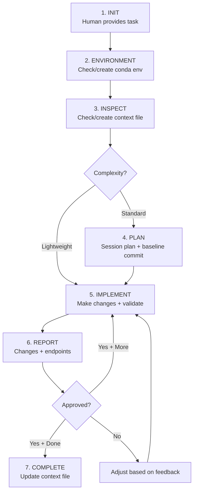
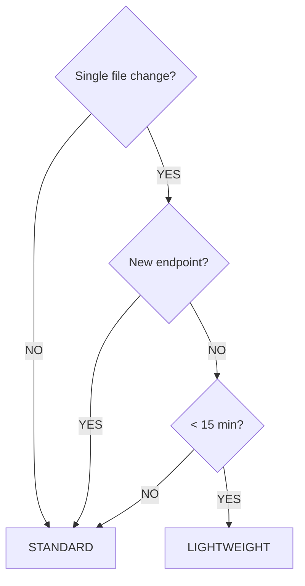

# Django Engineer Workflow (v2)

---

## Overview

A **Django backend development workflow** with strict conventions for environment management, testing, API documentation, and code style.

**Core principles:**
- Conda environment per project
- pytest with mocks (no database in tests)
- OpenAPI/Swagger documentation everywhere
- Black-formatted code

---

## Quick Reference



**KEY FILES:**
- `CLAUDE_django_context.md` - Long-term codebase knowledge (persists)
- `CLAUDE_session_plan.md` - Task-specific state + recovery (temporary)

**GIT CHECKPOINTS (Standard mode):**
- Baseline commit before starting
- Checkpoint commit after each human approval
- Session plan tracks commit hashes for rollback

---

## How to Start a Session

### Option 1: New Task (Copy-Paste This)

```
Read CLAUDE_django_engineer_workflow.md and follow the workflow.

Task: [describe what you need - API endpoint, model, feature]
```

### Option 2: With Existing Context

If you've used this workflow before and have a context file:

```
Read CLAUDE_django_engineer_workflow.md and CLAUDE_django_context.md.

Task: [describe task]
```

### Option 3: Resume Crashed Session

If session crashed and you have a session plan:

```
[paste recovery prompt from CLAUDE_session_plan.md]
```

### Option 4: After Context Compression

If agent seems to have forgotten workflow details:

```
Context seems compressed. Re-read the workflow:
- CLAUDE_django_engineer_workflow.md
- CLAUDE_session_plan.md (if exists)
- CLAUDE_django_context.md (if exists)

Continue from where we left off.
```

**Signs of compression:**
- Agent stops using structured report formats
- Agent forgets to run validation (black, pytest)
- Agent doesn't mention git checkpoints
- Responses become more generic

---

## Task Complexity Tiers

Determine which mode to use based on task complexity:

### Lightweight Mode (No Session Plan)

Skip session plan creation. Just implement and report.

**Criteria (ANY of these):**
- Single file change
- Simple bug fix
- Estimated < 15 minutes
- No clarification needed

**Examples:**
- "Fix the typo in the serializer help_text"
- "Add missing help_text to one field"
- "Update the endpoint description"
- "Fix the test mock"

**Workflow:**
```
Human: task
Agent: implement → validate → report → done
```

### Standard Mode (With Session Plan)

Create session plan to persist details and enable recovery.

**Criteria (ANY of these):**
- Multi-file changes
- New endpoint/feature
- Multiple iterations expected
- Clarification questions needed
- Complex business logic

**Examples:**
- "Create a new CRUD endpoint for orders"
- "Add authentication to the product endpoints"
- "Refactor the user serializers"
- "Implement a new service layer"

**Workflow:**
```
Human: task
Agent: clarify → create session plan → implement → validate → report → iterate → complete
```

### Complexity Decision Tree



---

## Question vs Implementation Mode

**CRITICAL:** Detect whether human is asking a question or requesting implementation.

### Question Mode (Read-Only)

**Triggers:** Human message contains question words or investigation requests:
- "How does...", "What is...", "Where is...", "Why does..."
- "Can you explain...", "Show me...", "Find..."
- "Is there...", "Does this...", "Which..."
- "Investigate...", "Check...", "Look at..."

**Agent behavior:**
- Investigate codebase (read files, grep, search)
- Answer the question with findings
- **DO NOT** edit any files
- **DO NOT** implement anything
- **DO NOT** create new files

**Response format:**
```markdown
## Investigation: [Topic]

### Question
[Restate the human's question]

### Findings
[What you discovered from investigating]

### Files Reviewed
- `path/to/file.py` - [what you found]
- `path/to/other.py` - [what you found]

### Answer
[Clear answer to the question]

### Related
[Optional: related files or concepts they might want to know about]
```

### Implementation Mode

**Triggers:** Human message contains action requests:
- "Create...", "Add...", "Build...", "Implement..."
- "Fix...", "Update...", "Change...", "Modify..."
- "Refactor...", "Delete...", "Remove..."

**Agent behavior:**
- Follow full workflow (environment, implement, validate, report)
- Edit/create files as needed
- Run tests and formatters

### Examples

| Human Says | Mode | Agent Does |
|------------|------|------------|
| "How does authentication work in this project?" | Question | Investigates, explains, NO edits |
| "Where are the product serializers?" | Question | Finds files, shows locations, NO edits |
| "Why is this test failing?" | Question | Investigates, explains cause, NO edits |
| "What endpoints do we have for users?" | Question | Lists endpoints, NO edits |
| "Create a new endpoint for orders" | Implementation | Full workflow with edits |
| "Fix the failing test in test_views.py" | Implementation | Edits code to fix |
| "Add validation to the product serializer" | Implementation | Edits serializer |

### Ambiguous Cases

If unclear, **ask for clarification**:

```
Agent: "I found the issue with the test. Would you like me to:
1. Just explain what's wrong (no changes)
2. Fix it for you (will edit files)

Which do you prefer?"
```

---

## Context File: `CLAUDE_django_context.md`

A living document that captures the Django project understanding. Located in project root.

### Purpose
- Eliminates redundant codebase exploration across sessions
- Provides consistent reference for apps, models, patterns
- Tracks drift when codebase evolves

### Agent Startup Check

**AGENT checks for `CLAUDE_django_context.md`:**

- **IF EXISTS**: "I found the Django context file. Ready to work. Want me to verify it's still accurate, or proceed?"
- **IF NOT EXISTS**: Proceeds to Codebase Inspection to create it

### Structure Template

```markdown
# Django Project Context

## Last Updated
[Date] - [Brief note on what changed]

## 1. Project Overview
- **Project name**: [name]
- **Django version**: [x.x]
- **DRF version**: [x.x]
- **Python version**: [x.x]
- **Database**: [PostgreSQL, SQLite, etc.]

## 2. Apps Structure
| App | Purpose | Key Models |
|-----|---------|------------|
| core | Shared utilities, base models | BaseModel |
| users | Authentication, profiles | User, Profile |
| products | Product catalog | Product, Category |
| orders | Order management | Order, OrderItem |

## 3. URL Structure
| Prefix | App | Router/Include |
|--------|-----|----------------|
| /api/v1/users/ | users | UserViewSet |
| /api/v1/products/ | products | ProductViewSet |
| /api/v1/orders/ | orders | OrderViewSet |
| /api/docs/ | - | Swagger UI |
| /api/schema/ | - | OpenAPI schema |

## 4. Key Models & Relationships
```
User (auth)
  └── Profile (1:1)
  └── Order (1:N)
        └── OrderItem (1:N)
              └── Product (N:1)

Product
  └── Category (N:1)
```

## 5. Authentication
- **Method**: [JWT, Session, Token]
- **Package**: [rest_framework_simplejwt, etc.]
- **Protected routes**: [List or pattern]

## 6. Key Patterns
- All models inherit from `core.models.BaseModel`
- All serializers use `help_text` for OpenAPI
- All views use `@extend_schema` decorators
- Tests use mocks, no database

## 7. Service Layer
Location: `[path/to/services]`

| Service | Path | Purpose |
|---------|------|---------|
| email_service | services/email.py | Send notifications |
| payment_service | services/payment.py | Stripe integration |

## 8. Custom Permissions
| Permission | Location | Usage |
|------------|----------|-------|
| IsOwner | core/permissions.py | Object-level ownership |
| IsAdminOrReadOnly | core/permissions.py | Admin write, public read |

## 9. Known Issues / Tech Debt
- [List any known issues]
- [Areas needing refactor]
- [Missing tests]
```

### Lifecycle

1. **Created**: When agent first inspects codebase
2. **Updated**: After each session completion with new patterns/changes
3. **Verified**: Agent can re-verify accuracy on request

---

## Session Plan File

### Purpose

For Standard mode tasks, agent creates a session plan to persist critical details:

- Task scope and objectives
- Files to be modified
- Decisions made during clarification
- Progress tracking
- Git checkpoint references

### File Location

```
CLAUDE_session_plan.md
```

### Template

```markdown
# Session Plan: [Feature/Task Name]

## Created
[Date] - [Brief description]

## Objective
[What we're building - 1-2 sentences]

## Target Files
| File | Action | Status |
|------|--------|--------|
| `myapp/serializers/order.py` | Create | ⏳ Pending |
| `myapp/views/order.py` | Create | ⏳ Pending |
| `myapp/urls.py` | Modify | ⏳ Pending |
| `tests/test_order_views.py` | Create | ⏳ Pending |

## Decisions Made
Clarifications and choices made during the session:

1. **Endpoint structure**: Using ViewSet with standard CRUD
2. **Permissions**: IsAuthenticated for all, IsOwner for update/delete
3. **Pagination**: Using default page size of 20

## Tasks
- [ ] Create Order serializer with help_text
- [ ] Create OrderViewSet with extend_schema
- [ ] Add URL routes
- [ ] Write unit tests with mocks
- [ ] Run validation (black, pytest, schema)

## Progress Log
| Time | Update |
|------|--------|
| Start | Created plan, reviewed existing patterns |
| ... | Completed serializer |
| ... | ViewSet done, moving to tests |

## Git Checkpoints
| Checkpoint | Commit Hash | Description | Rollback |
|------------|-------------|-------------|----------|
| Baseline | `abc1234` | Before starting task | `git reset --hard abc1234` |
| Task 1 | `def5678` | Serializer complete | `git reset --hard def5678` |

**Latest stable**: `def5678`

## Validation Status
- [ ] `black .` passes
- [ ] `pytest` passes
- [ ] `python manage.py spectacular --validate` passes

---

## Recovery Prompt
**Copy and paste this into a new session if this session crashes:**

> Continue Django development session for [Feature Name].
>
> Read the session plan: `CLAUDE_session_plan.md`
> Read the Django context: `CLAUDE_django_context.md`
>
> Current status:
> - Last completed: [Task X - description]
> - Next task: [Task Y - description]
> - Blocking issues: [None / description]
>
> Continue from where we left off.

**Last updated**: [Timestamp or step description]
```

### Lifecycle

1. **Created**: At start of Standard mode task
2. **Updated**: As work progresses (mark tasks complete, add checkpoints)
3. **Archived/Deleted**: When task is complete

---

## Environment Management

### Conda Environment Convention

**Environment name = Project directory name**

```bash
# If project is in /projects/myapp/
# Conda env name should be: myapp
```

### Agent Startup Sequence

Before any Python/Django command, agent MUST:

```bash
# 1. Get project name from current directory
PROJECT_NAME=$(basename $(pwd))

# 2. Check if conda env exists
conda env list | grep "^${PROJECT_NAME} "

# 3a. If NOT exists - Create and activate
conda create -n ${PROJECT_NAME} python=3.11 -y
conda activate ${PROJECT_NAME}
pip install -r requirements.txt

# 3b. If exists - Activate
conda activate ${PROJECT_NAME}
```

### Environment Verification

After activation, verify:
```bash
# Confirm correct environment
echo $CONDA_DEFAULT_ENV  # Should match project name

# Confirm Django is available
python -c "import django; print(django.VERSION)"
```

### Report Format

```markdown
## Environment
- Project: myapp
- Conda env: myapp (activated)
- Python: 3.11.x
- Django: 4.2.x
```

---

## Testing Conventions

### Framework: pytest

Always use pytest, never Django's test runner directly.

```bash
# Run all tests
pytest

# Run specific test file
pytest tests/test_views.py

# Run with coverage
pytest --cov=myapp --cov-report=term-missing

# Run with verbose output
pytest -v
```

### Test Structure

```
project/
├── myapp/
│   ├── models.py
│   ├── views.py
│   └── serializers.py
└── tests/
    ├── __init__.py
    ├── conftest.py          # Shared fixtures
    ├── test_models.py
    ├── test_views.py
    └── test_serializers.py
```

### Unit Tests Only (No Database)

**CRITICAL:** Tests must NOT require database setup.

```python
# GOOD - Using mocks
from unittest.mock import Mock, patch

@patch('myapp.views.User.objects.get')
def test_get_user(mock_get):
    mock_get.return_value = Mock(id=1, username='testuser')
    # ... test logic

# BAD - Requires database
def test_get_user(self):
    user = User.objects.create(username='testuser')  # Don't do this
```

### Mock Patterns

```python
# Mock a model queryset
@patch('myapp.views.Product.objects')
def test_list_products(mock_objects):
    mock_objects.filter.return_value = [
        Mock(id=1, name='Product 1'),
        Mock(id=2, name='Product 2'),
    ]

# Mock a serializer
@patch('myapp.views.ProductSerializer')
def test_create_product(mock_serializer):
    mock_serializer.return_value.is_valid.return_value = True
    mock_serializer.return_value.data = {'id': 1, 'name': 'New Product'}

# Mock external service
@patch('myapp.services.external_api.fetch_data')
def test_sync_data(mock_fetch):
    mock_fetch.return_value = {'status': 'success'}
```

### Test Naming Convention

```python
# Pattern: test_<action>_<condition>_<expected_result>

def test_create_user_with_valid_data_returns_201():
    pass

def test_create_user_with_missing_email_returns_400():
    pass

def test_get_user_when_not_found_returns_404():
    pass
```

---

## API Conventions

### Serializer Convention

**Every serializer field MUST have OpenAPI description via help_text:**

```python
from rest_framework import serializers

class UserSerializer(serializers.Serializer):
    """
    Serializer for User resource.
    Used for user registration and profile updates.
    """
    id = serializers.IntegerField(
        read_only=True,
        help_text="Unique identifier for the user"
    )
    username = serializers.CharField(
        max_length=150,
        help_text="Unique username for login (3-150 characters)"
    )
    email = serializers.EmailField(
        help_text="User's email address for notifications"
    )
    is_active = serializers.BooleanField(
        default=True,
        help_text="Whether the user account is active"
    )
```

### ModelSerializer Convention

```python
class ProductSerializer(serializers.ModelSerializer):
    """
    Serializer for Product model.
    Handles product CRUD operations.
    """
    class Meta:
        model = Product
        fields = ['id', 'name', 'price', 'stock', 'created_at']
        read_only_fields = ['id', 'created_at']
        extra_kwargs = {
            'name': {'help_text': 'Product display name (max 200 chars)'},
            'price': {'help_text': 'Price in USD (decimal, 2 places)'},
            'stock': {'help_text': 'Available inventory count'},
        }
```

### View Convention

**Every view/viewset MUST have OpenAPI decorators:**

```python
from rest_framework import viewsets
from drf_spectacular.utils import extend_schema, extend_schema_view

@extend_schema_view(
    list=extend_schema(
        summary="List all products",
        description="Returns a paginated list of all active products.",
        tags=["Products"],
    ),
    retrieve=extend_schema(
        summary="Get product details",
        description="Returns detailed information for a specific product.",
        tags=["Products"],
    ),
    create=extend_schema(
        summary="Create a new product",
        description="Creates a new product. Requires admin permissions.",
        tags=["Products"],
    ),
)
class ProductViewSet(viewsets.ModelViewSet):
    """ViewSet for Product CRUD operations."""
    queryset = Product.objects.filter(is_active=True)
    serializer_class = ProductSerializer
```

### URL Convention

```python
# urls.py
from django.urls import path, include
from rest_framework.routers import DefaultRouter
from drf_spectacular.views import SpectacularAPIView, SpectacularSwaggerView

router = DefaultRouter()
router.register(r'products', ProductViewSet, basename='product')

urlpatterns = [
    path('api/v1/', include(router.urls)),
    path('api/schema/', SpectacularAPIView.as_view(), name='schema'),
    path('api/docs/', SpectacularSwaggerView.as_view(url_name='schema'), name='swagger-ui'),
]
```

---

## Code Style

### Black Formatter

**All Python code MUST be formatted with Black.**

```bash
# Format single file
black myapp/views.py

# Format entire project
black .

# Check without modifying
black --check .
```

### Agent Behavior

Before committing or reporting changes:
```bash
# Always format
black .

# Then run tests
pytest
```

---

## Workflow Phases

### Phase 1: Initialization

**HUMAN provides:**
- Task description
- Any specific requirements or constraints

**AGENT does:**
1. Check/activate conda environment
2. Check for `CLAUDE_django_context.md`
3. Determine task complexity (Lightweight vs Standard)

### Phase 2: Codebase Inspection (if no context file)

Agent systematically explores the codebase:

**Inspection Checklist:**
- [ ] **Project structure**: Find apps, check installed apps
- [ ] **Models**: Catalog models and relationships
- [ ] **Serializers**: Find existing patterns, help_text usage
- [ ] **Views**: Find existing patterns, extend_schema usage
- [ ] **URLs**: Map API structure
- [ ] **Tests**: Find test patterns, mock usage
- [ ] **Services**: Find service layer if exists

After inspection, agent creates `CLAUDE_django_context.md`.

### Phase 3: Ready Signal

**AGENT reports:**
> "I've analyzed the codebase and created/updated `CLAUDE_django_context.md`
>
> Summary:
> - Django: 4.2.x with DRF 3.14.x
> - Apps: users, products, orders
> - Pattern: ViewSets with extend_schema decorators
>
> Ready for your task. What would you like me to do?"

### Phase 3.5: Session Plan Creation (Standard Mode Only)

**AGENT creates `CLAUDE_session_plan.md` with:**
- Objective
- Target files
- Decisions made during clarification
- Task checklist
- Git baseline commit

> "I've created a session plan at `CLAUDE_session_plan.md` to track this task. Starting implementation..."

**Skip if**: Task is lightweight.

### Phase 4: Implementation

Agent implements following conventions:
1. Model (if needed)
2. Serializer (with help_text)
3. View (with OpenAPI decorators)
4. URL routing
5. Tests (with mocks)

### Phase 5: Validation

Before reporting, agent runs:
```bash
# Format code
black .

# Run tests
pytest

# Check OpenAPI schema generates
python manage.py spectacular --validate
```

### Phase 6: Report

```markdown
## Changes Made

### Files Created:
- `myapp/serializers/product.py` - ProductSerializer with OpenAPI descriptions
- `myapp/views/product.py` - ProductViewSet with extend_schema decorators
- `tests/test_product_views.py` - Unit tests with mocks

### Files Modified:
- `myapp/urls.py` - Added product routes

### Validation:
- Black formatted ✓
- All tests pass (12 passed) ✓
- OpenAPI schema valid ✓

### API Endpoints Added:
| Method | Path | Description |
|--------|------|-------------|
| GET | /api/v1/products/ | List all products |
| POST | /api/v1/products/ | Create product |
| GET | /api/v1/products/{id}/ | Get product detail |
| PUT | /api/v1/products/{id}/ | Update product |
| DELETE | /api/v1/products/{id}/ | Delete product |
```

### Phase 7: Completion

**Step 1: UPDATE CONTEXT FILE**

Update `CLAUDE_django_context.md` with:
- New models/serializers/views created
- New URL routes
- New patterns introduced

**Step 2: CLEANUP (Standard mode)**
- Archive or delete `CLAUDE_session_plan.md`

**Step 3: SUMMARY**
> "Session complete.
>
> Validation: ✓ Black, ✓ Tests, ✓ Schema
>
> Files modified: [list]
>
> Context file updated. Ready for next session!"

---

## Agent Behaviors

### When to Ask Clarifying Questions

Ask before implementing when:

| Scenario | Example Question |
|----------|------------------|
| **Ambiguous scope** | "Should this endpoint be public or require authentication?" |
| **Missing requirements** | "What fields should the serializer include?" |
| **Multiple valid approaches** | "Should I use a ViewSet or separate APIViews?" |
| **Breaking change potential** | "This will change the response format. Is that okay?" |
| **Pattern conflict** | "Existing code uses function views, but ViewSets are more common. Which pattern?" |

### Change Reporting Format

After each implementation:

```markdown
## Changes Made

### Files Modified:
- `myapp/views/product.py` - Added filtering by category
- `myapp/serializers/product.py` - Added category_id field

### Files Created:
- `tests/test_product_filters.py` - Tests for new filter

### Key Changes:
1. **Filter**: Added `category` query parameter to list endpoint
2. **Serializer**: Added `category_id` with help_text
3. **Tests**: 4 new tests for filter scenarios

### Validation:
- Black formatted ✓
- Tests: 16 passed ✓
- Schema valid ✓

**Ready for your review.**
```

---

## Git Checkpoint Strategy

### Commit Message Format

**Always one-liner, max 1 sentence. Use conventional commit prefix:**

```
api(<type>): <short description>
```

| Type | When |
|------|------|
| `api(feat)` | New endpoint or feature |
| `api(fix)` | Bug fix |
| `api(test)` | Adding/updating tests |
| `api(refactor)` | Code restructure |
| `api(docs)` | Documentation/OpenAPI updates |
| `api(chore)` | Cleanup, baseline commits |

### When to Commit

| Trigger | Commit Message Example |
|---------|------------------------|
| **Before starting** | `api(chore): baseline before order endpoints` |
| **After human approval** | `api(feat): add order CRUD endpoints` |
| **Before risky change** | `api(chore): checkpoint before auth refactor` |
| **End of session** | `api(feat): complete order management feature` |

### Commit Workflow

**1. Baseline (before starting)**
```bash
git add -A
git commit -m "api(chore): baseline before order endpoints"
```
Record hash in session plan.

**2. After Each Approval**
```bash
git add -A
git commit -m "api(feat): add order serializer with OpenAPI docs"
```
Update session plan with new checkpoint.

**3. Quick Reference Commands**
```bash
# View recent checkpoints
git log --oneline -10

# Rollback to specific checkpoint
git reset --hard <commit-hash>

# View what changed since checkpoint
git diff <commit-hash>
```

### Skip Commits When

- Lightweight mode (simple single-file changes)
- Human explicitly says "don't commit"
- Project doesn't use git
- Changes are experimental (commit only after approval)

---

## Drift Detection

When human requests drift check (or periodically):

```markdown
## Drift Check Report

### Verified Accurate:
- ✅ App structure unchanged
- ✅ URL patterns match documentation
- ✅ Test patterns consistent

### Drift Detected:
- ⚠️ New app: `notifications` (not in context file)
- ⚠️ New model: `AuditLog` in core app
- ⚠️ Service added: `notification_service.py`

### Recommendations:
1. Add notifications app to context
2. Document AuditLog model
3. Update service layer section

Shall I update CLAUDE_django_context.md with these changes?
```

---

## Error Communication

### For Test Failures

Human provides:
1. Paste pytest output
2. Note which test(s) failed

### For Import/Runtime Errors

Human provides:
1. Paste error message and traceback
2. Note which command triggered it

### For Schema Validation Errors

Human provides:
1. Paste `spectacular --validate` output
2. Note which serializer/view is problematic

### Example Error Report

```
Tests failing after your last change:

FAILED tests/test_views.py::test_create_order_returns_201
  - AssertionError: Expected 201, got 400

Pytest output:
[paste full output]

Triggered when: Running pytest
```

---

## Quick Reference: OpenAPI Checklist

Before completing any API task:

- [ ] Serializer has docstring
- [ ] All serializer fields have help_text
- [ ] View/ViewSet has docstring
- [ ] All actions have @extend_schema decorator
- [ ] Schema includes: summary, description, tags
- [ ] `python manage.py spectacular --validate` passes
