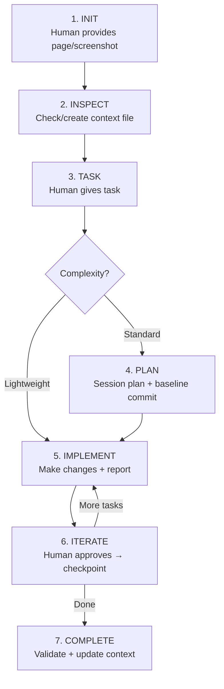
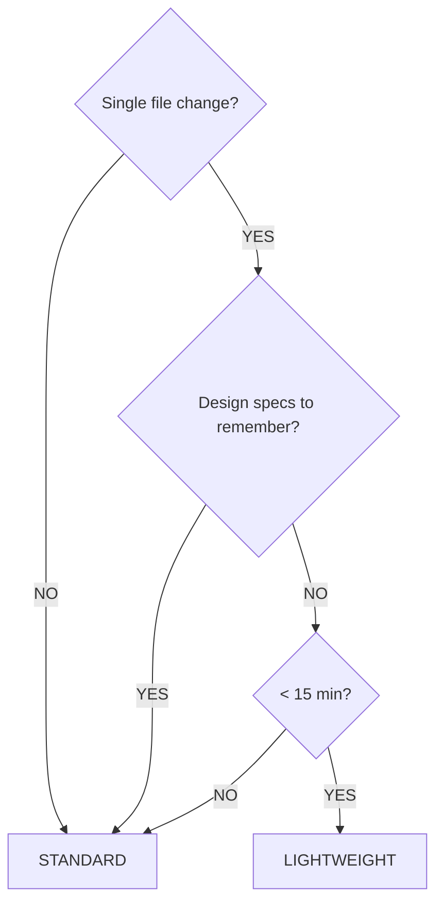
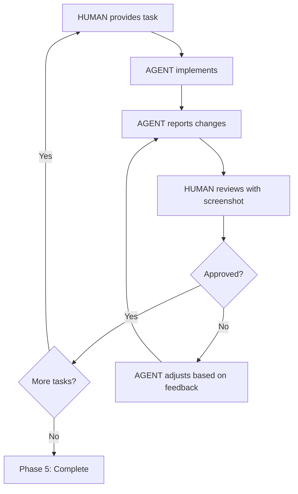

# Frontend Refactor/Build Workflow (v3)

---

## Overview

An **iterative agent-human workflow** for refactoring existing UI or building new frontend components. Designed for React + Tailwind but adaptable to any framework with CSS styling.

**Key Feature**: Human provides screenshots for feedback, agent implements and iterates until approved.

---

## IMPORTANT: Context Retention Instructions

> **FOR CLAUDE AGENT**: This section contains critical instructions for maintaining workflow knowledge.

### On Context Compression (`/compact`)

When context is compacted or compressed, **you MUST**:

1. **Immediately re-read this file**: `CLAUDE_frontend_refactor_workflow.md`
2. **Re-read the session plan** (if exists): `CLAUDE_session_plan.md`
3. **Re-read the frontend context** (if exists): `CLAUDE_frontend_context.md`

### Critical Information to Retain

Even after compression, always remember:

| Item | Value |
|------|-------|
| **Workflow file** | `CLAUDE_frontend_refactor_workflow.md` |
| **Context file** | `CLAUDE_frontend_context.md` |
| **Session plan** | `CLAUDE_session_plan.md` |
| **Modes** | Lightweight (simple) vs Standard (complex) |
| **Git checkpoints** | Baseline → approval-based commits |

### Self-Check After Compression

If you notice any of these, re-read the workflow file immediately:
- You forgot about session plan or recovery prompts
- You're not following the structured change report format
- You forgot to ask for screenshots after changes
- You forgot about git checkpoint strategy
- You're not using the visual comparison table format
- You forgot Lightweight vs Standard mode decision

### Compression Recovery Command

If context was compressed and you lost workflow details, tell the user:

```
"Context was compressed. Let me re-read the workflow files to continue properly."
```

Then read: `CLAUDE_frontend_refactor_workflow.md`, `CLAUDE_session_plan.md`, `CLAUDE_frontend_context.md`

---

## 📋 Cheat Sheet (Copy-Paste Prompts)

### New Session
```
Read CLAUDE_frontend_refactor_workflow.md and follow the workflow.

[paste screenshot]

I want to [describe task]
```

### With Existing Context
```
Read CLAUDE_frontend_refactor_workflow.md and CLAUDE_frontend_context.md.

[paste screenshot]

Task: [describe task]
```

### Resume Crashed Session
```
[paste recovery prompt from CLAUDE_session_plan.md]
```

### After Context Compression
```
Context seems compressed. Re-read the workflow:
- CLAUDE_frontend_refactor_workflow.md
- CLAUDE_session_plan.md (if exists)
- CLAUDE_frontend_context.md (if exists)

Continue from where we left off.
```

### Visual Comparison (Design vs Current)
```
Read CLAUDE_frontend_refactor_workflow.md.

Check [page/route]. Design looks like this [image-1], currently looks like this [image-2].
Identify differences and fix.
```

### With Figma MCP Link
```
Read CLAUDE_frontend_refactor_workflow.md.

Check [page]. Current state [image-1], Figma design [image-2].
Figma link for exact specs: [figma-url]

Identify differences and fix.
```

### With Theme Reference
```
Read CLAUDE_frontend_refactor_workflow.md.

Check [page]. Current [image-1], template [image-2].
Theme files in [/path/to/theme/]

Identify differences and fix using theme tokens.
```

### Site-Wide Color/Token Audit
```
Read CLAUDE_frontend_refactor_workflow.md.

Colors seem off across the whole site.
Check Figma via MCP: [figma-url]

Compare with theme config and fix.
```

### Multi-Screen Batch (Next Screen)
```
[Screen X] approved. Next, do [Screen Y].

Current [image-1], design [image-2].
```

---

## How to Start a Session (Detailed)

### Option 1: Kickstart Prompt (Copy-Paste This)

```
Read CLAUDE_frontend_refactor_workflow.md and follow the workflow.

[paste screenshot of current UI]

I want to [describe task - e.g., "refactor this settings page to match our design system"]
```

### Option 2: With Existing Context

If you've used this workflow before and have a context file:

```
Read CLAUDE_frontend_refactor_workflow.md and CLAUDE_frontend_context.md.

[paste screenshot]

Task: [describe what you want to do]
```

### Option 3: Resume Crashed Session

If session crashed and you have a session plan:

```
[paste recovery prompt from CLAUDE_session_plan.md]
```

The recovery prompt already contains instructions to read the necessary files.

### Option 4: After Context Compression

If you notice the agent seems to have forgotten workflow details (giving generic responses, not following the structured formats, missing steps):

```
Context seems compressed. Re-read the workflow:
- CLAUDE_frontend_refactor_workflow.md
- CLAUDE_session_plan.md (if exists)
- CLAUDE_frontend_context.md (if exists)

Continue from where we left off.
```

**Signs of compression:**
- Agent stops using structured comparison tables
- Agent forgets to update session plan/recovery prompt
- Agent doesn't mention git checkpoints
- Responses become more generic, less workflow-specific

---

## Quick Reference



**KEY FILES:**
- `CLAUDE_frontend_context.md` - Long-term codebase knowledge (persists)
- `CLAUDE_session_plan.md` - Task-specific state + recovery (temporary)

**GIT CHECKPOINTS (Standard mode):**
- Baseline commit before starting
- Checkpoint commit after each human approval
- Session plan tracks commit hashes for rollback

---

## Task Complexity Tiers

Determine which mode to use based on task complexity:

### Lightweight Mode (No Session Plan)

Skip session plan creation. Just implement and report.

**Criteria (ANY of these):**
- Single file change
- No design specs to preserve
- Estimated < 15 minutes
- Simple, unambiguous task
- No clarification needed

**Examples:**
- "Change the button color to blue"
- "Increase padding on this card to 24px"
- "Fix the typo in the header"
- "Hide this element on mobile"

**Workflow:**
```
Human: task + screenshot
Agent: implement → report changes → done
```

### Standard Mode (With Session Plan)

Create session plan to persist details and enable recovery.

**Criteria (ANY of these):**
- Multi-file changes
- Design specs from Figma/theme to preserve
- Multiple iterations expected
- Clarification questions needed
- Task spans multiple components
- Complex responsive/state changes

**Examples:**
- "Refactor this page to match the new Figma design"
- "Rebuild the navigation with new layout"
- "Update all cards to use the new design system"
- "Implement this new component from scratch"

**Workflow:**
```
Human: task + screenshot
Agent: clarify → create session plan → implement → report → iterate → complete
```

### Complexity Decision Tree



---

## Participants

| Role | Responsibilities |
|------|------------------|
| **Human** | Provides starting point, tasks, visual feedback via screenshots, approves work |
| **Agent** | Inspects codebase, maintains context file, implements changes, asks clarifying questions |

---

## Context File: `CLAUDE_frontend_context.md`

A living document that captures the frontend architecture understanding. Located in project root or `docs/` directory.

### Purpose
- Eliminates redundant codebase exploration across sessions
- Provides consistent reference for styling patterns, components, routes
- Tracks drift when codebase evolves

### Structure Template

```markdown
# Frontend Context

## Last Updated
[Date] - [Brief note on what changed]

## 1. Styling Framework
- **Framework**: [React, Vue, Svelte, etc.]
- **CSS Approach**: [Tailwind, CSS Modules, Styled Components, etc.]
- **Design System**: [Custom, Shadcn, MUI, Chakra, etc.]
- **Theme Config**: [Path to tailwind.config.js, theme file, etc.]

### Key Style Patterns
- Colors: [How colors are applied - e.g., `bg-primary`, `text-gray-900`]
- Spacing: [Spacing conventions - e.g., `p-4`, `gap-6`, `space-y-4`]
- Typography: [Text sizing patterns - e.g., `text-sm`, `font-medium`]
- Responsive: [Breakpoint patterns - e.g., `md:`, `lg:`]

### Custom Utilities
- [List any custom Tailwind classes or CSS utilities]

## 2. Routing
- **Router**: [Next.js App Router, React Router, etc.]
- **Route Structure**: [File-based, config-based]
- **Auth Routes**: [Protected route pattern]

### Key Routes
| Route | File | Purpose |
|-------|------|---------|
| `/` | `app/page.tsx` | Landing page |
| `/dashboard` | `app/dashboard/page.tsx` | Main dashboard |
| ... | ... | ... |

## 3. Shared Components
Location: `[path/to/components]`

| Component | Path | Usage |
|-----------|------|-------|
| Button | `components/ui/Button.tsx` | Primary action buttons |
| Card | `components/ui/Card.tsx` | Content containers |
| Modal | `components/ui/Modal.tsx` | Dialog overlays |
| ... | ... | ... |

### Component Patterns
- [How props are structured]
- [Composition patterns used]
- [Variant/size conventions]

## 4. Page-Specific Components
| Page | Components | Location |
|------|------------|----------|
| Dashboard | `DashboardHeader`, `StatsCards` | `components/dashboard/` |
| Settings | `SettingsForm`, `ProfileCard` | `components/settings/` |
| ... | ... | ... |

## 5. Service Layer
Location: `[path/to/services]`

| Service | Path | Purpose |
|---------|------|---------|
| api | `services/api.ts` | Base API client |
| authService | `services/auth.ts` | Authentication |
| userService | `services/user.ts` | User operations |
| ... | ... | ... |

### Data Fetching Pattern
- [React Query, SWR, fetch, axios]
- [How queries are structured]
- [Cache/invalidation patterns]

## 6. State Management
- **Global State**: [Redux, Zustand, Context, etc.]
- **Server State**: [React Query, SWR, etc.]
- **Form State**: [React Hook Form, Formik, etc.]

## 7. Key Conventions
- [File naming: kebab-case, PascalCase]
- [Export patterns: named vs default]
- [Import aliases: @/components, ~/utils]
- [Any project-specific patterns]

## 8. Known Issues / Tech Debt
- [List any known styling inconsistencies]
- [Areas needing refactor]
- [Deprecated patterns still in use]
```

---

## Session Plan File

### Purpose

Before starting implementation, agent creates a session plan file to persist critical details that may be lost during context compression:

- Task scope and objectives
- Design specs extracted from Figma/theme
- Files to be modified
- Decisions made during clarification
- Progress tracking

### File Location

```
docs/sessions/PLAN_{feature}_{date}.md
```

Or simpler, in project root:
```
CLAUDE_session_plan.md
```

### Template

```markdown
# Session Plan: [Feature/Task Name]

## Created
[Date] - [Brief description]

## Objective
[What we're building/refactoring - 1-2 sentences]

## Target Files
| File | Action | Status |
|------|--------|--------|
| `src/components/Header.tsx` | Modify | ⏳ Pending |
| `src/components/ui/Card.tsx` | Modify | ⏳ Pending |
| `src/components/NewComponent.tsx` | Create | ⏳ Pending |

## Design Specs
From Figma/theme - persisted here so context compression doesn't lose them:

```
Colors:
- Primary: #EB5017
- Background: #FFFFFF
- Text: #1A1A1A

Spacing:
- Card padding: 16px
- Gap between items: 12px
- Section margin: 24px

Typography:
- Heading: 24px/32px, font-weight: 600
- Body: 16px/24px, font-weight: 400
```

## Decisions Made
Clarifications and choices made during the session:

1. **Layout approach**: Using CSS Grid instead of Flexbox for the card grid
2. **Responsive breakpoint**: Switch to single column at 768px
3. **Animation**: No animation on card hover (keep it simple)

## Tasks
- [ ] Update Header component with new spacing
- [ ] Refactor Card to use design tokens
- [ ] Add responsive grid layout
- [ ] Fix button alignment issue

## Progress Log
| Time | Update |
|------|--------|
| Start | Created plan, reviewed Figma specs |
| ... | Completed Header modifications |
| ... | Card refactor done, moving to grid |

## Git Checkpoints
Commits made during this session for easy rollback:

| Checkpoint | Commit Hash | Description | Rollback |
|------------|-------------|-------------|----------|
| Baseline | `abc1234` | Before starting task | `git reset --hard abc1234` |
| Task 1 | `def5678` | Header spacing updated | `git reset --hard def5678` |
| Task 2 | `ghi9012` | Card refactored | `git reset --hard ghi9012` |

**Latest stable**: `ghi9012` (after Task 2 approval)

## Files Modified This Session
| File | Action | In Commit |
|------|--------|-----------|
| `src/components/Header.tsx` | Modified | `def5678` |
| `src/components/ui/Card.tsx` | Modified | `ghi9012` |
| `src/components/NewComponent.tsx` | Created | `ghi9012` |

## Pre-Completion Validation
Before marking task complete, verify:

- [ ] App runs without errors (`npm run dev` / `npm start`)
- [ ] No console errors in browser
- [ ] Changed components render correctly
- [ ] No TypeScript/lint errors (if applicable)
- [ ] Responsive behavior works (if changed)

## Notes
[Any blockers, questions for next session, or context for future reference]

---

## 🔄 Recovery Prompt
**Copy and paste this into a new session if this session crashes:**

> Continue frontend refactor session for [Feature Name].
>
> Read the session plan: `CLAUDE_session_plan.md`
> Read the frontend context: `CLAUDE_frontend_context.md`
>
> Current status:
> - Last completed: [Task X - description]
> - Next task: [Task Y - description]
> - Blocking issues: [None / description]
>
> Design specs are in the session plan. Continue from where we left off.

**Last updated**: [Timestamp or step description]
```

### Recovery Prompt Guidelines

The recovery prompt section should be updated:

| When | Update To |
|------|-----------|
| After clarification | Include decisions made, ready to start Task 1 |
| After each task completion | Update "Last completed" and "Next task" |
| When blocked | Add blocking issue description |
| After receiving feedback | Note feedback and what needs adjustment |

### Example Recovery Prompt Evolution

**After clarification:**
```markdown
## 🔄 Recovery Prompt
> Continue frontend refactor session for Settings Page Redesign.
>
> Read: `CLAUDE_session_plan.md` and `CLAUDE_frontend_context.md`
>
> Current status:
> - Last completed: Clarification phase
> - Next task: Update Header component spacing
> - Blocking issues: None
>
> Decisions: Using CSS Grid, breakpoint at 768px, no hover animations.

**Last updated**: After clarification
```

**After completing 2 tasks:**
```markdown
## 🔄 Recovery Prompt
> Continue frontend refactor session for Settings Page Redesign.
>
> Read: `CLAUDE_session_plan.md` and `CLAUDE_frontend_context.md`
>
> Current status:
> - Last completed: Task 2 - Refactored Card to use design tokens
> - Next task: Task 3 - Add responsive grid layout
> - Blocking issues: None
>
> Human approved Tasks 1-2. Ready to continue.

**Last updated**: After Task 2 approval
```

**When blocked:**
```markdown
## 🔄 Recovery Prompt
> Continue frontend refactor session for Settings Page Redesign.
>
> Read: `CLAUDE_session_plan.md` and `CLAUDE_frontend_context.md`
>
> Current status:
> - Last completed: Task 2 - Refactored Card
> - Next task: Task 3 - Fix grid layout (IN PROGRESS)
> - Blocking issues: Human reported grid not rendering on mobile,
>   see latest screenshot in chat or request new one
>
> Need to debug mobile grid issue before continuing.

**Last updated**: During Task 3 - debugging
```

### Lifecycle

1. **Created**: At start of task, after clarification phase
2. **Updated**: As work progresses (mark tasks complete, add notes)
3. **Archived/Deleted**: When task is complete
   - Option A: Delete file (ephemeral)
   - Option B: Move to `docs/sessions/archive/` (keep history)

---

## Git Checkpoint Strategy

For standard mode, use git commits as rollback checkpoints.

### Commit Message Format

**Always one-liner, max 1 sentence. Use conventional commit prefix:**

```
ui(<type>): <short description>
```

| Type | When |
|------|------|
| `ui(feat)` | New component or feature |
| `ui(fix)` | Bug fix, visual correction |
| `ui(refactor)` | Code restructure, no visual change |
| `ui(style)` | Spacing, colors, typography adjustments |
| `ui(chore)` | Cleanup, removing unused code |

### When to Commit

| Trigger | Commit Message Example |
|---------|------------------------|
| **Before starting** | `ui(chore): baseline before settings page refactor` |
| **After human approval** | `ui(style): update header spacing and colors` |
| **Before risky change** | `ui(chore): checkpoint before grid layout change` |
| **End of session** | `ui(refactor): complete settings page migration to tailwind` |

### Commit Workflow

**1. Baseline (before starting)**
```bash
git add -A
git commit -m "ui(chore): baseline before settings page refactor"
```
Record hash in session plan.

**2. After Each Approval**
```bash
git add -A
git commit -m "ui(style): update header spacing to match design"
```
Update session plan with new checkpoint.

**3. Quick Reference Commands**
```bash
# View recent checkpoints
git log --oneline -10

# Rollback to specific checkpoint
git reset --hard <commit-hash>

# Rollback but keep changes as unstaged
git reset --soft <commit-hash>

# View what changed since checkpoint
git diff <commit-hash>
```

### Agent Checkpoint Behavior

After human approves a change:

```bash
git add -A
git commit -m "ui(style): update header spacing to 32px"
```

> "✓ Checkpoint created: `def5678`. Updated session plan with rollback info. Proceeding to next task..."

### Recovery Prompt Update

When creating checkpoints, also update the recovery prompt:

```markdown
## 🔄 Recovery Prompt
> ...
> Current status:
> - Last completed: Task 2 - Card refactored
> - Last checkpoint: `ghi9012` (after Task 2 approval)
> - Rollback if needed: `git reset --hard ghi9012`
```

### Rollback Scenarios

| Scenario | Command | Result |
|----------|---------|--------|
| Undo current work, back to last approval | `git reset --hard <last-checkpoint>` | Discards all changes since checkpoint |
| Start over completely | `git reset --hard <baseline>` | Back to before session started |
| See what changed | `git diff <checkpoint>` | Shows all changes since that point |
| Undo but keep changes for review | `git reset --soft <checkpoint>` | Changes become unstaged |

### Skip Commits When

- Lightweight mode (simple single-file changes)
- Human explicitly says "don't commit"
- Project doesn't use git
- Changes are experimental/exploratory (commit only after approval)

### When to Create

Refer to **Task Complexity Tiers** at the top of this document.

| Mode | Create Plan? | Examples |
|------|--------------|----------|
| Lightweight | No | Button color, padding fix, typo |
| Standard | Yes | Multi-file refactor, Figma implementation, new components |

---

## Multi-Screen Implementation

When implementing multiple screens in one session (e.g., "make these 5 pages match the design"):

### Session Plan Strategy: Replace, Don't Append

```
Screen 1: Create session plan → implement → approve → checkpoint
Screen 2: REPLACE plan content → implement → approve → checkpoint
Screen 3: REPLACE plan content → implement → approve → checkpoint
...
```

**Why replace?**
- Keeps plan focused on current screen
- Prevents context bloat
- Git checkpoints preserve history of completed screens

### Agent Behavior

After human approves Screen N and says "next, do Screen M":

1. **Checkpoint** current screen: `git commit -m "ui(feat): complete [Screen N] implementation"`
2. **Update context file** with patterns learned from Screen N
3. **Replace session plan** with Screen M details (new objective, files, specs)
4. **Keep recovery prompt** pointing to latest checkpoint
5. Proceed with Screen M implementation

### Session Plan Between Screens

```markdown
## Session Plan: [Screen M] ← Updated title

## Completed This Session
- ✅ Screen N (checkpoint: `abc123`)
- ✅ Screen O (checkpoint: `def456`)
- ⏳ Screen M (current)

## Objective
[Screen M specific objective]

## Target Files
[Screen M specific files]
...
```

### When to Split Into New Session

| Scenario | Action |
|----------|--------|
| Same day, similar screens | Continue in one session |
| Screen needs 3+ feedback iterations | Consider new session after |
| Context compression detected | New session with recovery prompt |
| Screens span multiple days | New session per day |
| Switching to unrelated codebase area | New session |

### Quick Reference

```
Human: "Homepage done, next do the dashboard"

Agent:
1. git commit -m "ui(feat): complete homepage implementation"
2. Update CLAUDE_frontend_context.md (patterns learned)
3. Replace session plan objective/files for dashboard
4. "✓ Homepage checkpointed. Session plan updated for Dashboard. Ready to proceed."
```

---

## Workflow Phases

### Phase 1: Initialization

**HUMAN provides:**
- Page URL or route (e.g., "/dashboard/settings")
- Screenshot of current state
- Brief context ("This is the settings page, I want to refactor...")

**AGENT checks for `CLAUDE_frontend_context.md`:**

- **IF EXISTS**: "I found the frontend context file. Ready to work. Want me to verify it's still accurate, or proceed?"
- **IF NOT EXISTS**: Proceeds to Phase 2: Codebase Inspection

### Phase 2: Codebase Inspection

Agent systematically explores the codebase:

**Inspection Checklist:**

- [ ] **1. Styling Framework**
  - Check package.json for CSS framework (tailwind, styled-components)
  - Find config files (tailwind.config.js, postcss.config.js)
  - Identify design system (shadcn, radix, custom)
  - Note theme/color conventions

- [ ] **2. Routes Setup**
  - Identify router (Next.js App/Pages, React Router, etc.)
  - Map route structure
  - Note layout/middleware patterns
  - Identify auth/protected routes

- [ ] **3. Shared Components**
  - Find components directory
  - Catalog UI primitives (Button, Input, Card, etc.)
  - Note prop patterns and variants
  - Identify composition patterns

- [ ] **4. Page-Specific Components**
  - Find components related to target page
  - Understand component hierarchy
  - Note any page-specific utilities

- [ ] **5. Service Layer**
  - Find services/api directory
  - Identify data fetching patterns
  - Note any hooks for data (useQuery, useSWR)
  - Understand cache/state patterns

- [ ] **6. Page Purpose**
  - Read target page code
  - Understand user flows
  - Note interactions and state

After inspection, agent creates or updates `CLAUDE_frontend_context.md`.

### Phase 3: Ready Signal

**AGENT reports:**
> "I've analyzed the codebase and created/updated `CLAUDE_frontend_context.md`
>
> Summary:
> - Framework: React + Next.js App Router
> - Styling: Tailwind CSS with Shadcn components
> - Target page: /dashboard/settings
> - Key components: SettingsForm, ProfileCard, NotificationPrefs
>
> Ready for your task. What would you like me to do?"

### Phase 3.5: Session Plan Creation (Standard Mode Only)

**AGENT creates `CLAUDE_session_plan.md` with:**
- Objective
- Target files
- Design specs (from Figma MCP / theme / human input)
- Decisions made during clarification
- Task checklist
- Git baseline commit

> "I've created a session plan at `CLAUDE_session_plan.md` to track this task. Starting implementation..."

**Skip if**: Task is lightweight (single small change, no design specs).

### Phase 4: Task Loop



**AGENT steps during implementation:**
1. Understand task (or ask clarifying questions)
2. Plan approach
3. Implement changes
4. Report what was changed

**HUMAN review includes:**
- Take screenshot of updated UI
- Provide feedback: "Looks good!" OR "The spacing is off, see screenshot"

### Phase 5: Completion

**Step 1: VALIDATE**
- [ ] App runs (`npm run dev` works)
- [ ] No console errors
- [ ] Changed components render correctly
- [ ] Lint passes (`npm run lint`)

**Step 2: UPDATE CONTEXT FILE**

Update `CLAUDE_frontend_context.md` with:
- New components created
- Modified components
- New patterns introduced
- Any tech debt addressed or created

**Step 3: CLEANUP (Standard mode)**
- Archive or delete `CLAUDE_session_plan.md`
- Or keep for reference if human prefers

**Step 4: SUMMARY**
> "Session complete.
>
> Validation: ✓ App runs, ✓ No errors, ✓ Lint passes
>
> Files modified:
> - src/components/SettingsForm.tsx (modified)
> - src/components/ui/ResponsiveGrid.tsx (created)
>
> Context file updated. Ready for next session!"

### Lightweight Mode Completion

Simplified - no session plan cleanup:

> "Done. Changed `src/components/Button.tsx` - updated color to blue.
>
> ✓ App still runs, ✓ No errors
>
> Anything else?"

---

## Agent Behaviors

### When to Ask Clarifying Questions

Ask before implementing when:

| Scenario | Example Question |
|----------|------------------|
| **Ambiguous layout** | "Should the two-column layout be 50/50 or 60/40 split?" |
| **Missing design spec** | "What should happen on tablet (768px)? Same as mobile or desktop?" |
| **Multiple valid approaches** | "I can extract this as a shared component or keep it page-specific. Which do you prefer?" |
| **Breaking change potential** | "This change will affect 3 other pages. Should I update them too or scope to this page?" |
| **Pattern conflict** | "The existing code uses inline styles here, but rest of app uses Tailwind. Should I convert?" |

### Change Reporting Format

After each implementation:

```markdown
## Changes Made

### Files Modified:
- `app/dashboard/settings/page.tsx` - Updated layout to responsive grid
- `components/settings/SettingsForm.tsx` - Added sticky footer, responsive columns

### Files Created:
- `components/ui/ResponsiveGrid.tsx` - New reusable grid component

### Key Changes:
1. **Layout**: Changed from single column to `md:grid-cols-2` responsive grid
2. **Sticky Button**: Added `sticky bottom-0 bg-white py-4` to save button container
3. **Spacing**: Adjusted gap from `gap-4` to `gap-6` for better visual separation

### Testing Notes:
- Tested at 375px (mobile), 768px (tablet), 1024px (desktop)
- Save button stays visible while scrolling

**Ready for your review. Please share a screenshot of the current state.**
```

---

## Screenshot Workflow

### Human Provides Screenshots

Screenshots are pasted directly in chat for fast iteration. Essential for:
- **Starting point**: Shows current state before changes
- **Feedback**: Shows actual result vs expected
- **State capture**: Empty, loading, filled, error states

### Viewport Guidelines

Focus on **web portrait viewport** with general dimensions:

| Viewport | Width | Use Case |
|----------|-------|----------|
| Mobile | 375-390px | Primary mobile view |
| Tablet | 768px | Tablet portrait |
| Desktop | 1280px | Standard desktop |

Agent should ask which viewport to target if unclear.

### State Capture

When debugging, human should provide screenshots of relevant states:

```
□ Empty state (no data)
□ Loading state (skeleton/spinner)
□ Filled state (with data)
□ Error state (API failure, validation)
□ Edge cases (long text, missing images)
```

### Agent Screenshot Analysis

When receiving a screenshot, agent should:

1. **Compare to code** - Does the visual match the implemented styles?
2. **Identify discrepancies** - Spacing, colors, alignment issues
3. **Note specifics** - "The gap between cards appears to be ~24px but code shows `gap-4` (16px)"
4. **Suggest fixes** - "I'll update to `gap-6` to match the visual"

---

## Visual Comparison (Design vs Implementation)

When human provides both a design image and current implementation screenshot:

### Agent Response Format

```markdown
## Visual Comparison: [Page/Component Name]

### Images Received:
- **Design**: [image-1] - Target design
- **Current**: [image-2] - Current implementation

### Differences Identified:

| # | Element | Design | Current | Fix Required |
|---|---------|--------|---------|--------------|
| 1 | Header height | 72px | ~80px | Reduce height |
| 2 | Card padding | 16px | 24px | Change p-6 to p-4 |
| 3 | Button color | #EB5017 | #EF4444 | Update to correct hex |
| 4 | Gap between cards | 12px | 16px | Change gap-4 to gap-3 |
| 5 | Font weight | 600 | 400 | Add font-semibold |

### Summary:
- **Critical issues**: 2 (header height, button color)
- **Minor issues**: 3 (padding, gap, font weight)
- **Estimated complexity**: [Lightweight / Standard]

### Proposed Approach:
1. Fix header height in `Header.tsx`
2. Update button color in theme or component
3. Adjust card padding and gap
4. Add font weight to heading

Shall I proceed with these fixes?
```

### Combine with Theme/Design Reference

If human also provides theme location or Figma link:

1. **Read theme files first** - Understand available tokens (colors, spacing, typography)
2. **Then compare images** - Map differences to theme tokens
3. **Propose fixes using tokens** - Not hardcoded values

```
Human: "The /register page is off. Current state [image-1], template [image-2].
        Theme files in /themes/"

Agent: [Reads /themes/ first]

       "I've reviewed the theme files in /themes/. Available tokens:
        - Colors: --primary, --secondary, --bg-surface
        - Spacing: --space-sm (8px), --space-md (16px), --space-lg (24px)

        Now comparing template to current implementation:

        | Element | Template | Current | Fix |
        |---------|----------|---------|-----|
        | Card bg | --bg-surface | #f5f5f5 | Use var(--bg-surface) |
        | Button | --primary | #3b82f6 | Use var(--primary) |
        | Padding | --space-lg | 16px | Use var(--space-lg) |

        I'll fix these using your theme tokens for consistency."
```

### Combine with Figma MCP for Precise Specs

When human provides images AND a Figma link:

1. **Compare images first** - Identify visual differences (layout, spacing, alignment)
2. **Use Figma MCP** - Fetch exact measurements for precision
3. **Report with exact values** - Not "looks bigger" but "should be 24px, currently ~32px"

```
Human: "The site layout doesn't look the same as Figma. See /dashboard -
        currently [image-1], on Figma [image-2].
        Figma link: https://figma.com/design/ABC123/app?node-id=1-100"

Agent: [Compares images visually]
       [Uses MCP to fetch exact specs from Figma link]

       "I've compared the images and fetched exact specs from Figma:

        ## Layout Comparison: Dashboard

        | Element | Figma (exact) | Current (approx) | Difference |
        |---------|---------------|------------------|------------|
        | Sidebar width | 240px | ~280px | 40px too wide |
        | Content padding | 24px | ~16px | Needs more padding |
        | Card gap | 16px | ~24px | Gap too large |
        | Header height | 64px | ~72px | 8px too tall |

        The main issues:
        1. Sidebar is wider than spec (likely w-72 instead of w-60)
        2. Content area using p-4 instead of p-6
        3. Cards using gap-6 instead of gap-4

        These are structural layout changes across multiple components.
        Using Standard mode.

        Shall I proceed with fixes?"
```

**Why both images AND MCP link?**
- Images: Quick visual context, see the problem
- MCP: Exact pixel values for precise fixes

### Complexity Assessment

After visual comparison, agent determines mode:

| Differences Found | Mode |
|-------------------|------|
| 1-2 simple CSS changes | Lightweight |
| 3+ changes OR multi-file | Standard |
| Structural/layout changes | Standard |

### Example Flow

```
Human: "Check /dashboard page. On the planned design it looks like this
       [image-1], currently it looks like this [image-2].
       Identify the issue and fix."

Agent: [Analyzes both images]

       "I've compared the design to the current implementation:

       | Issue | Design | Current | Fix |
       |-------|--------|---------|-----|
       | Header bg | #1A1A1A | #000000 | Update bg-black to bg-[#1A1A1A] |
       | Card radius | 12px | 8px | Change rounded-lg to rounded-xl |
       | Spacing | 24px | 16px | Change gap-4 to gap-6 |

       This is 3 changes across 2 files. I'll use Standard mode.
       Creating session plan and baseline commit...

       Shall I proceed?"
```

---

## Design Token Audit (Site-Wide Issues)

When human reports site-wide issues (colors, typography, spacing off across the whole site):

### Trigger Phrases
- "Colors are off across the whole site"
- "Typography doesn't match Figma anywhere"
- "Spacing is inconsistent everywhere"

### Agent Approach

**This is NOT a visual comparison.** It's a config-level audit:

1. **Fetch design tokens from Figma** (via MCP)
2. **Read current theme/config files**
3. **Compare at token level** (not screenshot level)
4. **Fix in config** (one change affects whole site)

### Agent Response Format

```markdown
## Design Token Audit: Colors

### Source: Figma (via MCP)
Fetched from: [Figma link]

| Token Name | Figma Value | Description |
|------------|-------------|-------------|
| Primary | #EB5017 | Main brand color |
| Secondary | #1A1A1A | Text/headings |
| Background | #FFFFFF | Page background |
| Surface | #F5F5F5 | Card backgrounds |
| Error | #DC2626 | Error states |

### Current: tailwind.config.js
| Token Name | Current Value | Match? |
|------------|---------------|--------|
| primary | #EF4444 | ❌ Wrong |
| secondary | #1A1A1A | ✅ |
| background | #FFFFFF | ✅ |
| surface | #F3F4F6 | ⚠️ Close but not exact |
| error | #DC2626 | ✅ |

### Discrepancies Found:
1. **Primary**: Figma #EB5017 vs Config #EF4444
2. **Surface**: Figma #F5F5F5 vs Config #F3F4F6

### Fix Location:
- `tailwind.config.js` → theme.extend.colors
- Or `src/styles/theme.ts` if using CSS variables

### Impact:
Fixing these 2 values will update colors **site-wide**.

Shall I update the theme config?
```

### Example Flow

```
Human: "The colors seem off across the whole site. Check this dashboard
        screen in Figma via MCP: https://figma.com/design/ABC123/app?node-id=1-100"

Agent: [Uses MCP to fetch Figma design tokens]

       "I've fetched the color specs from Figma and compared with your
        tailwind.config.js:

        | Color | Figma | Current | Status |
        |-------|-------|---------|--------|
        | Primary | #EB5017 | #EF4444 | ❌ Mismatch |
        | Surface | #F5F5F5 | #F3F4F6 | ⚠️ Close |
        | Text | #1A1A1A | #1A1A1A | ✅ Match |

        The primary color is wrong - you're using Tailwind's red-500 instead
        of the brand orange.

        I'll update tailwind.config.js to fix this site-wide. This is a
        single-file change but affects the whole site, so I'll use Standard
        mode with a baseline commit.

        Proceed?"
```

### Complexity: Always Standard Mode

Even though it might be a single file change, site-wide theme changes are **always Standard mode**:
- High impact (affects entire site)
- Needs baseline commit for easy rollback
- Human should verify multiple pages after fix

---

## Design Reference

### Option 1: Figma MCP Link

Human can provide Figma file/node for agent to fetch design specs:

```
Figma: https://figma.com/design/FILE_KEY/name?node-id=1-234
```

Agent uses MCP to extract:
- Exact colors (hex values)
- Spacing values (padding, gaps, margins)
- Typography (font size, weight, line height)
- Border radius, shadows

### Option 2: Theme File Location

Human points to existing theme/config in repo:

```
Theme config: src/styles/theme.ts
Tailwind config: tailwind.config.js
Design tokens: src/tokens/colors.ts
```

Agent reads these files to understand available design tokens and use them consistently.

### Option 3: Inline Specs

Human provides specific values in chat:

```
Primary color: #EB5017
Card padding: 16px
Border radius: 8px
Font: Inter, 16px/24px
```

---

## Interaction & Behavior Feedback

Screenshots are static. For motion/interaction issues, human describes behavior:

### Quick Descriptors

| Aspect | Options |
|--------|---------|
| **Response** | instant / slight delay / laggy / no response |
| **Animation** | smooth / choppy / missing / too fast / too slow |
| **Scroll** | smooth / janky / stuck / bouncing |
| **Transition** | clean / abrupt / glitchy |

### Example Feedback

```
"The button tap feels laggy - about 300ms delay before navigation.
The list scroll is smooth but the pull-to-refresh animation is choppy."
```

### When to Screen Record

For complex interaction issues, human can share a short screen recording:
- Gesture sequences (swipe, pinch, drag)
- Multi-step animations
- Race conditions / flickering
- Timing-sensitive bugs

---

## Error Communication

When code breaks, human provides:

### For Crashes / Red Screens
1. Screenshot of error screen
2. Paste error message and stack trace from console

### For Silent Failures
1. Screenshot showing unexpected state
2. Describe expected vs actual behavior
3. Console warnings/errors if any

### For Build Errors
1. Paste terminal output
2. Note which command failed (`npm run dev`, `npm run build`, etc.)

### Example Error Report

```
Error after your last change:

TypeError: Cannot read property 'map' of undefined
  at UserList (src/components/UserList.tsx:23)
  at Dashboard (src/app/dashboard/page.tsx:45)

Triggered when: Loading the dashboard page
Expected: User list should render
Actual: White screen with error

[screenshot of error boundary / blank screen]
```

---

## Component Isolation

When debugging specific components, strategies to isolate:

### Strategy 1: Zoom Screenshot
Human screenshots just the problematic component/section, not full page.

```
"Here's just the header component - the spacing between the logo and nav is wrong"
[cropped screenshot of header only]
```

### Strategy 2: Dev Route
Create a temporary route for testing components in isolation:

```tsx
// app/dev/page.tsx (gitignored or removed before PR)
export default function DevPage() {
  return (
    <div className="p-8">
      <h1>Component Testing</h1>
      <ProblematicComponent testProp="value" />
    </div>
  );
}
```

### Strategy 3: Storybook (if available)
If project has Storybook, human can screenshot component stories:

```
"Here's the Button component from Storybook in its 'loading' variant"
[screenshot from Storybook]
```

### Strategy 4: Describe Focus Area
Human describes which part of screenshot to focus on:

```
"Full page screenshot attached. Focus on the card component in the middle -
the shadow looks different from the Figma design."
```

---

## Drift Detection

When human requests drift check (or periodically):

```markdown
## Drift Check Report

### Verified Accurate:
- ✅ Routing structure unchanged
- ✅ Shared components still at documented locations
- ✅ Tailwind config unchanged

### Drift Detected:
- ⚠️ New component: `components/ui/Tooltip.tsx` (not in context file)
- ⚠️ Route added: `/dashboard/analytics`
- ⚠️ Service renamed: `userService.ts` → `user.service.ts`

### Recommendations:
1. Add Tooltip to shared components section
2. Document analytics route
3. Update service layer paths

Shall I update CLAUDE_frontend_context.md with these changes?
```

---

## Framework Adaptations

| Framework | Key Files to Inspect |
|-----------|---------------------|
| React + Tailwind | `tailwind.config.js`, `globals.css`, `className` patterns |
| Vue + Tailwind | `tailwind.config.js`, `<style>` blocks, scoped styles |
| React + CSS Modules | `*.module.css`, `className={styles.xxx}` |
| React + Styled Components | `styled.xxx`, theme provider, prop-based styles |
| Svelte | `<style>` blocks, `:global()`, CSS custom properties |

*See `CLAUDE_frontend_refactor_workflow_ref.md` for detailed inspection checklists.*

