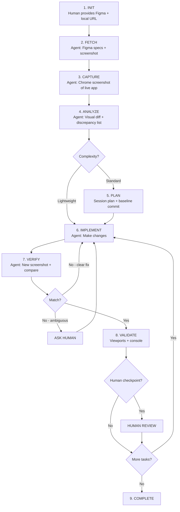
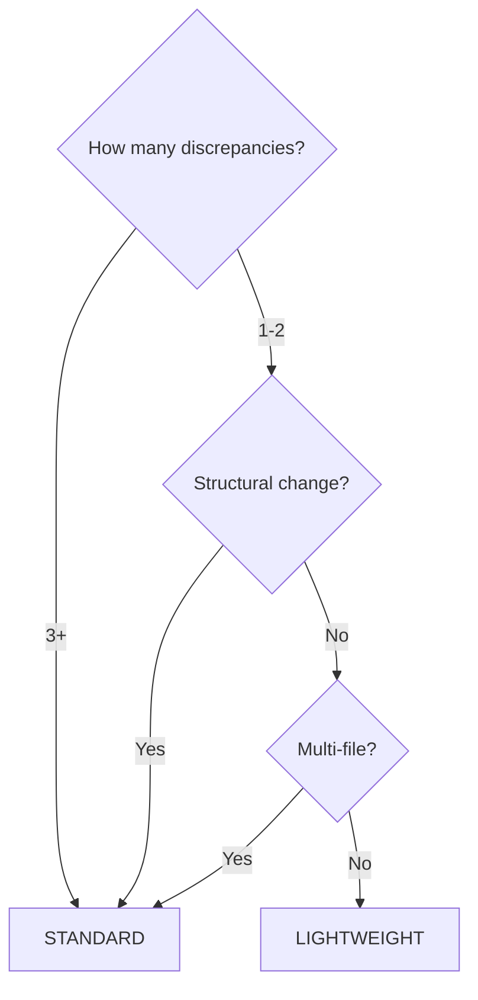

# Frontend Visual QA Workflow (v1)

---

## Overview

A **self-verifying agent workflow** for implementing UI from Figma designs or refactoring existing frontend. The agent uses **Figma MCP** to fetch design specs/screenshots and **Chrome MCP** to capture live app state, enabling automated visual comparison and iteration.

**Key Difference from Manual Workflow**: Agent captures its own screenshots, compares them to Figma, and iterates autonomously until the implementation matches—only asking humans when genuinely ambiguous.

---

## IMPORTANT: Context Retention Instructions

> **FOR CLAUDE AGENT**: This section contains critical instructions for maintaining workflow knowledge.

### On Context Compression (`/compact`)

When context is compacted or compressed, **you MUST**:

1. **Immediately re-read this file**: `CLAUDE_frontend_visual_qa_workflow.md`
2. **Re-read the session plan** (if exists): `CLAUDE_session_plan.md`
3. **Re-read the frontend context** (if exists): `CLAUDE_frontend_context.md`

### Critical Information to Retain

Even after compression, always remember:

| Item | Value |
|------|-------|
| **Workflow file** | `CLAUDE_frontend_visual_qa_workflow.md` |
| **Viewport: Mobile** | 390 x 844 |
| **Viewport: Tablet** | 768 x 1024 |
| **Viewport: Desktop** | 1440 x 900 (default) |
| **MCP tools** | Figma MCP + Chrome MCP |

### Self-Check After Compression

If you notice any of these, re-read the workflow file immediately:
- You forgot viewport dimensions
- You forgot to use Chrome MCP for screenshots
- You forgot to use Figma MCP for design specs
- You're asking user for screenshots instead of capturing them
- You're not following the structured comparison format
- You forgot about session plan or recovery prompts

### Compression Recovery Command

If context was compressed and you lost workflow details, tell the user:

```
"Context was compressed. Let me re-read the workflow files to continue properly."
```

Then read: `CLAUDE_frontend_visual_qa_workflow.md`, `CLAUDE_session_plan.md`, `CLAUDE_frontend_context.md`

---

## Cheat Sheet (Copy-Paste Prompts)

### New Session - Figma Implementation
```
Read CLAUDE_frontend_visual_qa_workflow.md and follow the workflow.

Figma design: [figma-url-with-node-id]
Local app: http://localhost:3000/[route]

Task: Implement this page/component to match the Figma design.
```

### New Session - Visual QA Check
```
Read CLAUDE_frontend_visual_qa_workflow.md and follow the workflow.

Figma design: [figma-url-with-node-id]
Local app: http://localhost:3000/[route]

Task: Compare current implementation to Figma and fix any discrepancies.
```

### With Existing Context
```
Read CLAUDE_frontend_visual_qa_workflow.md and CLAUDE_frontend_context.md.

Figma: [figma-url]
Local: http://localhost:3000/[route]

Task: [describe task]
```

### Resume Crashed Session
```
[paste recovery prompt from CLAUDE_session_plan.md]
```

### After Context Compression
```
Context seems compressed. Re-read the workflow:
- CLAUDE_frontend_visual_qa_workflow.md
- CLAUDE_session_plan.md (if exists)
- CLAUDE_frontend_context.md (if exists)

Continue from where we left off.
```

### Multi-Viewport QA
```
Read CLAUDE_frontend_visual_qa_workflow.md.

Figma design: [figma-url]
Local app: http://localhost:3000/[route]

Test viewports: 375px (mobile), 768px (tablet), 1280px (desktop)
Fix any discrepancies at each viewport.
```

### Multi-Screen Batch
```
Read CLAUDE_frontend_visual_qa_workflow.md.

Figma file: [figma-file-url]
Screens to implement:
1. Dashboard (node-id: 1-100) → /dashboard
2. Settings (node-id: 1-200) → /settings
3. Profile (node-id: 1-300) → /profile

Implement each screen to match Figma. Checkpoint after each.
```

### Continue to Next Screen
```
[Screen X] approved. Next, do [Screen Y].

Figma node: [node-id]
Route: /[route]
```

---

## Quick Reference



**KEY FILES:**
- `CLAUDE_frontend_context.md` - Long-term codebase knowledge (persists)
- `CLAUDE_session_plan.md` - Task-specific state + recovery (temporary)
- `screenshots/` - Captured screenshots for comparison (optional persistence)

**MCP TOOLS:**
- **Figma MCP**: Fetch design specs, export node screenshots
- **Chrome MCP**: Navigate, screenshot, resize viewport, check console

**GIT CHECKPOINTS (Standard mode):**
- Baseline commit before starting
- Checkpoint commit after each human approval
- Session plan tracks commit hashes for rollback

---

## MCP Capabilities

### Figma MCP

| Capability | Use Case |
|------------|----------|
| Get file/node info | Extract design specs (colors, spacing, typography) |
| Export node as image | Get screenshot of specific component/frame |
| Read styles | Get exact color values, text styles, effects |
| Read component properties | Understand variants, states |

### Chrome MCP

| Capability | Use Case |
|------------|----------|
| Navigate to URL | Open the target page in browser |
| Take screenshot | Capture current visual state |
| Resize viewport | Test responsive breakpoints |
| Get console logs | Check for errors/warnings |
| Click/interact | Verify hover states, interactions |
| Wait for element | Ensure page fully loaded before screenshot |

---

## Viewport Defaults

When user specifies a view type, use these exact dimensions with Chrome MCP:

| View | Width | Height | When User Says |
|------|-------|--------|----------------|
| **Mobile** | 390px | 844px | "mobile", "mobile view", "phone" |
| **Tablet** | 768px | 1024px | "tablet", "tablet view", "iPad" |
| **Desktop** | 1440px | 900px | "desktop", "desktop view", or no specification |

### Behavior Rules

1. **Default is Desktop**: If user doesn't specify a viewport, use **1440 x 900** (desktop)
2. **Explicit viewport**: If user says "mobile view", immediately set Chrome to **390 x 844**
3. **Multi-viewport task**: When testing all viewports, use all three sizes above
4. **Custom sizes**: If user provides specific dimensions, use those instead

### Quick Reference

```
Mobile view  → chrome.set_viewport(390, 844)
Tablet view  → chrome.set_viewport(768, 1024)
Desktop view → chrome.set_viewport(1440, 900)
```

### Common User Phrases → Viewport

| User Says | Agent Uses |
|-----------|------------|
| "check mobile" | 390 x 844 |
| "test on phone" | 390 x 844 |
| "mobile layout" | 390 x 844 |
| "tablet size" | 768 x 1024 |
| "iPad view" | 768 x 1024 |
| "desktop" | 1440 x 900 |
| "full screen" | 1440 x 900 |
| "laptop view" | 1440 x 900 |
| (nothing specified) | 1440 x 900 |

---

## Task Complexity Tiers

### Lightweight Mode (No Session Plan)

**Criteria (ANY of these):**
- Single file change
- 1-2 visual discrepancies
- No structural changes
- Estimated < 15 minutes

**Examples:**
- "Button color is wrong"
- "Padding needs adjustment"
- "Font weight doesn't match"

**Workflow:**
```
Human: Figma + URL
Agent: fetch → capture → compare → fix → verify → done
```

### Standard Mode (With Session Plan)

**Criteria (ANY of these):**
- Multi-file changes
- 3+ visual discrepancies
- Structural/layout changes
- Multiple components affected
- Multiple viewports need fixes

**Examples:**
- "Implement this entire page from Figma"
- "Fix all discrepancies on this screen"
- "Rebuild navigation to match design"

**Workflow:**
```
Human: Figma + URL
Agent: fetch → capture → compare → create plan → implement → verify → iterate → checkpoint → complete
```

### Complexity Decision Tree



---

## Workflow Phases

### Phase 1: Initialization

**HUMAN provides:**
- Figma URL with node-id (e.g., `https://figma.com/design/ABC/name?node-id=1-100`)
- Local app URL (e.g., `http://localhost:3000/dashboard`)
- Brief task description

**AGENT actions:**
1. Check for `CLAUDE_frontend_context.md`
2. If not exists, trigger codebase inspection (Phase 2)
3. If exists, proceed to Phase 3

### Phase 2: Codebase Inspection

Same as standard frontend workflow. Agent explores:
- Styling framework (Tailwind, CSS Modules, etc.)
- Component structure
- Routing setup
- Design tokens/theme config

Creates or updates `CLAUDE_frontend_context.md`.

### Phase 3: Design Fetch & Capture

**AGENT actions:**

1. **Fetch Figma design** (via Figma MCP):
   ```
   - Get node info for design specs
   - Export node as screenshot
   - Extract colors, spacing, typography values
   ```

2. **Capture live app** (via Chrome MCP):
   ```
   - Navigate to local URL
   - Wait for page load
   - Take screenshot at target viewport
   - Capture console logs
   ```

3. **Store references** (optional):
   ```
   screenshots/
   ├── figma/
   │   └── dashboard-design.png
   └── live/
       └── dashboard-current.png
   ```

### Phase 4: Visual Analysis

**AGENT generates comparison report:**

```markdown
## Visual Comparison: [Page/Component]

### Sources:
- **Figma**: [node-id] from [file]
- **Live**: [URL] at [viewport]

### Viewport: 1280x720 (Desktop)

### Discrepancies Found:

| # | Element | Figma Spec | Current | Severity | Fix |
|---|---------|------------|---------|----------|-----|
| 1 | Header height | 64px | 80px | High | Reduce height |
| 2 | Card padding | 16px | 24px | Medium | Change p-6 to p-4 |
| 3 | Primary button | #EB5017 | #EF4444 | High | Update color |
| 4 | Body font | 16px/24px | 14px/20px | Medium | Adjust text size |
| 5 | Card gap | 12px | 16px | Low | Change gap-4 to gap-3 |

### Console Status:
- Errors: 0
- Warnings: 1 (pre-existing React key warning)

### Complexity Assessment: STANDARD
- 5 discrepancies across 3 files
- Creating session plan...

### Screenshot Comparison:
[Agent describes key visual differences observed]
```

### Phase 5: Session Plan Creation (Standard Mode)

**AGENT creates `CLAUDE_session_plan.md`:**

```markdown
# Session Plan: [Feature/Page Name]

## Created
[Date] - Visual QA implementation from Figma

## Objective
Implement [page/component] to match Figma design [node-id]

## MCP Resources
- **Figma file**: [file-url]
- **Figma node**: [node-id]
- **Local URL**: [localhost-url]
- **Viewports**: [375, 768, 1280]

## Design Specs (from Figma)
```
Colors:
- Primary: #EB5017
- Background: #FFFFFF
- Text: #1A1A1A

Spacing:
- Card padding: 16px
- Gap: 12px
- Section margin: 24px

Typography:
- Heading: 24px/32px, weight 600
- Body: 16px/24px, weight 400
```

## Target Files
| File | Action | Status |
|------|--------|--------|
| `src/components/Header.tsx` | Modify | Pending |
| `src/components/ui/Card.tsx` | Modify | Pending |

## Discrepancies to Fix
- [ ] Header height: 80px → 64px
- [ ] Card padding: p-6 → p-4
- [ ] Button color: #EF4444 → #EB5017
- [ ] Body font: text-sm → text-base
- [ ] Card gap: gap-4 → gap-3

## Verification Checklist
- [ ] Desktop (1280px) matches Figma
- [ ] Tablet (768px) matches Figma
- [ ] Mobile (375px) matches Figma
- [ ] No console errors
- [ ] Hover/interaction states work

## Git Checkpoints
| Checkpoint | Commit | Description | Rollback |
|------------|--------|-------------|----------|
| Baseline | `abc123` | Before starting | `git reset --hard abc123` |

## Progress Log
| Time | Update |
|------|--------|
| Start | Fetched Figma specs, captured baseline |

## Screenshots Captured
| Type | Viewport | Path/Description |
|------|----------|------------------|
| Figma design | - | Node 1-100 exported |
| Live baseline | 1280px | Before changes |

---

## Recovery Prompt
**Copy and paste this into a new session if this session crashes:**

> Continue frontend visual QA session for [Page Name].
>
> Read: `CLAUDE_session_plan.md` and `CLAUDE_frontend_context.md`
> Read: `CLAUDE_frontend_visual_qa_workflow.md`
>
> MCP Resources:
> - Figma: [file-url] node [node-id]
> - Local: [localhost-url]
>
> Current status:
> - Last completed: [task description]
> - Next task: [task description]
> - Last checkpoint: `[commit-hash]`
>
> Design specs are in session plan. Continue implementation.

**Last updated**: Session start
```

### Phase 6: Implementation Loop

**AGENT iterates:**

```
1. Make code changes
2. Wait for hot reload (or refresh browser)
3. Capture new screenshot via Chrome MCP
4. Compare to Figma screenshot
5. If discrepancy remains → fix and repeat
6. If match → proceed to next discrepancy
7. If ambiguous → ask human
```

**Self-verification report after each change:**

```markdown
## Verification: [Change Description]

### Change Made:
Updated `Header.tsx` - changed `h-20` to `h-16` for 64px height

### Comparison:
| Element | Figma | Before | After | Status |
|---------|-------|--------|-------|--------|
| Header height | 64px | 80px | 64px | MATCH |

### Screenshot captured at [timestamp]
### Proceeding to next discrepancy...
```

### Phase 7: Validation

Before requesting human checkpoint:

**AGENT runs automated checks:**

```markdown
## Pre-Checkpoint Validation

### Visual Match:
| Viewport | Status | Notes |
|----------|--------|-------|
| 1280px (Desktop) | PASS | All elements match Figma |
| 768px (Tablet) | PASS | Responsive layout correct |
| 375px (Mobile) | PASS | Mobile layout correct |

### Console Check:
- Errors: 0
- New warnings: 0
- Pre-existing warnings: 1 (React key warning in unrelated component)

### Interaction Check:
- [ ] Hover states verified
- [ ] Click handlers work
- [ ] Form inputs functional (if applicable)

### Build Check:
- `npm run build`: PASS
- `npm run lint`: PASS (or N warnings)

### Ready for human checkpoint: YES
```

### Phase 8: Human Checkpoint

**AGENT presents:**

```markdown
## Checkpoint: [Milestone Name]

### Summary:
Implemented [X] changes to match Figma design.

### Visual Comparison:
- Figma design: [description or reference]
- Current implementation: [captured via Chrome MCP]

### Changes Made:
| File | Change |
|------|--------|
| `Header.tsx` | Height reduced to 64px |
| `Card.tsx` | Padding changed to 16px |
| `Button.tsx` | Color updated to #EB5017 |

### Validation:
- All viewports match Figma
- No console errors
- Build passes

### Questions/Ambiguities:
[None, or list items needing human decision]

**Awaiting your approval to checkpoint and continue.**
```

**HUMAN responds:**
- "Approved" → Agent creates git checkpoint, continues
- "The card shadow looks off" → Agent investigates, fixes, re-verifies
- "Skip the hover state for now" → Agent notes decision, continues

### Phase 9: Completion

**AGENT actions:**

1. **Final validation** - All viewports, console clean, build passes
2. **Update context file** - New patterns, components modified
3. **Final git commit** - `ui(feat): complete [page] implementation from Figma`
4. **Archive/delete session plan** (or keep if human prefers)
5. **Summary report**

```markdown
## Session Complete: [Page/Feature]

### Final Status:
- All [X] discrepancies resolved
- [Y] viewports verified
- No console errors
- Build passes

### Files Modified:
| File | Changes |
|------|---------|
| `src/components/Header.tsx` | Height, spacing |
| `src/components/ui/Card.tsx` | Padding, shadow |
| `src/app/dashboard/page.tsx` | Layout grid |

### Git History:
| Commit | Description |
|--------|-------------|
| `abc123` | Baseline |
| `def456` | Header + Card fixes |
| `ghi789` | Final - all viewports pass |

### Context File:
Updated `CLAUDE_frontend_context.md` with:
- New Card padding pattern
- Header height standard

### Ready for next task!
```

---

## Agent Behaviors

### When to Ask Human

Even with automated comparison, ask when:

| Scenario | Example |
|----------|---------|
| **Ambiguous design** | "Figma shows shadow but values aren't extractable" |
| **Multiple valid interpretations** | "This could be flexbox or grid, both work" |
| **Missing state in Figma** | "No hover state shown, should I add one?" |
| **Breaking change potential** | "This fix affects 5 other components" |
| **Tolerance question** | "1px difference - is this acceptable?" |

**Format for asking:**

```markdown
## Human Input Needed

**Issue**: [Description]

**What I see**:
- Figma: [spec or description]
- Current: [spec or description]

**Options**:
A) [Option with explanation]
B) [Option with explanation]
C) [Skip for now]

**My recommendation**: [A/B/C] because [reason]

Which do you prefer?
```

### Visual Comparison Report Format

After each comparison cycle:

```markdown
## Visual Comparison: [Component/Page]

### Sources:
- Figma: [node-id] exported at [timestamp]
- Live: [URL] at [viewport] captured at [timestamp]

### Match Status: [X/Y elements match]

### Discrepancies:
| Element | Figma | Current | Delta | Priority |
|---------|-------|---------|-------|----------|
| ... | ... | ... | ... | ... |

### Agent Assessment:
- **Auto-fixable**: [list]
- **Need human input**: [list or "None"]

### Next Action: [Proceeding with fixes / Asking human / Done]
```

### Console Monitoring

Check console after each change:

```markdown
## Console Check

### Errors: [count]
[List if any]

### Warnings: [count]
- New this session: [count]
- Pre-existing: [count]

### Assessment:
[Clean / Has issues to address / Pre-existing only]
```

### Multi-Viewport Testing

```markdown
## Viewport Verification

| Viewport | Width | Figma Node | Status | Issues |
|----------|-------|------------|--------|--------|
| Mobile | 375px | 1-101 | PASS | - |
| Tablet | 768px | 1-102 | FAIL | Card overlap |
| Desktop | 1280px | 1-100 | PASS | - |

### Tablet Issue Details:
[Description + fix plan]
```

---

## Git Checkpoint Strategy

### When to Commit

| Trigger | Action |
|---------|--------|
| Before starting | Baseline commit |
| After human approval | Checkpoint commit |
| After completing viewport | Optional checkpoint |
| Before risky change | Safety checkpoint |
| Session end | Final commit |

### Commit Message Format

```
ui(<type>): <short description>
```

| Type | When |
|------|------|
| `ui(feat)` | New component or feature |
| `ui(fix)` | Bug fix, visual correction |
| `ui(style)` | Spacing, colors, typography |
| `ui(refactor)` | Code restructure |

### Checkpoint Flow

```bash
# Baseline
git add -A && git commit -m "ui(chore): baseline before dashboard implementation"

# After approval
git add -A && git commit -m "ui(style): header and card match Figma specs"

# Final
git add -A && git commit -m "ui(feat): complete dashboard implementation from Figma"
```

---

## Multi-Screen Implementation

When implementing multiple screens in one session:

### Strategy: Replace Session Plan Per Screen

```
Screen 1: Plan → implement → verify → approve → checkpoint
Screen 2: REPLACE plan → implement → verify → approve → checkpoint
Screen 3: REPLACE plan → implement → verify → approve → checkpoint
```

### Session Plan Between Screens

```markdown
## Session Plan: [Screen M]

## Completed This Session
- [x] Screen N (checkpoint: `abc123`)
- [x] Screen O (checkpoint: `def456`)
- [ ] Screen M (current)

## Objective
[Screen M specific details]
...
```

### Workflow Per Screen

```
Human: "Dashboard done, next do Settings"

Agent:
1. git commit -m "ui(feat): complete dashboard from Figma"
2. Fetch Settings node from Figma
3. Navigate Chrome to /settings
4. Capture + compare
5. Replace session plan content
6. Implement Settings
```

---

## Session Recovery

### Recovery Prompt Template

Always keep updated in session plan:

```markdown
## Recovery Prompt

> Continue frontend visual QA session for [Feature].
>
> Read these files first:
> - `CLAUDE_frontend_visual_qa_workflow.md`
> - `CLAUDE_session_plan.md`
> - `CLAUDE_frontend_context.md`
>
> MCP Resources:
> - Figma file: [url]
> - Figma node: [node-id]
> - Local URL: [localhost-url]
>
> Current status:
> - Last completed: [Task X]
> - Next task: [Task Y]
> - Last checkpoint: `[commit-hash]`
> - Blocking issues: [None / description]
>
> Design specs are persisted in session plan.
> Continue from where we left off.

**Last updated**: [timestamp or step]
```

### When to Update Recovery Prompt

| Event | Update |
|-------|--------|
| After clarification | Add decisions made |
| After each task | Update last/next task |
| After checkpoint | Add commit hash |
| When blocked | Add blocker description |
| After human feedback | Note feedback received |

### Signs of Context Compression

If you notice:
- Agent stops using structured comparison tables
- Agent forgets MCP resources
- Agent doesn't capture screenshots
- Agent asks for info already in session plan
- Responses become generic

**Action**: Use "After Context Compression" prompt from cheat sheet.

---

## Context File: `CLAUDE_frontend_context.md`

Same structure as standard frontend workflow. Persists:
- Styling framework details
- Component locations
- Route structure
- Design token locations
- Service layer patterns

See `CLAUDE_frontend_visual_qa_workflow_ref.md` for full template.

---

## Error Handling

### Chrome MCP Failures

| Issue | Agent Action |
|-------|--------------|
| Page won't load | Check if dev server running, report to human |
| Screenshot fails | Retry once, then ask human |
| Console errors on load | Report errors, ask if should proceed |
| Timeout | Increase wait time, retry |

### Figma MCP Failures

| Issue | Agent Action |
|-------|--------------|
| Node not found | Verify node-id with human |
| Export fails | Try different scale, report if persists |
| Access denied | Ask human to check Figma permissions |

### Build/Runtime Errors

```markdown
## Error Detected

### Type: [Build / Runtime / Console]

### Error:
[Error message]

### Triggered by:
[Last change made]

### Agent Assessment:
[Analysis of cause]

### Options:
A) Rollback to last checkpoint (`git reset --hard [hash]`)
B) Attempt fix: [proposed fix]
C) Ask human for guidance

**Recommendation**: [A/B/C]
```

---

## Screenshot Storage (Optional)

For audit trail, agent can save screenshots:

```
screenshots/
├── figma/
│   ├── dashboard-desktop.png
│   ├── dashboard-tablet.png
│   └── dashboard-mobile.png
└── live/
    ├── dashboard-baseline-desktop.png
    ├── dashboard-v1-desktop.png
    ├── dashboard-v2-desktop.png
    └── dashboard-final-desktop.png
```

### Naming Convention

```
{page}-{version}-{viewport}.png

Examples:
- dashboard-baseline-1280.png
- settings-v2-375.png
- header-final-768.png
```

### When to Save

| Mode | Save Screenshots? |
|------|-------------------|
| Lightweight | No (transient) |
| Standard | Optional (human preference) |
| Multi-screen | Recommended (audit trail) |

---

## Framework Adaptations

| Framework | Figma Token Mapping |
|-----------|---------------------|
| Tailwind | Map to `tailwind.config.js` theme |
| CSS Variables | Map to `:root` custom properties |
| Styled Components | Map to theme provider |
| CSS Modules | Note class naming patterns |

See `CLAUDE_frontend_visual_qa_workflow_ref.md` for detailed mappings.

---

## Appendix: MCP Command Reference

### Figma MCP Examples

```
# Get node info
figma.get_file_node(file_key, node_id)

# Export as image
figma.export_node(file_key, node_id, format="png", scale=2)

# Get styles
figma.get_file_styles(file_key)
```

### Chrome MCP Examples

```
# Navigate
chrome.navigate(url)

# Screenshot
chrome.screenshot()

# Resize
chrome.set_viewport(width, height)

# Get console
chrome.get_console_logs()

# Click element
chrome.click(selector)

# Wait for element
chrome.wait_for_selector(selector)
```

*Note: Actual MCP syntax depends on installed MCP server implementation.*
