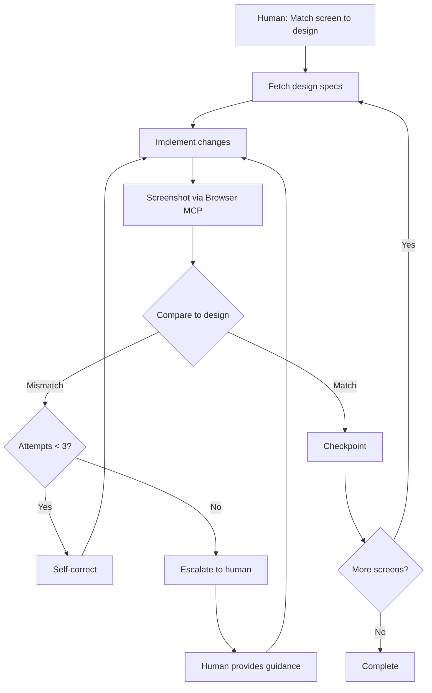

# Visual QA Workflow (v1)

---

## Cheat Sheet (Copy-Paste Prompts)

### Single Screen Match
```
Read CLAUDE_visual_qa_workflow.md.

Match this screen to the design.
- Route: /dashboard
- Dev server: localhost:3000
- Design: [paste image or Figma URL]

Viewport: 1280x720
```

### Multi-Screen Batch
```
Read CLAUDE_visual_qa_workflow.md.

Match these screens to their Figma designs:
1. /homepage - [figma-url-1]
2. /dashboard - [figma-url-2]
3. /settings - [figma-url-3]

Dev server: localhost:3000
Viewport: 1280x720
Checkpoint: after each screen
```

### Mobile Viewport
```
Read CLAUDE_visual_qa_workflow.md.

Match /homepage to design at mobile viewport.
- Dev server: localhost:3000
- Design: [paste image]
- Viewport: 390x844
```

### Resume After Checkpoint
```
Continue visual QA from where we left off.
Last completed: [Screen X]
Next: [Screen Y]
```

### Specific Element Focus
```
Read CLAUDE_visual_qa_workflow.md.

The header doesn't match the design.
- Route: /dashboard
- Dev server: localhost:3000
- Design: [paste image]
- Focus: header element only

Fix until it matches.
```

---

## Overview

An **autonomous visual QA workflow** where the agent implements UI changes and self-corrects using Browser MCP for screenshots. Human reviews at milestone checkpoints only.

**Key difference from manual workflow:** Agent takes its own screenshots and compares to design, iterating autonomously until match (or escalation).

---

## Requirements

| Tool | Purpose | Required |
|------|---------|----------|
| **Browser MCP** | Screenshots, navigation, viewport control | Yes |
| **Figma MCP** | Fetch design specs and images | Optional |
| **Dev server** | Running app to screenshot | Yes |

See `CLAUDE_visual_qa_workflow_ref.md` for MCP setup instructions.

---

## Quick Reference



---

## Participants

| Role | Responsibilities |
|------|------------------|
| **Human** | Provides task, design reference, approves checkpoints, handles escalations |
| **Agent** | Implements, screenshots, compares, self-corrects autonomously |

---

## Browser MCP Tools

Expected tools from Browser MCP (names may vary by implementation):

| Tool | Usage |
|------|-------|
| `browser_navigate` | Go to route, wait for load |
| `browser_screenshot` | Capture current viewport |
| `browser_set_viewport` | Set width/height |
| `browser_click` | Interact with elements |
| `browser_scroll` | Scroll page |
| `browser_wait` | Wait for selector/load |
| `browser_close` | Close browser session |

### Viewport Presets

| Name | Dimensions | Use Case |
|------|------------|----------|
| Desktop | 1280x720 | Standard desktop |
| Desktop Large | 1920x1080 | Full HD |
| Tablet | 768x1024 | iPad portrait |
| Mobile | 390x844 | iPhone 14 |
| Mobile Small | 375x667 | iPhone SE |

---

## Autonomous Loop

### Core Cycle

```
1. IMPLEMENT → Make code changes
2. SCREENSHOT → Capture via Browser MCP
3. COMPARE → Analyze against design
4. DECIDE:
   - Match? → Checkpoint, next screen
   - Mismatch? → Self-correct (max 3 attempts)
   - Stuck? → Escalate to human
```

### Iteration Tracking

```markdown
## Screen: /dashboard

### Iteration 1
- Changes: Implemented header layout
- Screenshot: [captured]
- Comparison:
  | Element | Design | Current | Match |
  |---------|--------|---------|-------|
  | Header height | 64px | 72px | ❌ |
  | Background | #1A1A1A | #1A1A1A | ✅ |
  | Nav spacing | 24px | 24px | ✅ |
- Issues: 1
- Action: Fixing header height

### Iteration 2
- Changes: Updated header h-18 to h-16
- Screenshot: [captured]
- Comparison: All elements match ✅
- Status: Complete
```

### Max Attempts

- **Default:** 3 self-correction attempts per element/issue
- **Then:** Escalate to human with specific blocker
- **Override:** Human can say "keep trying" or "skip this"

---

## Comparison Strategy

### Visual Analysis Process

When comparing design to screenshot:

1. **Layout structure** - Overall positioning, grid, flow
2. **Spacing** - Margins, padding, gaps
3. **Typography** - Font size, weight, line height, color
4. **Colors** - Backgrounds, borders, text colors
5. **Sizing** - Component dimensions, image sizes
6. **Alignment** - Text alignment, element centering
7. **States** - Hover, active, focus (if applicable)

### Comparison Report Format

```markdown
## Visual Comparison: [Route]

### Design Source
- Figma: [url] OR Image: [provided]
- Viewport: 1280x720

### Captured
- URL: localhost:3000/dashboard
- Timestamp: [time]

### Analysis

| Category | Element | Design | Current | Status |
|----------|---------|--------|---------|--------|
| Layout | Sidebar width | 240px | 280px | ❌ |
| Spacing | Card gap | 16px | 24px | ❌ |
| Color | Header bg | #1A1A1A | #1A1A1A | ✅ |
| Typography | Heading size | 24px | 24px | ✅ |

### Summary
- **Matches:** 8/10 elements
- **Mismatches:** 2 (sidebar width, card gap)
- **Confidence:** 80%

### Next Action
Self-correcting sidebar width and card gap...
```

---

## Escalation

### When to Escalate

| Condition | Action |
|-----------|--------|
| 3 failed attempts on same issue | Escalate |
| Ambiguous design (can't determine spec) | Escalate |
| Requires functionality change (not just visual) | Escalate |
| Browser MCP error/unavailable | Escalate |
| Confidence < 70% after correction | Escalate |

### Escalation Format

```markdown
## Escalation: [Issue]

### Context
- Screen: /dashboard
- Attempts: 3
- Issue: Cannot match card shadow

### What I Tried
1. `shadow-md` - too subtle
2. `shadow-lg` - too strong
3. `shadow-[0_4px_12px_rgba(0,0,0,0.15)]` - still not matching

### Design Reference
[design image snippet]

### Current Result
[screenshot snippet]

### Options
1. Provide exact shadow CSS values
2. Accept current implementation (shadow-md)
3. Skip card shadow, continue with other elements

### Awaiting your guidance.
```

---

## Checkpoints

### Checkpoint Frequency

| Setting | When |
|---------|------|
| `every_screen` | Checkpoint after each screen (default) |
| `every_3` | Batch 3 screens, then checkpoint |
| `on_completion` | Only checkpoint when all done |
| `on_escalation` | Checkpoint only when stuck |

Human specifies in task: "Checkpoint: after each screen"

### Checkpoint Report

```markdown
## Checkpoint: [Screen Name]

### Status: ✅ Complete

### Visual Match
- Design: [source]
- Implementation: [screenshot]
- Confidence: 95%

### Changes Made
| File | Change |
|------|--------|
| `src/components/Header.tsx` | Fixed height, updated padding |
| `src/app/dashboard/page.tsx` | Adjusted grid gap |

### Iterations
- Total: 2
- Self-corrections: 1

### Git Checkpoint
```bash
git commit -m "ui(feat): complete dashboard visual match"
```
Hash: `abc1234`

### Next Screen
Ready to proceed to /settings

**Approve to continue, or provide feedback.**
```

---

## Multi-Screen Batch

### Session Tracking

```markdown
## Visual QA Session

### Task
Match 5 screens to Figma designs

### Progress
| # | Screen | Status | Iterations | Checkpoint |
|---|--------|--------|------------|------------|
| 1 | /homepage | ✅ Complete | 2 | Approved |
| 2 | /dashboard | ✅ Complete | 1 | Approved |
| 3 | /settings | 🔄 In Progress | 1 | - |
| 4 | /profile | ⏳ Pending | - | - |
| 5 | /checkout | ⏳ Pending | - | - |

### Current: /settings
- Figma: [url]
- Iteration: 1
- Status: Comparing initial implementation...
```

### Between Screens

After human approves Screen N:

1. Git commit: `ui(feat): complete [Screen N] visual match`
2. Update session progress
3. Load next screen's design reference
4. Navigate browser to next route
5. Begin implementation

---

## Git Integration

### Commit Message Format

```
ui(<type>): <short description>
```

| Type | When |
|------|------|
| `ui(feat)` | Screen implementation complete |
| `ui(fix)` | Visual correction |
| `ui(style)` | Minor adjustments |
| `ui(chore)` | Baseline checkpoint |

### Checkpoint Commits

```bash
# Before starting
git commit -m "ui(chore): baseline before visual QA session"

# After each approved screen
git commit -m "ui(feat): complete homepage visual match"
git commit -m "ui(feat): complete dashboard visual match"

# End of session
git commit -m "ui(chore): visual QA session complete - 5 screens"
```

---

## Workflow Phases

### Phase 1: Initialization

**Human provides:**
- Screen(s) to match
- Design reference (Figma URL or image)
- Dev server URL
- Viewport dimensions
- Checkpoint frequency

**Agent verifies:**
- Browser MCP available
- Dev server accessible
- Design reference loadable

```markdown
Agent: "Browser MCP connected. Dev server at localhost:3000 responding.
        Design reference loaded from Figma.

        Ready to begin visual QA for /dashboard at 1280x720.
        Starting implementation..."
```

### Phase 2: Autonomous Implementation

Agent loops through:
1. Analyze design specs
2. Implement changes
3. Screenshot via Browser MCP
4. Compare to design
5. Self-correct if needed (max 3 attempts)
6. Report when match achieved or escalate

**Human is NOT involved** unless escalation.

### Phase 3: Checkpoint

Agent presents:
- Side-by-side comparison (design vs implementation)
- Changes made
- Confidence level
- Git commit hash

**Human responds:**
- "Approved" → Agent continues to next screen
- "Fix X" → Agent addresses feedback
- "Skip" → Agent moves to next screen
- "Abort" → Session ends

### Phase 4: Completion

After all screens:

```markdown
## Visual QA Complete

### Summary
| Screen | Status | Iterations | Confidence |
|--------|--------|------------|------------|
| /homepage | ✅ | 2 | 95% |
| /dashboard | ✅ | 1 | 98% |
| /settings | ✅ | 3 | 92% |
| /profile | ✅ | 2 | 96% |
| /checkout | ⚠️ Escalated | 3 | 78% |

### Total Stats
- Screens: 5
- Completed autonomously: 4
- Escalated: 1
- Total iterations: 11
- Avg confidence: 92%

### Git History
- Baseline: `abc1234`
- Final: `xyz7890`
- Rollback: `git reset --hard abc1234`

### Files Modified
| File | Screens Affected |
|------|------------------|
| `src/components/Header.tsx` | homepage, dashboard |
| `src/app/dashboard/page.tsx` | dashboard |
| `src/app/settings/page.tsx` | settings |
| `tailwind.config.js` | all (color fix) |
```

---

## Error Handling

### Browser MCP Errors

| Error | Action |
|-------|--------|
| Connection failed | Retry 3x, then escalate |
| Screenshot timeout | Increase wait time, retry |
| Navigation failed | Check URL, verify server running |
| Viewport not supported | Use closest supported size |

### Dev Server Errors

| Error | Action |
|-------|--------|
| Server not responding | Prompt human to start server |
| 404 on route | Verify route exists |
| Render error | Screenshot error state, escalate |
| Slow load | Increase wait time |

---

## Configuration Options

Human can specify in task:

```markdown
Config:
- Viewport: 1280x720
- Checkpoint: every_screen | every_3 | on_completion
- Max attempts: 3 (default)
- Confidence threshold: 90% (default)
- Wait after navigation: 2000ms (default)
- Git commits: yes | no
```

---

## Comparison to Manual Workflow

| Aspect | Manual (frontend_refactor) | Autonomous (visual_qa) |
|--------|---------------------------|------------------------|
| Screenshots | Human takes | Agent takes (Browser MCP) |
| Comparison | Human judges | Agent analyzes |
| Iteration speed | Minutes (wait for human) | Seconds (autonomous) |
| Human involvement | Every iteration | Checkpoints only |
| Best for | Subjective polish | Pixel-accurate matching |
| Requires | Human availability | Browser MCP setup |

---

## Limitations

- **Animations:** Static screenshots may miss animation issues
- **Interactions:** Limited to click/scroll, complex gestures need human testing
- **Subjective design:** Agent may match "wrong" when design is ambiguous
- **Browser differences:** Only tests in Chromium (Playwright default)
- **Auth flows:** May need human help with login-protected routes
