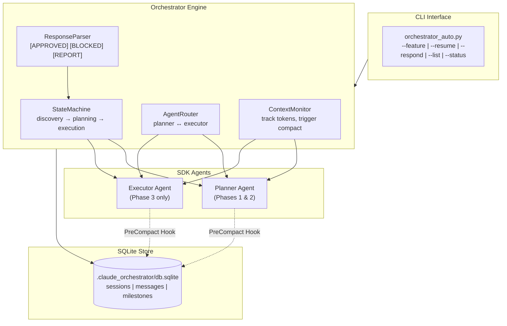
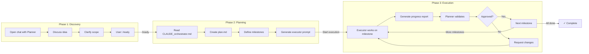
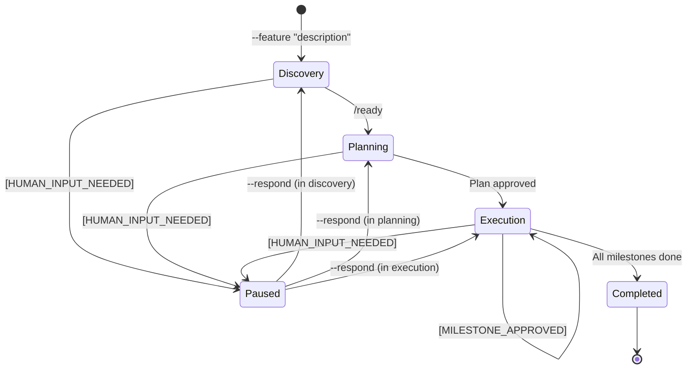
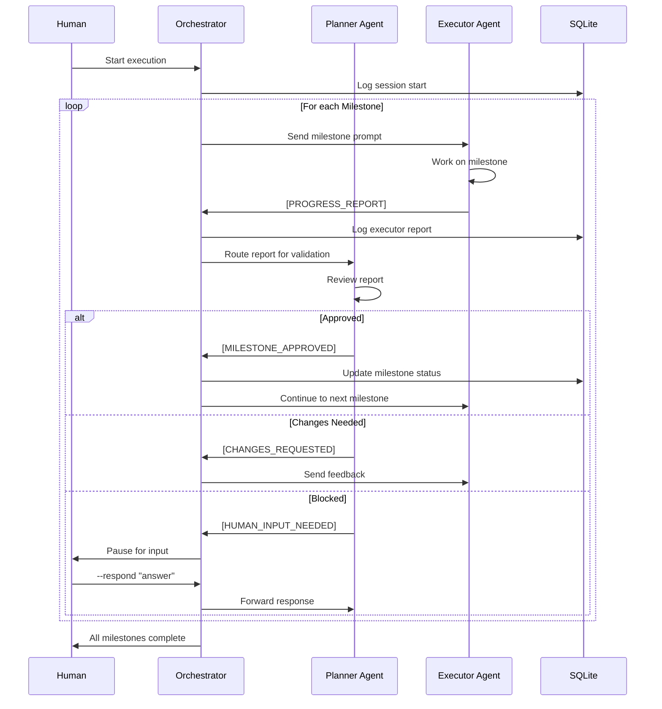
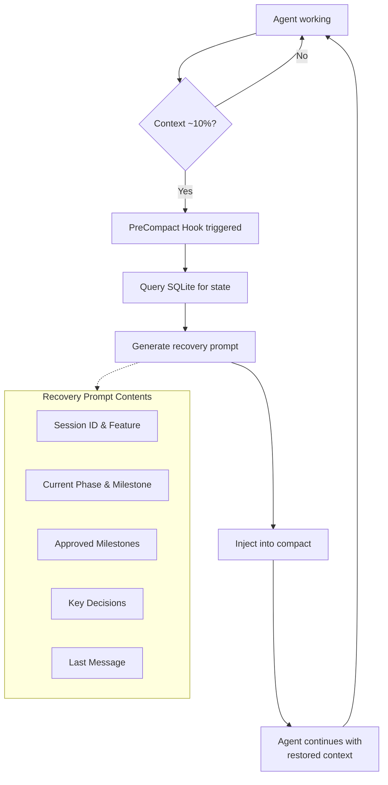
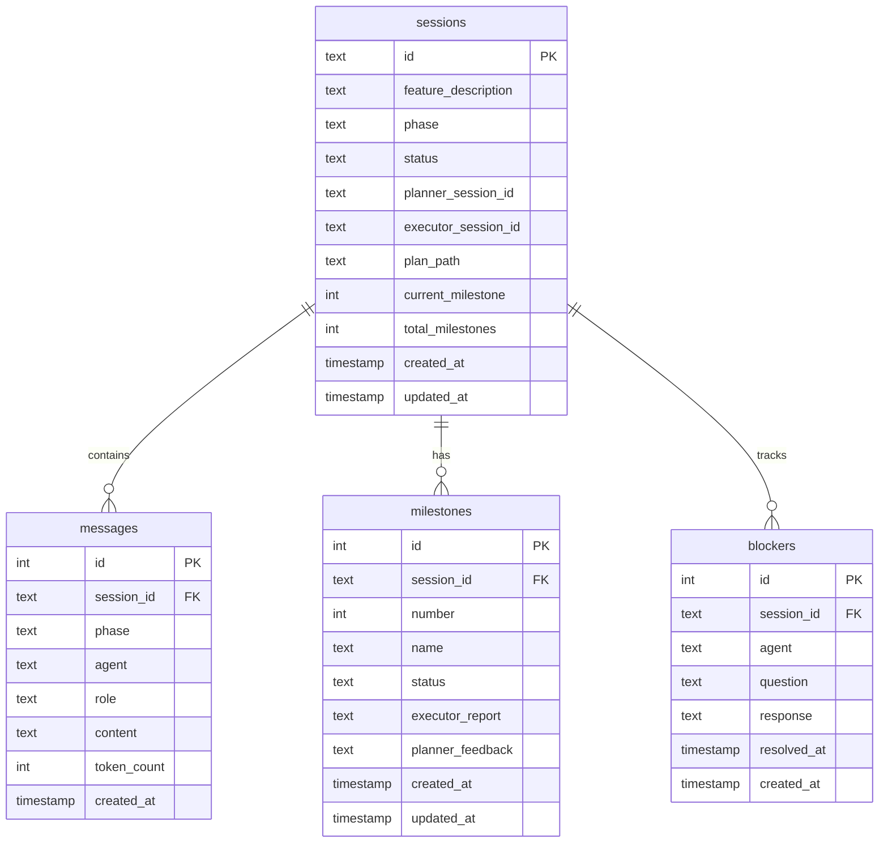

# Orchestrator Auto - Implementation Plan

## 1. Overview

Automate the two-agent orchestrator workflow using the Claude Agent SDK. The script manages Discovery → Planning → Execution phases, routes messages between Planner and Executor agents, persists state to SQLite, and handles context recovery via PreCompact hooks.

## 2. Architecture

### 2.1 Component Overview



### 2.2 Three-Phase Workflow



### 2.3 State Machine



### 2.4 Message Routing (Execution Phase)



### 2.5 Context Recovery Flow



## 3. File Structure

```
your-project/
├── CLAUDE_orchestrator.md              # Existing (unchanged)
├── orchestrator_auto/                  # New: package directory
│   ├── __init__.py
│   ├── __main__.py                     # CLI entry point
│   ├── cli.py                          # Argument parsing, commands
│   ├── engine.py                       # Main orchestrator logic
│   ├── agents.py                       # Agent creation, SDK wrappers
│   ├── state.py                        # State machine, phase transitions
│   ├── parser.py                       # Response parsing
│   ├── db.py                           # SQLite operations
│   ├── recovery.py                     # Context recovery, compact hooks
│   └── prompts.py                      # System prompts, templates
├── .claude_orchestrator/               # Runtime data (gitignore)
│   └── db.sqlite
├── pyproject.toml                      # Dependencies
└── tests/
    └── test_orchestrator_auto/
```

## 4. Milestones

---

### Milestone 1: Project Setup + SQLite Foundation

**Goal**: Establish project structure and persistence layer.

**Tasks**:
1. Create package directory structure
2. Set up `pyproject.toml` with dependencies:
   - `claude-agent-sdk>=0.1.16`
   - `click` (CLI framework)
   - Standard library: `sqlite3`, `asyncio`, `dataclasses`
3. Implement `db.py`:
   - Database initialization (create tables if not exist)
   - Session CRUD operations
   - Message logging
   - Milestone tracking
4. Write unit tests for database operations

**Deliverables**:
- [ ] Package structure created
- [ ] `pyproject.toml` with dependencies
- [ ] `db.py` with all CRUD operations
- [ ] Database schema implemented
- [ ] Unit tests passing

**Key References**:
- Database schema from draft doc

---

### Milestone 2: Agent Management + SDK Integration

**Goal**: Create agent wrappers and SDK integration.

**Tasks**:
1. Implement `agents.py`:
   - `PlannerAgent` class wrapping `ClaudeSDKClient`
   - `ExecutorAgent` class wrapping `ClaudeSDKClient`
   - System prompt configuration
   - Tool permissions (Read, Write, Edit, Bash, Glob, Grep)
2. Implement `recovery.py`:
   - `PreCompact` hook registration
   - Recovery prompt generation from SQL
   - Context injection
3. Implement `prompts.py`:
   - Planner system prompt (with response format tags)
   - Executor system prompt
   - Recovery prompt template
4. Write integration tests with mock responses

**Deliverables**:
- [ ] `agents.py` with PlannerAgent, ExecutorAgent
- [ ] `recovery.py` with PreCompact hook
- [ ] `prompts.py` with all templates
- [ ] Integration tests passing

**Key References**:
- SDK patterns from research
- Response format tags: `[MILESTONE_APPROVED]`, `[HUMAN_INPUT_NEEDED]`, `[PROGRESS_REPORT]`

---

### Milestone 3: State Machine + Response Parser

**Goal**: Implement phase transitions and response parsing.

**Tasks**:
1. Implement `state.py`:
   - `WorkflowState` dataclass
   - `StateMachine` class with phase transitions
   - State persistence to/from SQL
   - Valid transition rules:
     - discovery → planning (on `/ready`)
     - planning → execution (on plan approved)
     - execution → execution (milestone loop)
     - execution → completed (all milestones done)
     - any → paused (on blocker)
2. Implement `parser.py`:
   - Parse planner responses for:
     - `[MILESTONE_APPROVED]` → extract milestone number
     - `[HUMAN_INPUT_NEEDED]` → extract question
     - `[CHANGES_REQUESTED]` → extract feedback
   - Parse executor responses for:
     - `[PROGRESS_REPORT]` → extract report content
     - `[CLARIFICATION_NEEDED]` → route to planner
3. Write unit tests for parser and state machine

**Deliverables**:
- [ ] `state.py` with StateMachine
- [ ] `parser.py` with all parsers
- [ ] State transitions tested
- [ ] Parser patterns tested

**Key References**:
- Phase diagram from draft doc

---

### Milestone 4: Orchestrator Engine

**Goal**: Core orchestration logic connecting all components.

**Tasks**:
1. Implement `engine.py`:
   - `Orchestrator` class orchestrating agents
   - Discovery phase loop (human ↔ planner until `/ready`)
   - Planning phase (planner reads orchestrator.md, creates plan)
   - Execution phase loop:
     - Send milestone to executor
     - Receive progress report
     - Route to planner for validation
     - Auto-continue on approval
     - Pause on blocker
   - Token monitoring via `ResultMessage.usage`
   - Session resume support
2. Implement message routing:
   - Log all messages to SQL
   - Route executor reports to planner
   - Route planner feedback to executor
   - Route blockers to human (pause)
3. Write integration tests

**Deliverables**:
- [ ] `engine.py` with full orchestration
- [ ] All three phases working
- [ ] Message routing implemented
- [ ] Integration tests passing

**Key References**:
- Workflow diagram from draft doc

---

### Milestone 5: CLI Interface

**Goal**: User-facing command-line interface.

**Tasks**:
1. Implement `cli.py` using Click:
   - `--feature "description"` - Start new session
   - `--resume <session_id>` - Resume existing session
   - `--respond "answer"` - Respond to blocker
   - `--list` - List all sessions
   - `--status <session_id>` - Show session status
   - `--export <session_id>` - Export session log
2. Implement `__main__.py` for `python -m orchestrator_auto`
3. Add progress display:
   - Current phase indicator
   - Milestone progress bar
   - Agent activity indicator
4. Handle Ctrl+C gracefully (save state, clean exit)
5. Write CLI tests

**Deliverables**:
- [ ] `cli.py` with all commands
- [ ] `__main__.py` entry point
- [ ] Progress display working
- [ ] Graceful shutdown
- [ ] CLI tests passing

---

### Milestone 6: End-to-End Testing + Documentation

**Goal**: Validate complete workflow and document usage.

**Tasks**:
1. End-to-end test with real workflow:
   - Start session with feature description
   - Complete discovery phase
   - Verify plan creation
   - Execute through milestones
   - Test blocker handling
   - Test resume functionality
2. Test context recovery:
   - Simulate long session
   - Verify PreCompact hook triggers
   - Verify recovery prompt works
3. Update `CLAUDE_orchestrator.md`:
   - Add section for automated workflow
   - Document CLI commands
   - Add troubleshooting guide
4. Create `README.md` for the package

**Deliverables**:
- [ ] E2E test passing
- [ ] Context recovery tested
- [ ] `CLAUDE_orchestrator.md` updated
- [ ] Package README created

---

## 5. Response Format Tags

To enable reliable parsing, agents use structured tags:

### Planner Tags

```
[MILESTONE_APPROVED] Milestone N approved. Proceed to Milestone N+1.

[CHANGES_REQUESTED] Milestone N needs changes:
- Issue 1
- Issue 2

[HUMAN_INPUT_NEEDED] I need clarification on: <question>

[PLAN_READY] Implementation plan created at: <path>
Milestones: N total
Ready to start execution? (waiting for confirmation)
```

### Executor Tags

```
[PROGRESS_REPORT]
## Milestone N: Name - COMPLETED

### Files Created/Modified:
- path/to/file (created|modified)

### Test Results:
<output>

### Notes/Issues:
<notes>

### Ready for Review: YES
[/PROGRESS_REPORT]

[CLARIFICATION_NEEDED] I need the planner to clarify: <question>

[BLOCKED] Cannot proceed: <reason>
```

---

## 6. Database Schema

### 6.1 Entity Relationship Diagram



### 6.2 SQL Schema

```sql
CREATE TABLE sessions (
    id TEXT PRIMARY KEY,
    feature_description TEXT NOT NULL,
    phase TEXT NOT NULL DEFAULT 'discovery',
    status TEXT NOT NULL DEFAULT 'active',
    planner_session_id TEXT,
    executor_session_id TEXT,
    plan_path TEXT,
    current_milestone INTEGER DEFAULT 0,
    total_milestones INTEGER DEFAULT 0,
    created_at TIMESTAMP DEFAULT CURRENT_TIMESTAMP,
    updated_at TIMESTAMP DEFAULT CURRENT_TIMESTAMP
);

CREATE TABLE messages (
    id INTEGER PRIMARY KEY AUTOINCREMENT,
    session_id TEXT NOT NULL,
    phase TEXT NOT NULL,
    agent TEXT NOT NULL,
    role TEXT NOT NULL,
    content TEXT NOT NULL,
    token_count INTEGER,
    created_at TIMESTAMP DEFAULT CURRENT_TIMESTAMP,
    FOREIGN KEY (session_id) REFERENCES sessions(id)
);

CREATE TABLE milestones (
    id INTEGER PRIMARY KEY AUTOINCREMENT,
    session_id TEXT NOT NULL,
    number INTEGER NOT NULL,
    name TEXT,
    status TEXT NOT NULL DEFAULT 'pending',
    executor_report TEXT,
    planner_feedback TEXT,
    created_at TIMESTAMP DEFAULT CURRENT_TIMESTAMP,
    updated_at TIMESTAMP DEFAULT CURRENT_TIMESTAMP,
    FOREIGN KEY (session_id) REFERENCES sessions(id)
);

CREATE TABLE blockers (
    id INTEGER PRIMARY KEY AUTOINCREMENT,
    session_id TEXT NOT NULL,
    agent TEXT NOT NULL,
    question TEXT NOT NULL,
    response TEXT,
    resolved_at TIMESTAMP,
    created_at TIMESTAMP DEFAULT CURRENT_TIMESTAMP,
    FOREIGN KEY (session_id) REFERENCES sessions(id)
);

CREATE INDEX idx_messages_session ON messages(session_id);
CREATE INDEX idx_milestones_session ON milestones(session_id);
```

---

## 7. Dependencies

```toml
[project]
name = "orchestrator-auto"
version = "0.1.0"
requires-python = ">=3.10"
dependencies = [
    "claude-agent-sdk>=0.1.16",
    "click>=8.0",
]

[project.optional-dependencies]
dev = [
    "pytest>=7.0",
    "pytest-asyncio>=0.21",
]

[project.scripts]
orchestrator = "orchestrator_auto.cli:main"
```

---

## 8. Risk Mitigation

| Risk | Mitigation |
|------|------------|
| SDK API changes | Pin version, wrap SDK calls in our classes |
| Context overflow | PreCompact hook + proactive recovery |
| Response parsing fails | Fallback to human review, log unparsed responses |
| Agent session corrupts | Store all messages, allow session reset |
| Rate limits | Exponential backoff, respect API limits |

---

## 9. Success Criteria

- [ ] Can start a new session and complete discovery phase
- [ ] Plan is created and stored correctly
- [ ] Milestones execute with auto-approval on success
- [ ] Blockers pause for human input
- [ ] Sessions can be resumed after interruption
- [ ] Context recovery works on long sessions
- [ ] CLI is intuitive and provides good feedback

---

## Version History

| Version | Date | Changes |
|---------|------|---------|
| 1.0 | 2025-12-15 | Initial implementation plan |
| 1.1 | 2025-12-15 | Added Mermaid diagrams: architecture, workflow, state machine, sequence, ER |
