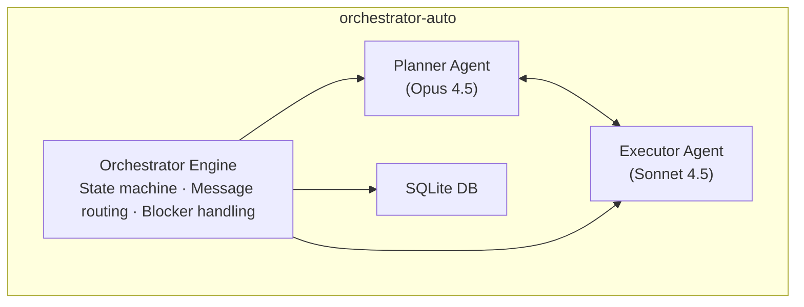
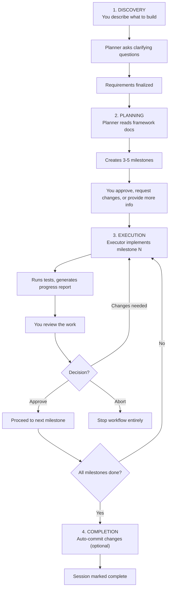

# Orchestrator Auto

**Automated two-agent workflow orchestration for complex software engineering tasks.**

A planner (Claude Opus) breaks your feature request into milestones. An executor (Claude Sonnet/Haiku) builds each milestone one at a time. You review and approve between milestones.

---

## Quick Start (5 Minutes)

### 1. Install & Verify

**Via Homebrew (recommended for end users):**
```bash
brew tap ailabph/orchestrator-auto
brew install orchestrator-auto
```

**Via pip:**
```bash
pip install orchestrator-auto        # Base install
pip install "orchestrator-auto[tui]" # With TUI support
```

**From source (development):**
```bash
cd orchestrator-auto
conda env create -f environment.yml && conda activate orchestrator-auto
pip install -e ".[tui]"
```

Then set up auth and verify:
```bash
export ANTHROPIC_API_KEY="sk-ant-api03-your-key"  # Or use Claude Pro OAuth token
orchestrator check  # Verify everything works
```

### 2. Start Your First Workflow

```bash
orchestrator start -f "Add email notifications to the user system"
```

The planner creates a plan with 3-5 milestones. You'll see:
1. **Planning phase** → Planner proposes milestones
2. **Approval** → You approve or request changes
3. **Execution** → Executor builds milestone 1, reports progress
4. **Review** → You review and approve before next milestone
5. **Repeat** → Milestones 2-5 follow same pattern

### 3. Approve a Milestone

When executor finishes a milestone:

```
✅ Milestone 1: EmailTemplate model + migrations
[code, tests, and a detailed progress report]

What's next?
```

You respond:
```
✅ Approved. Proceed to Milestone 2.
```

Or if there's an issue:
```
❌ Milestone 1 needs changes: Email validation should reject addresses with +, handle case-insensitive. Fix and regenerate.
```

### 4. Check Status Anytime

```bash
orchestrator list                    # See all sessions
orchestrator status <session-id>     # Check current milestone
orchestrator resume <session-id>     # Continue where you left off
```

---

## How It Works

### Architecture



### Workflow Execution Flow



**Key insight:** Executor STOPS after each milestone and waits for your approval. This prevents wasted compute on wrong directions.

### Workflow Phases

| Phase | Description |
|-------|-------------|
| Discovery | Refine requirements with planner |
| Planning | Create implementation plan with milestones |
| Execution | Execute milestones, planner reviews each |
| Completed | All milestones approved |
| Paused | Waiting for human input (blocker) |

---

## Module Map (For Agents)

**Entry points and key functions for agents exploring the codebase.**

| Module | Purpose | Key Entry Points |
|--------|---------|------------------|
| `cli.py` | CLI entry point | `start()`, `resume()`, `respond()`, `list_sessions()`, `helper()` |
| `engine.py` | Core orchestration | `Orchestrator` class, `run()`, `_run_discovery()`, `_run_planning()`, `_run_execution()` |
| `state.py` | State machine | `StateMachine`, `WorkflowState`, `transition()` |
| `parser.py` | Response parsing | `parse_planner_response()`, `parse_executor_response()`, `is_response_truncated()` |
| `agents.py` | Agent wrappers | `PlannerAgent`, `ExecutorAgent`, `create_planner_agent()`, `create_executor_agent()` |
| `db.py` | Persistence | `create_session()`, `get_session()`, `update_session()`, `create_blocker()` |
| `config.py` | Configuration | `load_config()`, `get_model_id()`, `load_mcp_config_raw()` |
| `telegram.py` | Notifications | `TelegramNotifier`, `send_blocker_notification()` |
| `git.py` | Auto-commit | `auto_commit()`, `get_staged_diff()` |
| `commit_ai.py` | AI commit messages | `generate_smart_commit_message()` |
| `secrets.py` | Secrets detection | `contains_secrets()` |
| `prompts.py` | System prompts | `PLANNER_SYSTEM_PROMPT`, `EXECUTOR_SYSTEM_PROMPT`, `MILESTONE_PROMPT` |
| `auth.py` | Auth detection | `detect_auth()`, `format_auth_display()` |
| `exceptions.py` | Custom exceptions | `OrchestratorError`, `AgentError`, `SessionStateError` |
| `recovery.py` | Context recovery | For compressed session handling |
| `output.py` | Activity display | `StreamingIndicator` |
| `input_handler.py` | CLI input | Multi-line paste support |
| `logging_config.py` | Session logging | Per-session file logging |
| `todo.py` | Batch task execution | `TodoRunner`, `run_todo_file()`, `parse_completion_tags()` |
| `todo_parser.py` | Checkbox file parsing | `parse_task_file()`, `update_task_file()`, `Task`, `TaskFile` |
| `convert.py` | Plan format conversion | `convert_plan()`, `validate_plan()`, `PlanConverter` |
| `controllers/queue_controller.py` | Queue mode orchestration | `QueueController`, `QueueEvent`, `QueueItem` |
| `controllers/watch_controller.py` | Watch mode orchestration | `WatchController`, `WatchEvent`, `FileState` |
| `tui/` | Text User Interface | `OrchestratorTUI`, `QueueTUI`, `WatchTUI`, widgets, screens |
| `explore.py` | Exploration sub-agent | `ExploreSubAgent`, `explore_async()`, `compact_findings()` |
| `validation/` | Validation sub-agents | `SecurityValidator`, `PerformanceValidator`, `APIValidator`, `ValidationPipeline` |
| `chat.py` | Direct chat interface | `ChatSession` |
| `playwright_test.py` | Playwright MCP verification | `run_playwright_test()`, `run_playwright_test_both()` |
| `io/` | Input/output abstraction | `ChunkEvent`, `StateChangeEvent`, `InputProvider`, `CLIInputProvider` |
| `resources/` | Bundled documentation | CLI_REFERENCE.md, CONFIGURATION.md, TROUBLESHOOTING.md |

### Database Tables

| Table | Purpose |
|-------|---------|
| `sessions` | Workflow metadata, phase, status, milestone counts |
| `messages` | All agent/user messages with token counts |
| `blockers` | Questions waiting for human answers |
| `milestones` | Plan structure and milestone statuses |
| `queue_items` | Batch execution queue state |
| `telegram_state` | Telegram polling cursor for reply routing |
| `exploration_results` | Pre-milestone codebase exploration findings |
| `session_errors` | Error tracking and debugging with stack traces |
| `tool_invocations` | Tool usage audit trails (SDK 0.1.22+) |
| `validation_results` | Post-milestone validation issues with severity counts |

---

## Common Workflows

### Build a Backend API

**Scenario:** Add a `/api/users` endpoint with authentication, validation, and tests.

```bash
orchestrator start -f "Add /api/users POST endpoint with email validation and password hashing"
```

**Typical milestones the planner creates:**
- M1: User model + database migrations
- M2: Serializer + password hashing + validation
- M3: API endpoint + authentication check
- M4: Unit tests + integration tests
- M5: Error handling + edge cases

**Your role:** Review each milestone, verify tests pass, approve before next.

### Build a Frontend Component

**Scenario:** Add a login form with validation and error handling.

```bash
orchestrator start -f "Build login form component with email/password fields, client-side validation, and error messages"
```

**Typical milestones:**
- M1: Component structure + styling
- M2: Form state management + validation
- M3: Error display + loading state
- M4: Integration with auth API
- M5: Accessibility + unit tests

**Your role:** Review screenshots after each milestone, approve styling before moving on.

### Refactor Existing Code

**Scenario:** Migrate authentication from sessions to JWT.

```bash
orchestrator start -f "Refactor authentication from session-based to JWT tokens, maintaining backward compatibility"
```

**Typical milestones:**
- M1: JWT generation + token validation logic
- M2: Middleware + protected routes
- M3: Migration script + session cleanup
- M4: Tests + security validation
- M5: Documentation + deployment guide

**Your role:** Test each milestone, verify no regressions.

### Cost-Saving with Cheaper Models

**Default:** Opus for planner, Sonnet for executor (most accurate).

**Budget option:** Use cheaper models for executor

```bash
orchestrator start -f "Add X feature" -pm sonnet -em haiku
```

Saves ~70% on execution cost. Planner (Opus) still plans well; executor just needs to follow instructions.

### Auto-Commit on Completion

**Scenario:** You trust the workflow and want automatic commits.

```bash
orchestrator start -f "Add feature" --auto-commit
```

Or with AI-generated commit messages:

```bash
orchestrator start -f "Add feature" --auto-commit --smart-commit
```

**Note:** Never pushes automatically. Only creates local commits.

### Batch Process Multiple Features (Queue Mode)

**Scenario:** You have 3 features to build, want them sequential.

Create plan files:
- `plan1.md` - "Add user authentication"
- `plan2.md` - "Add email notifications"
- `plan3.md` - "Add password reset"

Then run them sequentially:

```bash
orchestrator start --queue plan1.md plan2.md plan3.md
```

Each plan becomes its own session. When plan1 completes, plan2 starts automatically. If a plan hits a blocker, queue pauses—resolve with `orchestrator resume <id>`, then queue continues.

**Resume existing queue:**
```bash
orchestrator start --queue
```

**Reset queue (clear failed/paused items):**
```bash
orchestrator start --queue --queue-reset
```

### Watch a Directory for New Plans

**Scenario:** Continuous delivery—drop plans in a folder, they execute automatically.

```bash
orchestrator watch ./plans/ --auto-commit
```

**With custom models and smart commits:**
```bash
orchestrator watch ./plans/ -pm sonnet -em haiku --auto-commit --smart-commit
```

**With MCP tools (e.g., Playwright):**
```bash
orchestrator watch ./plans/ --mcp-config .mcp.json --headless
```

**What happens:**
1. Drop `feature-x.md` into `./plans/`
2. Watcher sees it, validates it (use `--convert` to auto-convert invalid plans)
3. Orchestrator executes it
4. On completion: `feature-x.md` → `feature-x_done.md` (auto-committed)

### Direct Chat (No Orchestration)

**Scenario:** Quick questions or ad-hoc tasks without the full workflow.

```bash
orchestrator chat                              # Default (Sonnet with tools)
orchestrator chat -m opus                      # Use Opus
orchestrator chat --no-tools                   # Pure chat mode
orchestrator chat -s "You are a Python expert" # Custom system prompt
```

### AI Documentation Assistant

**Scenario:** Get instant answers about orchestrator-auto from the bundled documentation.

```bash
orchestrator helper "how do I use queue mode?"           # Ask with quotes
orchestrator helper how do I resume a session            # Or without quotes
orchestrator helper "what models are available?" -m opus # Use a different model
orchestrator helper "how to setup telegram?" -v          # Verbose mode (shows docs used)
```

The helper uses AI (default: Haiku for low cost) to answer your questions based on bundled documentation. It cannot access your filesystem—answers come only from README, CLI reference, configuration guide, and troubleshooting docs.

### Text User Interface (TUI)

**Scenario:** Rich terminal interface for monitoring workflows with real-time updates.

```bash
pip install orchestrator-auto[tui]  # Install TUI dependencies

orchestrator watch ./plans/ --tui         # Watch mode TUI
orchestrator todo tasks.md --tui          # Todo mode TUI
```

**TUI Features:**
- Real-time streaming output with syntax highlighting
- Status panel showing phase, models, API calls, tokens, elapsed time
- Milestone progress tracking with visual checkmarks
- Log panel for orchestrator messages with filtering
- Input modals for blocker/discovery prompts
- Responsive layouts adapting to terminal width
- **Layout B (Watch mode):** Compact 3-column layout with sub-agent integration
  - HeaderBar with session/model info and milestone progress bar
  - SubAgentPanel showing exploration queries and validation status
  - StatsPanel with session totals, per-file stats, and per-agent breakdown (Planner/Executor/Explore)
  - Thinking token tracking for Claude extended thinking mode
  - Task progress (N/M tasks) and files changed per milestone
  - WatchPanel with files organized by category: PENDING, ONGOING, DONE, PAUSED, FAILED

**Watch Mode TUI Keybindings (press `?` for full list):**
| Key | Action |
|-----|--------|
| `q` | Quit |
| `?` | Show help |
| `r` | Respond to blocker |
| `y` | Copy session ID to clipboard |
| `b` | View full blocker question |
| `p` | Pause/resume directory polling |
| `g` | Show git diff |
| `Tab` | Focus next panel |
| `j`/`k` | Scroll down/up in focused panel |
| `1`/`2`/`3` | Log filter (errors/+warnings/all) |

### Batch Task Execution (Todo Mode)

**Scenario:** Execute a checklist of independent tasks with fresh agent context per task.

Create a markdown file with checkbox tasks:

```markdown
# tasks.md
- [ ] Add input validation to `src/api/users.py`
- [ ] Write unit tests for the UserService class @tests/test_users.py
- [ ] Update API documentation in README
```

Run all pending tasks:

```bash
orchestrator todo tasks.md                    # Execute pending tasks
orchestrator todo tasks.md --retry-failed     # Also retry [!] tasks
orchestrator todo tasks.md --dry-run          # Preview without executing
orchestrator todo tasks.md -m haiku           # Use cheaper model
orchestrator todo tasks.md --verbose          # Show full agent output
orchestrator todo tasks.md --timeout 600      # 10 min timeout per task
orchestrator todo tasks.md --results out.md   # Write detailed results
orchestrator todo tasks.md --mcp-config .mcp.json  # With MCP tools
orchestrator todo tasks.md --tui              # TUI mode
```

**Task file format:**
- `[ ]` = pending (will execute)
- `[x]` = done (skipped)
- `[!]` = failed (skipped unless `--retry-failed`)
- `@path/to/file` = inject file contents as context

**Key features:**
- Fresh agent context per task (no token accumulation)
- Atomic file updates (crash-safe)
- Per-task timeout (default 5 min)
- MCP tool support via `--mcp-config`
- Multi-line tasks with blank lines and nested bullets

**Example with file references:**

```markdown
- [ ] Review and fix type errors in @src/models/user.py
- [ ] Refactor authentication logic per @docs/auth-spec.md
- [ ] Add tests for @src/services/email.py following @tests/test_example.py pattern
```

**Example with multi-line tasks:**

```markdown
- [ ] **auth_test.py** - Test HMAC Authentication

  Build a CLI tool `scripts/cli/auth_test.py` for testing.

  Requirements:
  - Create a shared HMAC client module
  - Load API keys from `.env`
  - Display response fields

---

- [ ] **deposit_create.py** - Create Deposit

  Build a CLI tool for creating deposits.

  Requirements:
  - Prompt for required fields
  - Handle success/error responses
```

Tasks can span multiple lines with blank lines between paragraphs. The parser stops at `---` dividers, `#` headings, or the next checkbox.

### Force-Complete Stuck Sessions

**Scenario:** Session finished all work but is stuck due to incorrect milestone count or unresolvable blocker.

```bash
orchestrator complete <session-id>                    # Force-complete
orchestrator complete <session-id> --auto-commit      # Complete and commit
orchestrator complete <session-id> --auto-commit --smart-commit  # With AI commit message
```

### Convert Plans to Orchestrator Format

**Scenario:** You have a markdown plan that doesn't follow orchestrator milestone format.

```bash
orchestrator convert plan.md                          # Output to stdout
orchestrator convert plan.md -o converted.md          # Output to file
orchestrator convert plan.md --in-place               # Modify in place (creates backup)
orchestrator convert plan.md --in-place --no-backup   # In-place without backup
orchestrator convert plan.md --validate-only          # Check if already valid
orchestrator convert plan.md --dry-run                # Preview without writing
orchestrator convert plan.md --max-milestones 7       # Limit milestone count
orchestrator convert plan.md -m haiku                 # Use cheaper model for conversion
```

### Kill Orphaned MCP Processes

**Scenario:** Playwright MCP servers left running after crashed sessions.

```bash
orchestrator cleanup                     # Kill MCP servers only (safe)
orchestrator cleanup --dry-run           # Preview what would be killed
orchestrator cleanup --all               # Also kill browser processes
orchestrator cleanup -p "my-mcp"         # Custom pattern
```

### Test Playwright MCP Integration

**Scenario:** Verify Playwright MCP tools work with your agents.

```bash
orchestrator test-playwright planner --test-url http://localhost:3000/
orchestrator test-playwright executor --test-url http://localhost:3000/
orchestrator test-playwright both --test-url http://localhost:3000/
orchestrator test-playwright executor --test-url URL --mcp-config .mcp.json
orchestrator test-playwright executor --test-url URL --timeout 120 --out-dir ./artifacts
orchestrator test-playwright executor --test-url URL -m haiku -v  # Cheaper model, verbose
```

---

## Quick Reference

**I want to...** → **Use these flags:**

| Goal | Command |
|------|---------|
| Start a basic workflow | `orchestrator start -f "Feature"` |
| Save money on API costs | `orchestrator start -f "Feature" -pm sonnet -em haiku` |
| Auto-commit when done | `orchestrator start -f "Feature" --auto-commit` |
| Auto-commit with AI messages | `orchestrator start -f "Feature" --auto-commit --smart-commit` |
| Choose AI commit model | `orchestrator start -f "Feature" --auto-commit --auto-commit-model haiku` |
| Use an existing plan file | `orchestrator start --plan docs/plan.md` |
| Run multiple plans sequentially | `orchestrator start --queue plan1.md plan2.md plan3.md` |
| Reset queue (clear failed items) | `orchestrator start --queue --queue-reset` |
| Keep plan filename on completion | `orchestrator start --plan plan.md --no-rename` |
| Debug mode (full stack traces) | `orchestrator start -f "Feature" --debug` |
| Use TUI dashboard | `orchestrator start -f "Feature" --tui` |
| Monitor a folder for new plans | `orchestrator watch ./plans/ --auto-commit` |
| Get notifications via Telegram | `orchestrator start -f "Feature" --telegram` |
| Use Playwright for browser tests | `orchestrator start -f "E2E tests" --mcp-config .mcp.json` |
| Run headless (no browser window) | `orchestrator start -f "Feature" --mcp-config .mcp.json --headless` |
| Resume a paused workflow | `orchestrator resume <session-id>` |
| Resume with auto-commit | `orchestrator resume <session-id> --auto-commit --smart-commit` |
| Answer a blocker question | `orchestrator respond <session-id> "Yes, proceed with approach A"` |
| Answer blocker with TUI | `orchestrator respond <session-id> "answer" --tui` |
| See all sessions | `orchestrator list` |
| Check session details | `orchestrator status <session-id>` |
| Force-complete stuck session | `orchestrator complete <session-id>` |
| Convert plan to orchestrator format | `orchestrator convert plan.md -o out.md` |
| Kill orphaned MCP processes | `orchestrator cleanup --dry-run` |
| Test Playwright MCP integration | `orchestrator test-playwright executor --test-url URL` |
| Export session to markdown | `orchestrator export <session-id> -o report.md` |
| Direct chat (no orchestration) | `orchestrator chat` or `orchestrator chat -m opus` |
| Chat with custom system prompt | `orchestrator chat -s "You are a security expert"` |
| Ask questions about orchestrator | `orchestrator helper "how do I use queue mode?"` |
| Run a checklist of tasks | `orchestrator todo tasks.md` |
| Run tasks with cheaper model | `orchestrator todo tasks.md -m haiku` |
| Use TUI for watch mode | `orchestrator watch ./plans/ --tui` |
| Use TUI for todo mode | `orchestrator todo tasks.md --tui` |
| Test Telegram config | `orchestrator telegram test` |
| Listen for Telegram replies | `orchestrator telegram listen` |
| Ping Telegram bot | `orchestrator telegram ping` |
| Disable file rewind on rejection | `orchestrator start -f "Feature" --no-rewind` |
| Set planner reasoning effort | `orchestrator start -f "Feature" --planner-effort high` |
| Set executor reasoning effort | `orchestrator start -f "Feature" --executor-effort medium` |
| Enable extended thinking | `orchestrator start -f "Feature" --thinking adaptive` |
| Set thinking budget | `orchestrator start -f "Feature" --thinking 10000` |
| Verify setup | `orchestrator check` |

---

## Troubleshooting Basics

### Blocker paused my workflow

Check what the blocker is asking:
```bash
orchestrator status <session-id>
```

Respond to continue:
```bash
orchestrator respond <session-id> "Your answer here"

# Or with TUI for rich visual feedback:
orchestrator respond <session-id> "Your answer here" --tui
```

### API key doesn't work

```bash
orchestrator check  # Diagnose the issue
```

Common fixes:
- API key format: Should be `sk-ant-api03-...` (not `sk-ant-oat01-...` which is OAuth)
- No credits: Visit https://console.anthropic.com/account/billing/overview
- Wrong variable: Use `ANTHROPIC_API_KEY` for API keys

### Workflow stuck / no progress

**Diagnose and fix:**

```bash
orchestrator status <session-id>              # Check state and blockers
orchestrator respond <session-id> "answer"    # Answer pending blocker
orchestrator reset <session-id>               # Reset stale heartbeat
orchestrator resume <session-id>              # Resume paused session
orchestrator resume <session-id> --force      # Force resume orphaned session
orchestrator complete <session-id>            # Force-complete if stuck at end
```

| Symptom | Solution |
|---------|----------|
| Blocker waiting | `orchestrator respond <id> "answer"` |
| Orphaned (crashed) | `orchestrator resume <id> --force` |
| Stale heartbeat | `orchestrator reset <id>` then `resume` |
| Finished but stuck | `orchestrator complete <id>` |

### Where are the logs?

```
~/.claude_orchestrator/logs/error_<session-id>_<timestamp>.log
```

Use `--debug` flag for immediate stack traces:
```bash
orchestrator start -f "Feature" --debug
```

---

## Response Tags

Communication protocol between agents and orchestrator.

### Planner Tags

| Tag | Meaning |
|-----|---------|
| `[PLAN_READY]` | Plan created, ready for approval (wraps `[PLAN_CONTENT]...[/PLAN_CONTENT]`) |
| `[MILESTONE_APPROVED]` | Proceed to next milestone |
| `[CHANGES_REQUESTED]` | Revisions needed on current milestone |
| `[HUMAN_INPUT_NEEDED]` | Blocker - need human decision |

### Executor Tags

| Tag | Meaning |
|-----|---------|
| `[PROGRESS_REPORT]...[/PROGRESS_REPORT]` | Milestone complete, reporting results (paired tag) |
| `[CLARIFICATION_NEEDED]` | Need info to proceed |
| `[BLOCKED]` | External dependency or error |

---

## Installation

### Homebrew (recommended)

```bash
brew tap ailabph/orchestrator-auto
brew install orchestrator-auto
```

Upgrade to the latest version:
```bash
brew upgrade orchestrator-auto
```

### pip

```bash
pip install orchestrator-auto           # Base install
pip install "orchestrator-auto[tui]"    # With TUI support
pip install "orchestrator-auto[telegram]" # With Telegram support
```

### From source (development)

```bash
# 1. Navigate to directory
cd orchestrator-auto

# 2. Create conda environment
conda env create -f environment.yml
conda activate orchestrator-auto

# 3. Install
pip install -e .              # Base install
pip install -e ".[tui]"       # With TUI support (optional)
```

### Authentication (all install methods)

```bash
# Option A: Claude Pro/Max subscription (recommended)
claude login
claude setup-token
export CLAUDE_CODE_OAUTH_TOKEN="sk-ant-oat01-your-token"

# Option B: API key (pay-as-you-go)
export ANTHROPIC_API_KEY="sk-ant-api03-your-key"

# Verify installation and auth
orchestrator check
```

### Authentication Methods

| Method | Env Variable | Billing | Best For |
|--------|--------------|---------|----------|
| **Claude Subscription** | `CLAUDE_CODE_OAUTH_TOKEN` | Pro/Max plan | Personal use, included usage |
| **API Key** | `ANTHROPIC_API_KEY` | Pay-per-use | Teams, high volume, CI/CD |

**Important:**
- Don't set both variables simultaneously
- OAuth tokens (`sk-ant-oat01-...`) → `CLAUDE_CODE_OAUTH_TOKEN`
- API keys (`sk-ant-api03-...`) → `ANTHROPIC_API_KEY`

---

## Model Selection

| Alias | Model ID |
|-------|----------|
| `opus` | `claude-opus-4-6` |
| `sonnet` | `claude-sonnet-4-6` |
| `haiku` | `claude-haiku-4-5-20251001` |

**Defaults:** Planner = Opus, Executor = Sonnet

### Cost Optimization

| Setup | Command | Cost | Use Case |
|-------|---------|------|----------|
| Default | `orchestrator start -f "Feature"` | ~$1-5/feature | Most accurate |
| Budget | `orchestrator start -f "Feature" -pm sonnet -em haiku` | ~$0.3-1/feature | Simple features |
| Complex | `orchestrator start -f "Feature" -pm opus -em opus` | ~$5-15/feature | Hard problems |

---

## Documentation

| Document | Content |
|----------|---------|
| [CLI Reference](docs/CLI_REFERENCE.md) | Full command reference with all options |
| [Configuration](docs/CONFIGURATION.md) | Models, Telegram, MCP tools, auth, smart commit |
| [Architecture](docs/ARCHITECTURE.md) | Code design, data flow, patterns, database schema |
| [Troubleshooting](docs/TROUBLESHOOTING.md) | Detailed issue resolution and debugging |
| [Changelog](CHANGELOG.md) | Version history |

---

## Development

### Project Structure

```
orchestrator-auto/
├── orchestrator_auto/
│   ├── cli.py               # CLI interface
│   ├── engine.py            # Core orchestration
│   ├── state.py             # State machine
│   ├── parser.py            # Response parsing
│   ├── agents.py            # Agent wrappers
│   ├── config.py            # Model config
│   ├── db.py                # Database ops
│   ├── auth.py              # Auth detection
│   ├── chat.py              # Direct chat interface
│   ├── git.py               # Auto-commit
│   ├── commit_ai.py         # AI commit messages
│   ├── secrets.py           # Secrets detection
│   ├── telegram.py          # Telegram notifications
│   ├── recovery.py          # Context recovery
│   ├── prompts.py           # System prompts
│   ├── exceptions.py        # Custom exceptions
│   ├── logging_config.py    # Per-session logging
│   ├── output.py            # Activity display
│   ├── input_handler.py     # Multi-line paste support
│   ├── explore.py           # Exploration sub-agent
│   ├── convert.py           # Plan format conversion
│   ├── todo.py              # Batch task execution
│   ├── todo_parser.py       # Checkbox file parsing
│   ├── playwright_test.py   # Playwright MCP verification
│   ├── controllers/
│   │   ├── queue_controller.py  # Queue mode orchestration
│   │   └── watch_controller.py  # Watch mode orchestration
│   ├── validation/          # Post-milestone validators
│   │   ├── security.py      # SQL injection, XSS, secrets
│   │   ├── performance.py   # N+1 queries, sync-in-async
│   │   ├── api.py           # Missing validation, hardcoded URLs
│   │   └── pipeline.py      # Parallel validation runner
│   ├── io/                  # Input/output abstraction
│   │   ├── events.py        # ChunkEvent, StateChangeEvent
│   │   └── input_provider.py # InputProvider, CLIInputProvider
│   ├── resources/           # Bundled docs for helper command
│   └── tui/                 # Text User Interface
│       ├── app.py           # OrchestratorTUI
│       ├── queue_app.py     # QueueTUI
│       ├── watch_app.py     # WatchTUI
│       ├── todo_app.py      # TodoTUI
│       ├── adapter.py       # Thread-safe adapters
│       ├── messages.py      # Custom messages
│       ├── bindings.py      # Keybindings
│       ├── widgets/         # UI widgets
│       ├── screens/         # Modal screens
│       └── styles/          # Theme CSS
├── tests/
├── docs/
└── README.md
```

### Running Tests

```bash
pytest tests/ -v
pytest tests/ --cov=orchestrator_auto
```

---

## Dependencies

| Package | Required Version | Purpose |
|---------|------------------|---------|
| `claude-agent-sdk` | ≥0.1.50 | Claude Code Python SDK |
| `click` | ≥8.0 | CLI framework |
| `prompt_toolkit` | ≥3.0 | Multi-line input handling |
| `pyyaml` | ≥6.0 | Configuration files |
| `textual` | ≥0.80.0 | TUI framework (optional) |
| `httpx` | ≥0.27 | Telegram support (optional) |

---

## Claude Agent SDK Features

orchestrator-auto is built on the [Claude Agent SDK](https://github.com/anthropics/claude-agent-sdk-python), which provides the same tools, agent loop, and context management that power Claude Code.

### Sub-Agents

The SDK supports spawning sub-agents via the `Task` tool for focused subtasks:

| Built-in Sub-Agent | Purpose |
|--------------------|---------|
| `Explore` | Fast codebase exploration and search |
| `Plan` | Implementation planning and architecture |
| `general-purpose` | Research and multi-step tasks |

**orchestrator-auto Sub-Agents** (Phase 1):

| Sub-Agent | Model | Purpose | Governance |
|-----------|-------|---------|------------|
| `ExploreSubAgent` | Sonnet | Pre-milestone codebase discovery (read-only) | 25K tokens, 5 turns, 30s timeout |
| `CommitAI` | Sonnet | AI-generated commit messages | 30s timeout |
| `ValidationPipeline` | N/A (pattern-based) | Post-milestone code analysis | 3 validators in parallel, 45s total |

**Exploration** gathers context before execution:
```bash
orchestrator start -f "Add auth" --explore --explore-query "Find existing auth patterns"
```

**Validation** checks code quality after execution:
```bash
orchestrator start -f "Add API endpoint" --validate --validators security,api
```

Built-in validators:
- **SecurityValidator** - SQL injection, XSS, secrets, path traversal
- **PerformanceValidator** - N+1 queries, unbounded queries, sync-in-async
- **APIValidator** - Missing validation, inconsistent errors, hardcoded URLs

> **Note:** Sub-agent flags are accepted in v1.3.0 but not yet wired into execution flow.

**Custom sub-agents** can be defined programmatically:

```python
from claude_agent_sdk.types import AgentDefinition

my_subagent = AgentDefinition(
    description="Backend API specialist",
    prompt="You are an expert in REST API design...",
    tools=["Read", "Write", "Edit", "Bash"],
    model="sonnet",  # or "opus", "haiku", "inherit"
)
```

**Constraints:**
- Sub-agents cannot spawn other sub-agents (no nesting)
- Each sub-agent starts with fresh context
- Multiple sub-agents can run in parallel

### SDK Version Compatibility

| SDK Version | Status | Key Features |
|-------------|--------|--------------|
| 0.1.50 | Current minimum | All features below included |
| 0.1.50 | - | `get_session_info()`, `tag_session()`, `rename_session()`, typed `RateLimitEvent`, per-turn `AssistantMessage.usage` |
| 0.1.46 | - | `effort` field, `ThinkingConfig` types, `ResultMessage.stop_reason` |
| 0.1.40 | - | Forward-compatible message parsing |
| 0.1.23 | - | `get_mcp_status()` for MCP health checks |
| 0.1.22 | - | `tool_use_result` for audit trails |
| 0.1.17 | - | `uuid` field, `rewind_files()` for file rollback |
| 0.1.16 | - | Rate limit detection |

---

## Related

- [CLAUDE_orchestrator.md](../CLAUDE_orchestrator.md) - Framework docs
- [Claude Agent SDK](https://github.com/anthropics/claude-agent-sdk-python) - SDK docs (current: v0.1.50+)
- [Subagents in the SDK](https://platform.claude.com/docs/en/agent-sdk/subagents) - Official sub-agent documentation

## Future Planned Features

- [x] `orchestrator helper "your question"` powered by haiku, referencing the README file
- [x] `orchestrator start --tui` and `orchestrator start --plan path/to/complex_plan.md --tui`
