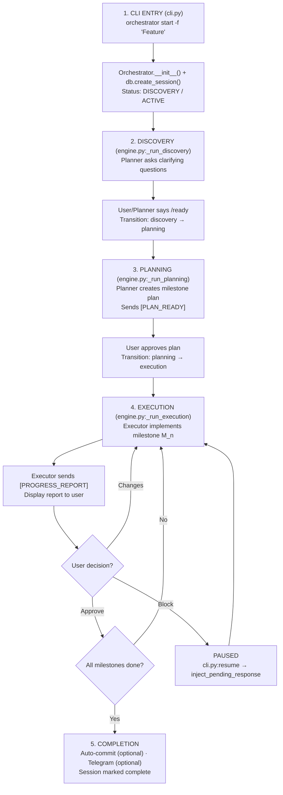
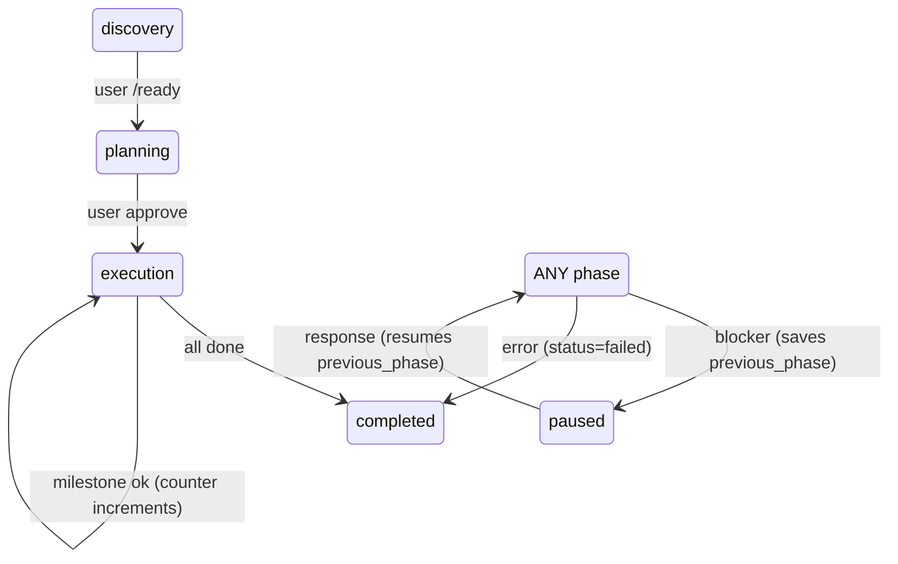
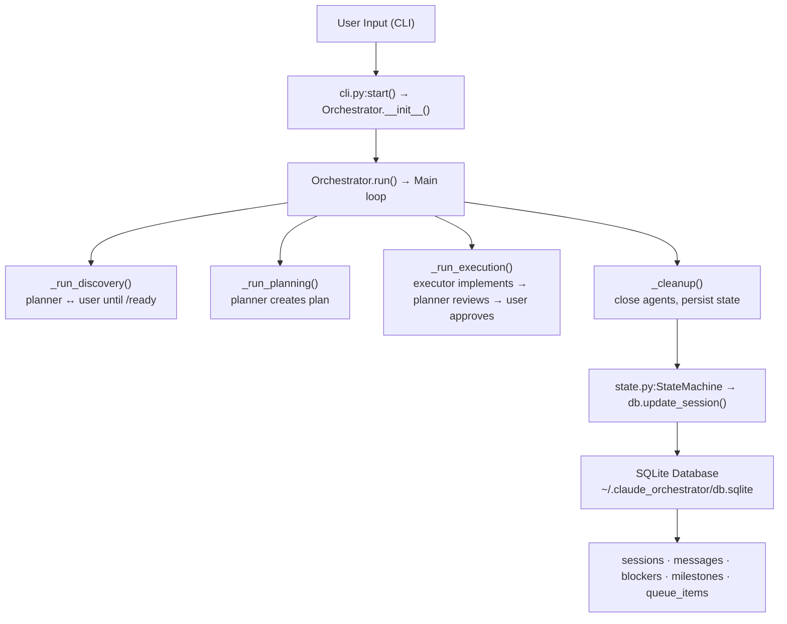
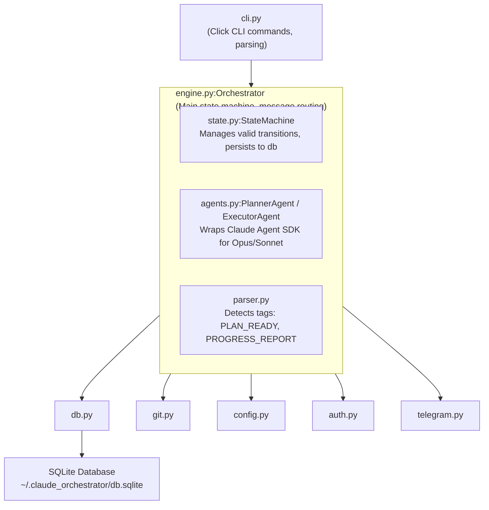

# Code Architecture & Design

**For developers and agents exploring the codebase.**

## Where to Start (Entry Points)

If you want to understand how orchestrator-auto works at the code level, start here:

**User-facing entry:** `orchestrator_auto/cli.py`
- Click command definitions
- Parses CLI flags
- Calls `Orchestrator` class to start/resume sessions
- Handles output and signal handling

**Core orchestration:** `orchestrator_auto/engine.py:Orchestrator`
- Main state machine and workflow controller
- Routes messages between Planner and Executor agents
- Manages transitions: discovery → planning → execution → completion
- Handles blockers (human input needed)

**Session state:** `orchestrator_auto/state.py:StateMachine`
- Defines phases (discovery, planning, execution, completed, paused)
- Defines statuses (active, paused, completed, failed)
- Manages valid transitions
- Persists state to database

**Response parsing:** `orchestrator_auto/parser.py`
- Detects `[PLAN_READY]`, `[PROGRESS_REPORT]`, `[BLOCKED]` tags
- Extracts data from responses
- Detects truncated responses (auto-continue on incomplete)

**Agent wrappers:** `orchestrator_auto/agents.py`
- `PlannerAgent` - Claude Opus, creates plans, reviews reports
- `ExecutorAgent` - Claude Sonnet/Haiku, implements milestones
- Converts messages to Agent SDK format

---

## Session Lifecycle (Birth → Death)

Every session follows this path through the code:



---

## State Machine & Transitions

The `state.py:StateMachine` controls all phase transitions. Valid transitions:



**Key insight:** Executor STOPS after each milestone. Planner reviews the report. User approves/rejects. This is enforced by `engine.py:_route_to_planner()` which requires explicit approval before proceeding.

---

## High-Level Data Flow



---

## Module Interaction Diagram



---

## Key Classes & Responsibilities

| Class | File | Responsibility |
|-------|------|----------------|
| `Orchestrator` | engine.py | Main loop: runs discovery → planning → execution. Routes messages between planner/executor. Handles blockers. |
| `StateMachine` | state.py | Validates phase transitions. Persists state to database. Tracks current milestone. |
| `WorkflowState` | state.py | Data class: current phase, status, milestone count, feature description. |
| `PlannerAgent` | agents.py | Wraps Claude Opus. Creates plans, reviews executor reports, requests changes. |
| `ExecutorAgent` | agents.py | Wraps Claude Sonnet/Haiku. Implements milestones, runs tests, generates reports. |
| `TelegramNotifier` | telegram.py | Sends workflow notifications (start, milestone, blocker, complete). |
| `OrchestratorError` | exceptions.py | Custom exception for orchestrator-specific errors. |

---

## Database Schema (Key Tables)

```
sessions
├─ id (TEXT, primary key)                  # Unique session identifier
├─ feature_description (TEXT)              # "Add user authentication"
├─ phase (TEXT)                            # discovery | planning | execution | completed | paused
├─ status (TEXT)                           # active | paused | completed | failed
├─ current_milestone (INT)                 # Current milestone being executed (0 = not in execution)
├─ total_milestones (INT)                  # Total number of milestones in plan
├─ planner_session_id (TEXT)               # Claude Agent SDK session ID for planner
├─ executor_session_id (TEXT)              # Claude Agent SDK session ID for executor
├─ plan_path (TEXT)                        # Path to saved plan file
├─ previous_phase (TEXT)                   # Phase before pause (for resume)
├─ project_id (TEXT)                       # Git repo root (for project scoping)
├─ created_at, updated_at (TIMESTAMP)      # Metadata

messages
├─ session_id (FK sessions)                # Which session this message belongs to
├─ phase (TEXT)                            # Which phase the message was sent in
├─ agent (TEXT)                            # "planner" | "executor" | "user"
├─ role (TEXT)                             # "user" | "assistant" (for agent SDK)
├─ content (TEXT)                          # Full message content
├─ token_count (INT)                       # Token count of message

blockers
├─ session_id (FK sessions)
├─ phase (TEXT)                            # Phase when blocker occurred
├─ agent (TEXT)                            # "planner" | "executor"
├─ question (TEXT)                         # The question asked
├─ response (TEXT)                         # Human's answer (null until answered)
├─ created_at, resolved_at (TIMESTAMP)

milestones
├─ session_id (FK sessions)
├─ milestone_number (INT)                  # 1, 2, 3, ...
├─ title (TEXT)                            # "User model + migrations"
├─ description (TEXT)                      # Milestone description from plan
├─ status (TEXT)                           # pending | in_progress | approved | rejected
```

---

## Response Tag Parsing & Routing

The `parser.py` module detects tags in agent responses and routes them:

**Planner Tags:**
```
[PLAN_READY] Path: plan.md Milestones: 5
[PLAN_CONTENT]...[/PLAN_CONTENT]
  └─ Returns: (PLANNER_PLAN_READY, {"path": "...", "milestones": 5, "content": "..."})
  └─ engine.py receives → saves plan, transitions to execution

[MILESTONE_APPROVED] Milestone 2 is good!
  └─ Returns: (PLANNER_APPROVED, {"milestone": 2})
  └─ engine.py receives → approval, proceed to next milestone

[CHANGES_REQUESTED] Milestone 3 needs:
  - Better error handling
  - Add logging
  └─ Returns: (PLANNER_CHANGES_REQUESTED, {"issues": [...]})
  └─ engine.py receives → re-run executor with feedback

[HUMAN_INPUT_NEEDED] Should we use Redis or in-memory cache?
  └─ Returns: (PLANNER_BLOCKED, {"question": "..."})
  └─ engine.py receives → create blocker, pause workflow
```

**Executor Tags:**
```
[PROGRESS_REPORT] Milestone 1 complete
Code: ...
Tests: ...
  └─ Returns: (EXECUTOR_REPORT, {...})
  └─ engine.py receives → display to user, wait for approval

[CLARIFICATION_NEEDED] What database should I use, PostgreSQL or SQLite?
  └─ Returns: (EXECUTOR_CLARIFICATION, {"question": "..."})
  └─ engine.py receives → create blocker, pause workflow

[BLOCKED] Cannot run tests, pytest not installed
  └─ Returns: (EXECUTOR_BLOCKED, {"reason": "..."})
  └─ engine.py receives → create blocker, pause workflow

Truncated Response: (ends with "Let me continue..." or "Thinking about...")
  └─ parser.py:is_response_truncated() detects incomplete response
  └─ engine.py receives → sends APPROVAL_CONTINUATION_TEMPLATE
  └─ Agent continues from where it left off (token limit recovery)
```

---

## Blocker Mechanics

When an agent needs human input:

1. **Agent sends** `[HUMAN_INPUT_NEEDED]` or `[BLOCKED]` tag
2. **Parser detects** it → `parse_planner_response()` or `parse_executor_response()`
3. **Engine creates blocker** → `db.create_blocker(session_id, question)`
4. **Engine pauses** → `state.transition(HUMAN_INPUT_NEEDED)` → phase=paused, previous_phase saved
5. **User sees prompt** with the question
6. **User responds** → `orchestrator respond <session-id> "answer"`
7. **CLI resumes** → `Orchestrator.run(session_id=...)`
8. **Engine injects response** → `_inject_pending_response()` adds answer to agent's conversation
9. **Agent continues** from where it paused
10. **State transitions** back to previous_phase

**Key code locations:**
- Create blocker: `db.py:create_blocker()`
- Pause workflow: `state.py:transition(HUMAN_INPUT_NEEDED)`
- Resume: `engine.py:_inject_pending_response()`

---

## Design Patterns Used

1. **State Machine Pattern** (`state.py`)
   - Validates transitions, prevents invalid states
   - Single source of truth for phase/status

2. **Message Queue Pattern** (`db.py:messages table`)
   - All messages stored persistently
   - Conversation history available for resume
   - Agents load history on resume for context

3. **Context Manager Pattern** (`db.py:get_connection()`)
   - Automatic connection cleanup
   - Transaction handling (commit/rollback)

4. **Adapter Pattern** (`agents.py`)
   - Wraps Claude Agent SDK for planner/executor
   - Abstracts away SDK complexity

5. **Factory Pattern** (`agents.py:create_planner_agent()`, `create_executor_agent()`)
   - Creates agents with proper configuration
   - Handles model selection, MCP tools, etc.

6. **Template Method Pattern** (`prompts.py`)
   - Standard prompts for discovery, planning, milestone execution
   - Templates injected with variables (feature, milestone number, etc.)

7. **Command Pattern** (`cli.py`)
   - Click commands encapsulate workflow actions
   - Each command (start, resume, respond) is self-contained

---

## Project Structure

```
orchestrator-auto/
├── orchestrator_auto/
│   ├── cli.py               # CLI interface
│   ├── engine.py            # Core orchestration
│   ├── state.py             # State machine
│   ├── parser.py            # Response parsing
│   ├── agents.py            # Agent wrappers
│   ├── config.py            # Model config
│   ├── git.py               # Auto-commit
│   ├── secrets.py           # Secrets detection for smart commit
│   ├── commit_ai.py         # AI commit message generation
│   ├── telegram.py          # Telegram notifications
│   ├── recovery.py          # Context recovery
│   ├── prompts.py           # System prompts
│   ├── db.py                # Database ops
│   ├── logging_config.py    # Per-session logging
│   └── exceptions.py        # Custom exception hierarchy
├── tests/
├── docs/
└── README.md
```

---

## Running Tests

```bash
pytest tests/ -v
pytest tests/ --cov=orchestrator_auto
```
