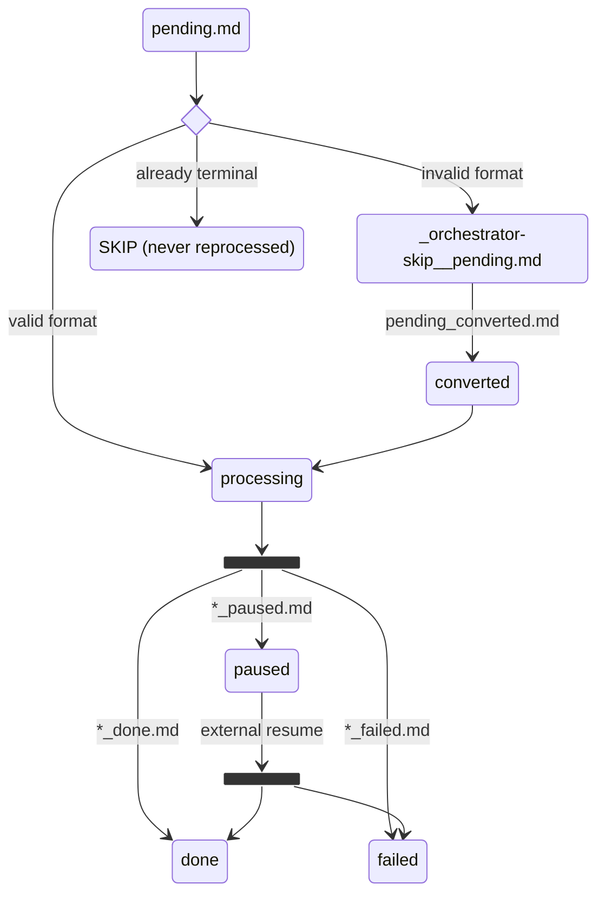

# Plan: Watch Mode

## Overview

Add `orchestrator watch ./plans/` command that monitors a directory for new `.md` files, auto-converts to orchestrator format, executes, and renames to terminal state on completion.

**Pattern:** Follow `telegram listen` command structure (polling loop with graceful shutdown)

---

## File State Machine



**Note:** `*_paused.md` is an intermediate state. After external resume completes,
the watcher renames it to `*_done.md` or `*_failed.md` based on final session phase.

---

## Candidate Selection

### Considered Files
- Only `*.md` files in the watched directory (non-recursive)
- Sorted by **mtime ascending** (oldest first), tie-break by **filename ascending**
- mtime is taken from `stat().st_mtime` at scan time; ties break lexicographically by filename

### Ignored Files (never processed as new work)
| Pattern | Reason |
|---------|--------|
| `_orchestrator-skip*` | Quarantined invalid originals |
| `*_done.md` | Successfully completed (terminal) |
| `*_failed.md` | Failed execution (terminal) |
| `*_paused.md` | Paused on blocker (intermediate; watcher monitors for resume) |

---

## Processing Semantics

### Sequential Execution
- **One plan at a time**: While an orchestrator run is active (including paused), watcher does not start another plan
- **Oldest-first queue**: Deterministic ordering ensures stable behavior across restarts

### Invalid Plan Handling (Conversion + Quarantine)
When a plan is not orchestrator-compatible:

1. **Convert**: Write `<stem>_converted.md` (new valid plan)
2. **Quarantine**: Rename original to `_orchestrator-skip__<original_filename>.md`
3. **Continue**: Watcher picks up `<stem>_converted.md` on next poll

**Collision handling for converted files:**
- If `<stem>_converted.md` exists, try `<stem>_converted_2.md`, `<stem>_converted_3.md`, etc.

### Terminal State Mapping

| Outcome | Rename To | Next Action |
|---------|-----------|-------------|
| `Phase.COMPLETED` | `*_done.md` | Continue to next plan |
| `Phase.FAILED` or exception | `*_failed.md` | Log error, continue to next plan |
| `Phase.PAUSED` (blocker) | `*_paused.md` | Print resume command, **halt queue** |

### Pause/Blocker Behavior (Halt on Pause)
When session transitions to paused:
1. Rename current plan to `*_paused.md`
2. Update `sessions.plan_path` in DB to the new path (so `resume` works)
3. Print clear next action:
   ```
   Session paused (blocker). Resume with:
     orchestrator resume <session_id> --answer "your response"
   ```
4. **Stop starting new work** until user manually resumes
5. Watcher continues polling but takes no action while paused session exists

### Post-Resume Reconciliation
When watcher detects a previously-paused session is no longer paused:
1. Check session's final phase:
   - `Phase.COMPLETED` → rename `*_paused.md` → `*_done.md`
   - `Phase.FAILED` → rename `*_paused.md` → `*_failed.md`
   - Still in progress (`Phase.DISCOVERY`, `Phase.PLANNING`, `Phase.EXECUTION`) → keep waiting
2. Update `sessions.plan_path` to new terminal path
3. Clear `paused_session_id` and resume normal queue processing

**Note on rename retry:** If the initial `*_paused.md` rename failed (file in
`currently_processing` set), reconciliation still attempts the final terminal
rename (`*_done.md` or `*_failed.md`). The file may have become renameable since
the initial failure.

### DB Path Consistency
After **any** terminal rename (`*_done.md`, `*_failed.md`, `*_paused.md`):
- Call `db.update_session(session_id, {'plan_path': new_path})`
- This ensures `orchestrator resume`, `orchestrator export`, etc. find the file

---

## Edge Cases

### Rename Failures
- **Cause**: File locked, permissions, Windows semantics
- **Fallback**: Log warning, add to in-memory `currently_processing` set
- **Effect**: File won't be re-attempted until watcher restart

### Watcher Restart While Paused
- **Scenario**: Watcher stops while session is paused, user manually resumes session
- **Effect**: `*_paused.md` file is NOT automatically renamed to `*_done.md` or `*_failed.md`
- **Why**: `paused_session_id` and `paused_plan_path` are in-memory state, lost on restart
- **Safety**: File remains as `*_paused.md` (ignored by watcher), can be renamed manually
- **Future enhancement**: Startup reconciliation scan could detect orphaned paused files

### Converted File Collisions
- Append counter: `_converted.md` → `_converted_2.md` → `_converted_3.md`
- Maximum attempts: 100 (fail if all exist)

### Failure Semantics
The following conditions result in `*_failed.md` (execution failures only):
- `orch.state.phase == Phase.FAILED`
- `orch.state.status == Status.FAILED`
- Any exception during `orch.start()`

**Note:** Conversion failures do NOT create `*_failed.md`. They are quarantine-only
(original moved to `_orchestrator-skip__*`, no execution occurred). The watcher
logs "conversion failed; quarantined" and continues to next candidate.

### Manual Override
- `_orchestrator-skip` prefix is the user escape hatch
- To permanently ignore a file: rename to `_orchestrator-skip__filename.md`
- Documented as intentional feature

---

## CLI Interface

```python
@cli.command()
@click.argument('plans_dir', type=click.Path(exists=True, file_okay=False))
@click.option('--poll-interval', default=2, type=int, help='Poll interval in seconds (default: 2)')
@click.option('--convert/--no-convert', default=True, help='Auto-convert invalid plans (default: enabled)')
@click.option('--db-path', '-d', help='Custom database path')
@click.option('--planner-model', '-pm', help='Model for planner agent')
@click.option('--executor-model', '-em', help='Model for executor agent')
@click.option('--auto-commit/--no-auto-commit', default=False, help='Auto-commit on completion')
@click.option('--smart-commit/--no-smart-commit', default=None, help='Use AI commit messages')
@click.option('--telegram/--no-telegram', default=None, help='Enable Telegram notifications')
def watch(plans_dir, poll_interval, convert, ...):
    """Watch a directory for new plan files and execute them.

    Example:
        orchestrator watch ./plans/
        orchestrator watch ./plans/ --poll-interval 5
        orchestrator watch ./plans/ --no-convert
    """
```

---

## Implementation

### Files to Modify

| File | Change |
|------|--------|
| `orchestrator_auto/cli.py` | Add `watch` command, `_run_watch_mode()`, helpers |
| `tests/test_cli.py` | Add tests for watch command |
| `README.md` | Document the feature |

### Helper Functions

```python
def _is_watch_candidate(path: Path) -> bool:
    """Check if file should be considered for processing."""
    name = path.name
    stem = path.stem

    # Must be .md file
    if path.suffix.lower() != '.md':
        return False

    # Skip quarantined files
    if name.startswith('_orchestrator-skip'):
        return False

    # Skip terminal states
    if stem.endswith('_done') or stem.endswith('_failed') or stem.endswith('_paused'):
        return False

    return True


def _get_pending_plans(plans_dir: Path) -> list[Path]:
    """Get candidate plans sorted by mtime asc, then filename asc."""
    candidates = [p for p in plans_dir.glob('*.md') if _is_watch_candidate(p)]
    return sorted(candidates, key=lambda p: (p.stat().st_mtime, p.name))


def _find_available_converted_path(original: Path) -> Path:
    """Find available path for converted file with collision handling."""
    base = original.parent / f"{original.stem}_converted.md"
    if not base.exists():
        return base

    for i in range(2, 101):
        candidate = original.parent / f"{original.stem}_converted_{i}.md"
        if not candidate.exists():
            return candidate

    raise RuntimeError(f"Too many converted files for {original.name}")


def _quarantine_and_convert(plan_path: Path) -> Optional[Path]:
    """Quarantine invalid plan and create converted copy. Returns converted path or None."""
    from .convert import convert_plan, ConversionError

    content = plan_path.read_text()

    try:
        converted_content, metadata = convert_plan(content)
    except ConversionError as e:
        # Conversion failed - quarantine original, no converted file
        quarantine_path = plan_path.parent / f"_orchestrator-skip__{plan_path.name}"
        plan_path.rename(quarantine_path)
        return None

    # Find available converted path
    converted_path = _find_available_converted_path(plan_path)

    # Write converted content
    converted_path.write_text(converted_content)

    # Quarantine original
    quarantine_path = plan_path.parent / f"_orchestrator-skip__{plan_path.name}"
    plan_path.rename(quarantine_path)

    return converted_path


def _rename_to_terminal(
    plan_path: Path,
    suffix: str,
    session_id: Optional[str] = None,
    db_path: Optional[str] = None,
) -> tuple[bool, str]:
    """Rename plan to terminal state and update DB. Returns (success, new_path_or_error)."""
    # suffix is one of: '_done', '_failed', '_paused'
    new_name = f"{plan_path.stem}{suffix}{plan_path.suffix}"
    new_path = plan_path.parent / new_name

    try:
        plan_path.rename(new_path)

        # Update DB so resume/export find the file
        if session_id:
            db.update_session(session_id, {'plan_path': str(new_path)}, db_path)

        return True, str(new_path)
    except OSError as e:
        return False, str(e)


@dataclass
class WatchResult:
    """Result of processing a plan file."""
    status: str  # 'completed', 'failed', 'paused', 'skipped'
    session_id: Optional[str] = None
    executed_path: Optional[Path] = None  # The file that was actually executed
    error: Optional[str] = None
```

### Main Watch Loop

```python
def _run_watch_mode(...):
    plans_path = Path(plans_dir).resolve()
    currently_processing: set[str] = set()  # Fallback for rename failures
    paused_session_id: Optional[str] = None  # Track if we're halted on pause
    paused_plan_path: Optional[Path] = None  # Track the paused file for post-resume rename

    while running:
        # If halted on pause, check for external resume
        if paused_session_id:
            session = db.get_session(paused_session_id, db_path)

            if session and session['phase'] != Phase.PAUSED:
                # Session was resumed externally - do post-resume reconciliation
                final_phase = session['phase']

                # Check for terminal phases only
                if final_phase in (Phase.COMPLETED, Phase.FAILED):
                    if paused_plan_path and paused_plan_path.exists():
                        if final_phase == Phase.COMPLETED:
                            _rename_to_terminal(paused_plan_path, '_done', paused_session_id, db_path)
                            click.secho(f"✓ Resumed session completed: {paused_plan_path.stem}_done.md", fg="green")
                        else:  # Phase.FAILED
                            _rename_to_terminal(paused_plan_path, '_failed', paused_session_id, db_path)
                            click.secho(f"✗ Resumed session failed: {paused_plan_path.stem}_failed.md", fg="red")

                    # Clear from currently_processing if it was there (rename retry)
                    currently_processing.discard(paused_plan_path.name if paused_plan_path else "")

                    # Clear pause state and continue queue
                    paused_session_id = None
                    paused_plan_path = None
                else:
                    # Still in progress (discovery/planning/execution) - keep waiting
                    time.sleep(poll_interval)
                    continue
            else:
                # Still paused - keep polling
                time.sleep(poll_interval)
                continue

        # Get oldest pending plan
        pending = _get_pending_plans(plans_path)
        pending = [p for p in pending if p.name not in currently_processing]

        if not pending:
            time.sleep(poll_interval)
            continue

        plan_path = pending[0]

        # Process the plan (returns WatchResult with executed_path)
        result = _process_watch_file(plan_path, convert=convert, ...)

        # Use executed_path for rename (may differ from plan_path if converted)
        target_path = result.executed_path or plan_path

        # Handle result
        if result.status == 'completed':
            _rename_to_terminal(target_path, '_done', result.session_id, db_path)
        elif result.status == 'failed':
            _rename_to_terminal(target_path, '_failed', result.session_id, db_path)
        elif result.status == 'paused':
            success, new_path = _rename_to_terminal(target_path, '_paused', result.session_id, db_path)
            paused_session_id = result.session_id
            paused_plan_path = Path(new_path) if success else target_path
            if not success:
                currently_processing.add(target_path.name)
        elif result.status == 'skipped':
            # Conversion failed - already quarantined, nothing more to do
            click.secho(f"⚠ Skipped (conversion failed): {plan_path.name}", fg="yellow")

        time.sleep(poll_interval)
```

---

## Test Cases

### Unit Tests

```python
class TestWatchCandidateSelection:
    def test_accepts_plain_md_file(self):
        assert _is_watch_candidate(Path("feature.md")) is True

    def test_rejects_quarantined_file(self):
        assert _is_watch_candidate(Path("_orchestrator-skip__feature.md")) is False

    def test_rejects_done_file(self):
        assert _is_watch_candidate(Path("feature_done.md")) is False

    def test_rejects_failed_file(self):
        assert _is_watch_candidate(Path("feature_failed.md")) is False

    def test_rejects_paused_file(self):
        assert _is_watch_candidate(Path("feature_paused.md")) is False


class TestGetPendingPlans:
    def test_sorts_by_mtime_then_filename(self, tmp_path):
        # Create files with controlled mtimes
        ...

    def test_excludes_terminal_files(self, tmp_path):
        ...


class TestQuarantineAndConvert:
    def test_creates_converted_file(self, tmp_path):
        ...

    def test_quarantines_original(self, tmp_path):
        ...

    def test_handles_collision(self, tmp_path):
        ...


class TestRenameToTerminal:
    def test_renames_to_done(self, tmp_path):
        plan = tmp_path / "feature.md"
        plan.write_text("# Test")
        success, new_path = _rename_to_terminal(plan, '_done')
        assert success
        assert Path(new_path).name == "feature_done.md"

    def test_updates_db_on_rename(self, tmp_path, temp_db):
        # Verify session.plan_path is updated
        ...


class TestPostResumeReconciliation:
    def test_renames_paused_to_done_after_resume(self, tmp_path):
        ...

    def test_renames_paused_to_failed_after_resume(self, tmp_path):
        ...


class TestWatchCommand:
    def test_help_shows_options(self, runner):
        result = runner.invoke(cli, ['watch', '--help'])
        assert '--poll-interval' in result.output

    def test_requires_directory(self, runner):
        result = runner.invoke(cli, ['watch'])
        assert result.exit_code != 0
```

---

## README Updates

**Quick Reference:**
```bash
# Watch mode: monitor directory for new plans
orchestrator watch ./plans/

# Watch with custom poll interval
orchestrator watch ./plans/ --poll-interval 5

# Watch without auto-conversion
orchestrator watch ./plans/ --no-convert

# Watch with auto-commit
orchestrator watch ./plans/ --auto-commit
```

**Command Documentation:**
```markdown
### `watch` - Watch Directory for Plans

Monitor a directory for new `.md` files. Plans are processed oldest-first,
auto-converted if needed, and renamed to terminal state on completion.

| Option | Description |
|--------|-------------|
| `plans_dir` | Directory to watch (required) |
| `--poll-interval` | Poll interval in seconds (default: 2) |
| `--convert/--no-convert` | Auto-convert invalid plans (default: enabled) |
| `--auto-commit` | Auto-commit on completion |
| `--telegram` | Enable Telegram notifications |
| `-pm, --planner-model` | Planner model |
| `-em, --executor-model` | Executor model |

**File naming conventions:**
- `_orchestrator-skip__*` - Quarantined (ignored)
- `*_done.md` - Completed successfully
- `*_failed.md` - Failed execution
- `*_paused.md` - Paused on blocker (queue halted)
```

---

## Verification

```bash
# Create test directory
mkdir -p /tmp/watch-test

# Add a valid plan
cat > /tmp/watch-test/feature-a.md << 'EOF'
# Feature A
### Milestone 1: Setup
Tasks here
EOF

# Start watch mode
orchestrator watch /tmp/watch-test/

# In another terminal, add plans
echo "# Feature B\n### Milestone 1: Build" > /tmp/watch-test/feature-b.md

# Observe:
# - feature-a.md processed first (older mtime)
# - On completion: feature-a_done.md
# - feature-b.md processed next
# - On completion: feature-b_done.md

# Test invalid plan handling
echo "# No milestones" > /tmp/watch-test/invalid.md
# Observe:
# - _orchestrator-skip__invalid.md created (quarantine)
# - invalid_converted.md created (if conversion succeeds)
# - invalid_converted.md processed

# Test pause handling
# When blocker occurs:
# - feature_paused.md created
# - "orchestrator resume <id>" printed
# - No new plans processed until resumed

# Run unit tests
pytest tests/test_cli.py -v -k "watch"
```

---

## No Breaking Changes

- New command, no existing behavior modified
- Uses existing functions: `convert_plan()`, `Orchestrator`
- Follows existing patterns: `telegram listen` polling
