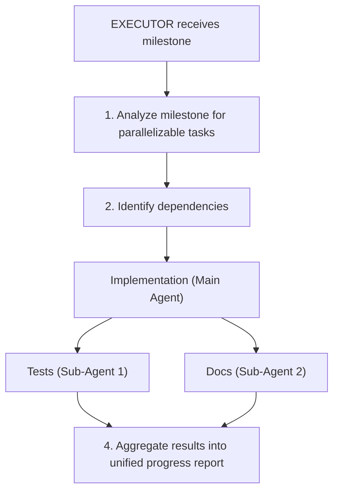

# Proposal: Parallel Task Execution with Sub-Agents

**Status:** Approved by: CTO, 2026-01-28
**Phase:** 3 (Final)
**Author:** Engineering Team
**Created:** 2026-01-28
**Updated:** 2026-01-28
**Category:** Performance Optimization

---

## Version Context

This proposal is the most complex in the subagent suite and requires stable foundations from Phase 1 (Exploration, Validation) and Phase 2 (Research) before implementation.

| Component | Version | Relevant Feature |
|-----------|---------|------------------|
| orchestrator-auto | 1.2.0+ | Mature subagent patterns from prior phases |
| claude-agent-sdk | 0.1.23 | Task tool, concurrent execution |

---

## Executive Summary

Enable the Executor agent to spawn multiple sub-agents for parallel execution of independent tasks within a milestone. This significantly reduces wall-clock time for milestones containing parallelizable work such as "create model + create tests" or "add endpoint + update documentation".

## Problem Statement

Currently, milestone execution is strictly sequential:
1. Executor receives milestone with multiple tasks
2. Tasks are executed one after another
3. Independent tasks (e.g., tests, docs) wait for prior tasks to complete

Example milestone with parallelizable work:
```markdown
## Milestone 3: User API Endpoint
- Create UserController with CRUD endpoints
- Add request/response DTOs
- Write unit tests for UserController
- Update API documentation
```

The tests and documentation are independent of the implementation and could run in parallel.

## Proposed Solution

Implement **task decomposition and parallel execution**:



### Architecture

```python
class ExecutorAgent(BaseAgent):
    async def execute_milestone_parallel(
        self,
        milestone: str,
        max_parallel: int = 3
    ) -> str:
        # Step 1: Decompose milestone into tasks
        tasks = await self._decompose_milestone(milestone)

        # Step 2: Build dependency graph
        graph = self._build_dependency_graph(tasks)

        # Step 3: Execute with parallelization
        results = await self._execute_parallel(graph, max_parallel)

        # Step 4: Aggregate results
        return self._aggregate_results(results)

    async def _execute_parallel(
        self,
        graph: TaskGraph,
        max_parallel: int
    ) -> Dict[str, TaskResult]:
        results = {}
        semaphore = asyncio.Semaphore(max_parallel)

        async def execute_task(task: Task):
            async with semaphore:
                if task.is_independent:
                    # Spawn sub-agent for independent task
                    return await self._spawn_subagent(task)
                else:
                    # Execute in main agent context
                    return await self._execute_task(task)

        # Execute tasks respecting dependencies
        for level in graph.topological_levels():
            level_results = await asyncio.gather(
                *[execute_task(t) for t in level]
            )
            results.update(zip([t.id for t in level], level_results))

        return results
```

### Task Decomposition

```python
class TaskDecomposer:
    """Analyzes milestone text to extract parallelizable tasks."""

    PARALLEL_INDICATORS = [
        (r"write.*tests?", "testing", independent=True),
        (r"update.*doc", "documentation", independent=True),
        (r"add.*migration", "database", independent=False),
        (r"create.*endpoint", "implementation", independent=False),
    ]

    def decompose(self, milestone: str) -> List[Task]:
        tasks = []
        for line in milestone.split('\n'):
            if line.strip().startswith('- '):
                task = self._classify_task(line)
                tasks.append(task)
        return self._resolve_dependencies(tasks)
```

### Configuration

```yaml
# config.yaml
executor:
  parallel_execution: true     # Enable parallel sub-agents
  max_parallel_agents: 3       # Concurrent sub-agent limit
  parallel_task_types:         # Tasks eligible for parallel execution
    - testing
    - documentation
    - linting
    - type_checking
```

### CLI Integration

```bash
# Enable parallel execution (default when configured)
orchestrator start -f "Build user system" --parallel

# Limit parallelism
orchestrator start -f "Build user system" --max-parallel 2

# Disable for debugging
orchestrator start -f "Build user system" --no-parallel

# View parallel execution in status
orchestrator status <session-id>
# Output:
# Milestone 3: User API Endpoint
#   ├── [DONE] Implementation (main agent)
#   ├── [RUNNING] Tests (sub-agent-1)
#   └── [RUNNING] Documentation (sub-agent-2)
```

## Implementation Plan

### Phase 1: Task Decomposition
- Implement TaskDecomposer class
- Build dependency graph logic
- Add task classification patterns

### Phase 2: Parallel Execution
- Implement sub-agent spawning with asyncio.gather
- Add semaphore-based concurrency control
- Implement result aggregation

### Phase 3: Monitoring & Control
- Add parallel execution status to CLI
- Implement sub-agent cancellation on main agent failure
- Add metrics collection

### Phase 4: Smart Scheduling
- Learn from historical execution patterns
- Optimize task ordering based on typical durations
- Predict parallelization opportunities

## Benefits

| Benefit | Impact |
|---------|--------|
| Reduced wall-clock time | 30-50% faster milestone completion |
| Better resource utilization | Multiple agents working simultaneously |
| Improved test coverage | Tests run as soon as implementation exists |
| Scalable architecture | Easy to add more parallel task types |

## Risks & Mitigations

| Risk | Mitigation |
|------|------------|
| Race conditions in file edits | File-ownership enforcement (see below) |
| Increased API costs | Parallel agents may use more tokens total |
| Dependency misdetection | Conservative dependency analysis, main agent validates |
| Sub-agent failures | Fail-fast with clear error aggregation |
| Context isolation issues | Each sub-agent gets focused context only |

### File-Ownership Guardrail (Mandatory)

To prevent race conditions and conflicting writes, parallel sub-agents operate under strict file-ownership rules:

```python
class FileOwnership:
    """Tracks file ownership across parallel sub-agents."""

    def __init__(self):
        self._owners: Dict[Path, str] = {}  # file -> agent_id
        self._lock = asyncio.Lock()

    async def claim(self, agent_id: str, files: List[Path]) -> bool:
        """Claim ownership of files. Returns False if any file is already owned."""
        async with self._lock:
            for f in files:
                if f in self._owners and self._owners[f] != agent_id:
                    return False  # Conflict detected
            for f in files:
                self._owners[f] = agent_id
            return True

    async def release(self, agent_id: str):
        """Release all files owned by agent."""
        async with self._lock:
            self._owners = {f: o for f, o in self._owners.items() if o != agent_id}
```

**Enforcement rules:**
1. Parent agent allocates file ownership per sub-agent before spawning
2. Sub-agents can only write to files they own
3. Validation step rejects milestone if overlapping writes detected
4. Conflict triggers sequential re-execution (fallback to safe mode)

**Example allocation:**
```
Milestone: "Add user auth with tests and docs"
├── Implementation agent: owns src/auth/*.py
├── Test agent: owns tests/test_auth*.py
└── Docs agent: owns docs/auth.md
```

## Cost Analysis

| Scenario | Sequential | Parallel | Difference |
|----------|------------|----------|------------|
| Tokens (typical) | 15,000 | 18,000 | +20% |
| Wall time | 5 min | 2.5 min | -50% |
| API calls | 8 | 12 | +50% |

**Trade-off:** Slightly higher token cost for significantly faster completion.

## Success Metrics

- Wall-clock time reduction per milestone
- Parallel execution utilization rate
- Sub-agent success rate
- User opt-in rate for parallel mode

## Effort Estimate

**Complexity:** High
**Files Modified:** 5-7 (agents.py, engine.py, config.py, cli.py, state.py)
**New Files:** 2-3 (decomposer.py, parallel.py, task_graph.py)
**Testing:** Extensive async testing, race condition testing

---

## Appendix: Dependency Graph Example

```
Milestone: "Add user authentication with tests and docs"

Tasks extracted:
1. Create User model           [implementation]
2. Add password hashing        [implementation, depends: 1]
3. Create auth endpoints       [implementation, depends: 2]
4. Write unit tests            [testing, depends: 3]
5. Write integration tests     [testing, depends: 3]
6. Update API docs             [documentation, depends: 3]

Execution plan:
Level 0: [1]                   # Sequential
Level 1: [2]                   # Sequential
Level 2: [3]                   # Sequential
Level 3: [4, 5, 6]             # PARALLEL - all depend only on 3
```
