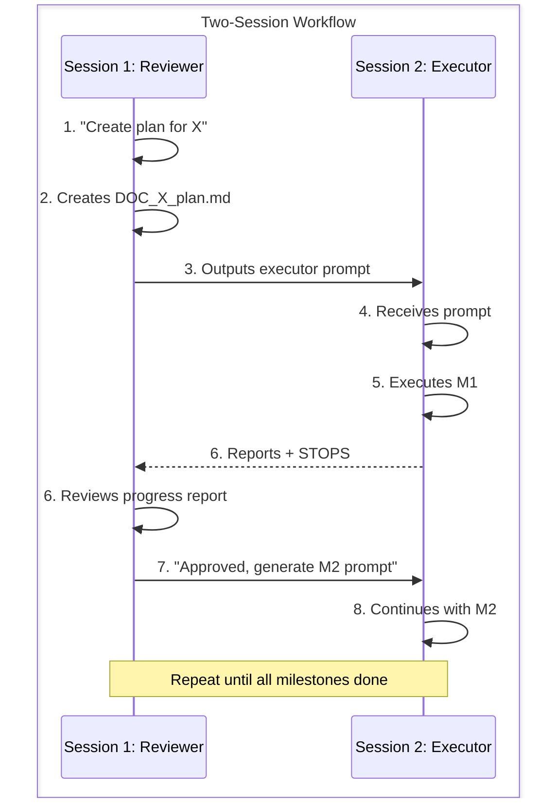
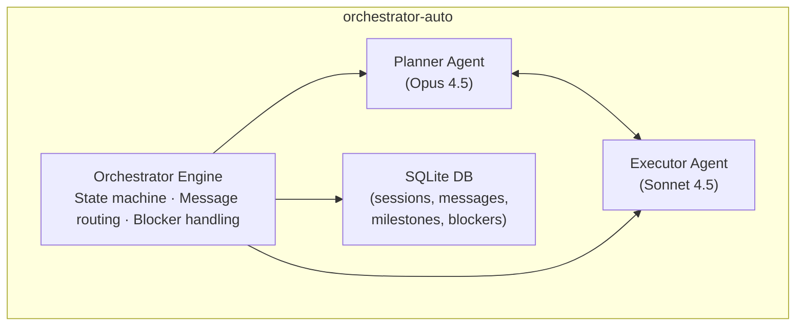

# Claude Orchestrator: Milestone-Based Task Execution Framework (v2)

## Overview

A **gated milestone workflow** for AI agents executing complex multi-step tasks. Ensures human oversight at critical checkpoints for review, validation, and course correction.

**Architecture**: Two separate Claude sessions - one as Reviewer/Planner, one as Executor - communicating through structured prompts with human as intermediary.

---

## IMPORTANT: Context Retention Instructions

> **FOR BOTH AGENTS**: This section contains critical instructions for maintaining workflow knowledge.

### On Context Compression (`/compact`)

**Reviewer Agent** - When context is compacted:
1. Re-read this file: `CLAUDE_orchestrator.md`
2. Re-read the plan document: `docs/[feature]/DOC_[feature]_plan.md`
3. Check milestone progress: Which milestones are approved?

**Executor Agent** - When context is compacted:
1. Re-read this file: `CLAUDE_orchestrator.md`
2. Re-read the plan document provided in your prompt
3. Check: What milestone am I on? What's left to do?

### Critical Information to Retain

| Agent | Must Remember |
|-------|---------------|
| **Reviewer** | Plan doc path, current milestone #, approved milestones, blocking issues |
| **Executor** | Plan doc path, current milestone #, deliverables checklist, test requirements |

### Self-Check After Compression

**Reviewer** - Re-read workflow if you:
- Forgot which milestones are approved
- Lost track of the plan document location
- Can't remember the executor prompt format

**Executor** - Re-read workflow if you:
- Forgot the progress report format
- Don't remember to STOP after milestone
- Lost track of deliverables checklist

### Compression Recovery Command

If context was compressed, tell the user:
```
"Context was compressed. Let me re-read the workflow and plan to continue properly."
```

Then read: `CLAUDE_orchestrator.md` and the relevant plan document.

---

## Core Principles

| Principle | Description |
|-----------|-------------|
| **Milestone-Based** | Tasks divided into 3-5 discrete milestones with clear deliverables |
| **Gated Approval** | No milestone proceeds without explicit human approval |
| **Structured Reports** | Standardized format: files changed, test results, issues |

---

## Quick Start

### Step 1: Create Implementation Plan
```
docs/{feature}/DOC_{feature_name}_plan.md
```
Include: endpoint spec, file organization, code patterns, testing requirements, security considerations.

### Step 2: Define Milestones (3-5)

| Project Type | Milestone Pattern |
|--------------|-------------------|
| **API Endpoints** | Schemas → Service Logic → Controller + Routes → Validation |
| **New Features** | Models → Services → API/UI → Tests + Integration |
| **Bug Fixes** | Failing Test → Fix → Verify + Regression |
| **Frontend** | Components + Types → Logic → Styling → Tests + Storybook |
| **Data Pipeline** | Schema → ETL Logic → Orchestration → Monitoring + Tests |
| **Infrastructure** | Config → Resources → Network + Security → Validation |

### Step 3: Execute + Review Loop
1. Give prompt to Claude → 2. Agent executes milestone, stops, reports → 3. Review and approve/reject → 4. Repeat

---

## Two-Agent Workflow

This framework is designed for a **two-agent architecture** to optimize context usage and model costs.

### Architecture



```mermaid
graph LR
    subgraph Planner ["PLANNER/REVIEWER (Opus · strategic)"]
        P1["Reviews framework docs"]
        P2["Researches project codebase"]
        P3["Creates implementation plan"]
        P4["Writes orchestrator prompt"]
        P5["Validates milestone reports"]
        P6["Approves/rejects milestones"]
        P7["Stays grounded · minimal context"]
    end
    subgraph Executor ["EXECUTOR (Sonnet/Haiku · cost-effective)"]
        E1["Receives orchestrator prompt"]
        E2["Executes ONE milestone only"]
        E3["Generates progress report"]
        E4["STOPS and waits for approval"]
        E5["Fresh context each milestone"]
    end
    Planner -- "prompt" --> Executor
    Executor -- "report" --> Planner
```

### Benefits

| Benefit | Description |
|---------|-------------|
| **Context efficiency** | Planner stays lean, doesn't accumulate execution details |
| **Model optimization** | Expensive model for planning, cheaper for execution |
| **Fresh executor** | Each milestone starts clean, no accumulated confusion |
| **Grounded reviewer** | Planner validates objectively without being "in the weeds" |

### Planner/Reviewer Responsibilities

1. **Research phase**
   - Review framework documentation
   - Explore project codebase
   - Identify patterns and existing conventions
   - Ask clarifying questions

2. **Planning phase**
   - Create implementation plan (`DOC_{feature}_plan.md`)
   - Define milestones with clear deliverables
   - Write orchestrator prompt for executor

3. **Review phase**
   - Validate executor's progress report
   - Check files created/modified match expectations
   - Verify tests pass and coverage meets targets
   - Approve, request changes, or abort

### Executor Responsibilities

1. Receive orchestrator prompt with plan reference
2. Execute **ONE milestone only**
3. Generate progress report in specified format
4. **STOP** and wait for approval
5. Never proceed to next milestone without explicit approval

### Handoff Format (Planner → Executor)

The planner creates this prompt to send to a fresh executor session:

```markdown
## Agent Task: [Feature Name]

### Plan Document
Read and follow: `docs/[path]/DOC_[feature]_plan.md`

### Workflow Instructions
This task has **[N] milestones**. After completing each:
1. **STOP** and generate a progress report
2. **WAIT** for approval before proceeding
3. **DO NOT** continue without explicit approval

### Current Milestone: [N]
[Copy milestone details from plan]

### Progress Report Format
```
## Milestone [N]: [Name] - COMPLETED

### Files Created/Modified:
- path/to/file (created|modified)

### Test Results:
[paste output]

### Notes/Issues:
[blockers, deviations, questions]

### Ready for Review: YES
```

**Begin Milestone [N]. Stop and report when complete.**
```

### Report Validation Checklist (Reviewer)

When executor submits a progress report, planner validates:

| Check | Question |
|-------|----------|
| **Completeness** | All deliverables in milestone checklist addressed? |
| **Files** | Expected files created/modified in correct locations? |
| **Patterns** | Code follows existing project conventions? |
| **Tests** | Tests written and passing? |
| **Coverage** | Coverage meets target (if specified)? |
| **Issues** | Any blockers or deviations that need discussion? |

### Milestone Continuation Prompt

After approving a milestone, planner sends to **same or new** executor:

```
Milestone [N] approved.

Continue with Milestone [N+1]:
[Copy next milestone details from plan]

Stop and report when complete.
```

### Session Management

| Scenario | Recommendation |
|----------|----------------|
| Small milestones | Same executor session, continue with approval |
| Large milestones | New executor session to reset context |
| Context getting long | Start fresh executor session |
| Executor confused | Start fresh executor session with clearer prompt |

---

## Plan Document Templates

### Backend API Plan Template

```markdown
# [Feature Name] API - Implementation Plan

## 1. Overview
[What endpoint(s) and why - 2-3 sentences]

## 2. Endpoint Specification

### 2.1 Endpoint Details
| Property | Value |
|----------|-------|
| **URL** | `[METHOD] /api/v1/[path]/` |
| **View** | `[app].views.[ViewName]` |
| **Permission** | `[PermissionClass]` |
| **Service** | `[app].services.[method]` |

### 2.2 Path Parameters
| Param | Type | Required | Description |
|-------|------|----------|-------------|
| `id` | UUID | Yes | Resource ID |

### 2.3 Query Parameters
| Param | Type | Required | Default | Description |
|-------|------|----------|---------|-------------|
| `page` | int | No | 1 | Page number |
| `page_size` | int | No | 20 | Items per page |

### 2.4 Request Body (if POST/PUT/PATCH)
```json
{
  "field": "type"
}
```

### 2.5 Response Schema
```json
{
  "count": 0,
  "results": []
}
```

### 2.6 Error Responses
| Status | Condition | Response |
|--------|-----------|----------|
| 400 | Invalid params | `{"field": ["error"]}` |
| 401 | Not authenticated | `{"detail": "..."}` |
| 403 | Not authorized | `{"detail": "..."}` |
| 404 | Not found | `{"detail": "..."}` |

## 3. Architecture

### 3.1 File Structure
```
[app]/
├── views.py           # Add [ViewName]
├── serializers.py     # Add query/response serializers
├── urls.py            # Add URL pattern
├── services/
│   └── [service].py   # Add [method]
└── tests/
    ├── test_[feature]_view.py
    └── test_[feature]_service.py
```

### 3.2 Patterns to Follow
- View: `[app]/views.py::[ExistingView]`
- Service: `[app]/services/[file].py::[method]`
- Serializer: `[app]/serializers.py::[Serializer]`

## 4. Implementation Details

### 4.1 Query Serializer
```python
class [Feature]QuerySerializer(serializers.Serializer):
    # fields...
```

### 4.2 Service Method
```python
@staticmethod
def [method_name](params) -> dict:
    """Docstring"""
    pass
```

## 5. Testing Strategy

### 5.1 Unit Tests (Service)
- test_[scenario_1]
- test_[scenario_2]
- test_edge_case

### 5.2 Integration Tests (View)
- test_unauthenticated_returns_401
- test_unauthorized_returns_403
- test_valid_request_returns_200

### 5.3 Coverage Targets
| Component | Target |
|-----------|--------|
| Serializers | 95% |
| Service | 90% |
| View | 85% |

## 6. Security
- [ ] Auth: JWT required
- [ ] Authorization: [Permission class]
- [ ] Input validation: All params via serializer
- [ ] Data protection: [considerations]

## 7. Anti-Patterns
### Don't: [Bad pattern]
```python
# BAD
```
### Do: [Good pattern]
```python
# GOOD
```
```

---

### Frontend Feature Plan Template

```markdown
# [Feature Name] - Implementation Plan

## 1. Overview
[What component/page and why - 2-3 sentences]

## 2. Feature Specification

### 2.1 Component Details
| Property | Value |
|----------|-------|
| **Component** | `[ComponentName]` |
| **Route** | `/path/to/page` |
| **State** | React Query + URL params |
| **API** | `[METHOD] /api/v1/[endpoint]/` |

### 2.2 User Stories
- As a [user], I can [action] so that [benefit]
- As a [user], I can [action] so that [benefit]

### 2.3 UI Mockup
```
┌─────────────────────────────────────────────────────────────────┐
│  Page Title                                            [Action] │
├─────────────────────────────────────────────────────────────────┤
│  [Filter ▼]  [Filter ▼]  [Date Range]              [Reset]     │
├─────────────────────────────────────────────────────────────────┤
│  Column 1   │ Column 2 │ Status    │ Actions                   │
│─────────────┼──────────┼───────────┼───────────────────────────│
│  Data       │ Data     │ ✓ Done    │ [View]                    │
├─────────────────────────────────────────────────────────────────┤
│  ◀ Prev    Page 1 of 10    Next ▶                              │
└─────────────────────────────────────────────────────────────────┘
```

## 3. Architecture

### 3.1 File Structure
```
src/components/[feature]/
├── [Feature]Content.tsx        # Main container
├── [Feature]DataTable.tsx      # Table component
├── [Feature]Filters.tsx        # Filter controls
├── [Feature]DetailDrawer.tsx   # Detail view
├── columns.tsx                 # Table columns
├── index.ts                    # Exports
└── __tests__/
    └── [Feature].test.tsx
```

### 3.2 Patterns to Follow
- Component: `src/components/[existing]/`
- Hook: `src/hooks/use[Existing].ts`
- Service: `src/services/[existing]Service.ts`

## 4. Implementation Details

### 4.1 Types
```typescript
export interface [Feature] {
  id: string;
  // fields...
}

export interface [Feature]Filters {
  // filter fields...
}
```

### 4.2 Service Method
```typescript
async get[Feature](params: Params): Promise<Response> {
  // implementation
}
```

### 4.3 Hook
```typescript
export const [FEATURE]_QUERY_KEY = '[feature]';

export function use[Feature](params: Params) {
  return useQuery({
    queryKey: [[FEATURE]_QUERY_KEY, params],
    queryFn: () => service.get[Feature](params),
  });
}
```

### 4.4 Main Component Structure
```tsx
export function [Feature]Content() {
  const { data, isLoading } = use[Feature](params);

  return (
    // JSX structure
  );
}
```

## 5. Testing Strategy

### 5.1 Unit Tests
- renders loading state
- renders data correctly
- handles empty state
- filter changes update query

### 5.2 Integration Tests
- fetches data on mount
- pagination works
- filters apply correctly

### 5.3 Coverage Targets
| Component | Target |
|-----------|--------|
| Hooks | 90% |
| Components | 80% |

## 6. Accessibility
- [ ] Keyboard navigation
- [ ] ARIA labels on table
- [ ] Screen reader announcements
- [ ] Focus management in modals

## 7. Anti-Patterns
### Don't: [Bad pattern]
```tsx
// BAD
```
### Do: [Good pattern]
```tsx
// GOOD
```
```

---

## Orchestrator Prompt Template

```markdown
## Agent Task: [Task Title]

### Objective
[One-sentence description]

### Context
[2-3 sentences: why needed, what it connects to]

### Workflow Instructions
This task has **[N] milestones**. After each:
1. **STOP** and generate a progress report
2. **WAIT** for approval
3. **DO NOT** proceed until explicitly approved

---

## Milestone [N]: [Name]

### Prerequisites
- [Previous milestone approved, if applicable]

### Tasks
1. [Task]
2. [Task]

### Key References
- [File/pattern to follow]

### Deliverables
- [ ] [Deliverable]
- [ ] Tests passing

**⛔ STOP - Generate progress report, wait for approval**

---

[Repeat milestone block for each milestone]

---

## Quick Reference

| Resource | Path |
|----------|------|
| Implementation Plan | `docs/path/to/plan.md` |
| Pattern to Follow | `path/to/example.py` |
```

---

## Progress Report Template

Use this format after completing each milestone:

```
## Milestone [N]: [Name] - COMPLETED

### Files Created/Modified:
- path/to/file (created|modified)

### Test Results:
[paste output]

### Notes/Issues:
[blockers, deviations, questions]

### Ready for Review: YES
```

For final milestone, add:
```
### Coverage Report:
[paste summary]

### TASK COMPLETE - Ready for Final Review
```

---

## Review Commands

| Action | Command |
|--------|---------|
| **Approve** | `Milestone [N] approved. Proceed to Milestone [N+1].` |
| **Changes needed** | `Milestone [N] needs changes: [issues]. Fix and regenerate report.` |
| **Approve with notes** | `Milestone [N] approved with notes: [observations]. Proceed.` |
| **Abort** | `ABORT: [Reason]. Do not proceed.` |

---

## Kickstart Prompts (Copy-Paste)

### Reviewer Agent (First Claude Session)

```
Read CLAUDE_orchestrator.md. You are the REVIEWER agent.

Create an implementation plan for: [FEATURE DESCRIPTION]

1. Research the codebase to understand existing patterns
2. Create plan at: docs/[feature]/DOC_[feature]_plan.md
3. Define 3-5 milestones with clear deliverables
4. Generate the executor prompt for Milestone 1

After creating the plan, show me the prompt to send to the executor agent.
```

### Executor Agent (Second Claude Session)

```
Read CLAUDE_orchestrator.md. You are the EXECUTOR agent.

[PASTE PROMPT FROM REVIEWER AGENT]
```

### Reviewer: Continue After Milestone Approval

```
Milestone [N] approved.

Generate the prompt for the executor to continue with Milestone [N+1].
```

### Reviewer: Request Changes

```
Milestone [N] needs changes:
- [Issue 1]
- [Issue 2]

Generate a prompt for the executor to fix these issues.
```

### Executor: Continue After Approval

```
Milestone [N] approved. Continue with Milestone [N+1]:

[PASTE NEXT MILESTONE DETAILS FROM REVIEWER]
```

---

## Typical Session Flow



### Human's Role

| Step | Human Action |
|------|--------------|
| Start | Give feature request to Reviewer |
| After plan | Review plan, approve or request changes |
| After executor prompt | Copy prompt to Executor session |
| After milestone report | Copy report to Reviewer session |
| After review | Copy approval/changes to Executor session |
| Repeat | Until all milestones complete |

---

## Example: API Endpoint (Condensed)

```markdown
## Agent Task: User Activity Log Endpoint

### Objective
Create `GET /api/v1/admin/users/{user_id}/activity-log/`

### Context
Admins need to audit user actions. Follows existing admin module patterns.

### Milestones (4)

**M1: Serializers** → QuerySerializer, ItemSerializer, ResponseSerializer + tests
**M2: Service** → `get_user_activity_log()` in AdminService + pagination + tests
**M3: View + URL** → UserActivityLogView + Swagger + route + integration tests
**M4: Validation** → Full test suite, 85%+ coverage, docs updated
```

---

## Recovery Protocol

### If Reviewer Session Crashes

**Start new Reviewer session with:**

```
Read CLAUDE_orchestrator.md. You are the REVIEWER agent.

Recovering session for: [FEATURE NAME]

Plan document: docs/[feature]/DOC_[feature]_plan.md

Current status:
- Milestones approved: [1, 2, ...]
- Current milestone: [N] (executor working / awaiting review)
- Blocking issues: [None / description]

[If executor submitted report, paste it here]

Continue reviewing from where we left off.
```

### If Executor Session Crashes

**Option A: Resume in same session (if possible)**
```
Context was compressed. Re-read:
- CLAUDE_orchestrator.md
- The plan document

Continue Milestone [N] from where we left off.
Last completed: [file/task]
```

**Option B: Start new Executor session**

Ask Reviewer to generate a new executor prompt that includes:
```
Milestone [N] is IN PROGRESS. Previous executor crashed.

Completed so far:
- [file1] created
- [task1] done

Remaining:
- [task2]
- [task3]

Continue from where the previous executor left off.
```

### Session State Tracking

Reviewer should maintain a mental (or written) state:

```markdown
## Session State: [Feature]

Plan: docs/[feature]/DOC_[feature]_plan.md

| Milestone | Status | Commit |
|-----------|--------|--------|
| M1 | ✅ Approved | `abc123` |
| M2 | ✅ Approved | `def456` |
| M3 | 🔄 In Progress | - |
| M4 | ⏳ Pending | - |

Current: Executor working on M3
Blocking: None
```

---

## Git Checkpoint Strategy

### When to Commit

| Event | Who Commits | Message Format |
|-------|-------------|----------------|
| After milestone approved | Executor (before next milestone) | `feat([feature]): complete M[N] - [description]` |
| Before risky change | Executor | `chore([feature]): checkpoint before [risky thing]` |
| End of session | Executor | `wip([feature]): M[N] in progress - [status]` |

### Commit Message Examples

```bash
# After milestone approval
feat(user-activity): complete M1 - serializers and unit tests
feat(user-activity): complete M2 - service layer with pagination
feat(user-activity): complete M3 - view, routes, integration tests

# Work in progress (session ending mid-milestone)
wip(user-activity): M3 in progress - view done, tests pending

# Checkpoint before risky change
chore(user-activity): checkpoint before refactoring query logic
```

### Rollback Strategy

Include in plan document:

```markdown
## Git Checkpoints

| Milestone | Commit | Rollback Command |
|-----------|--------|------------------|
| Baseline | `abc123` | `git reset --hard abc123` |
| M1 | `def456` | `git reset --hard def456` |
| M2 | `ghi789` | `git reset --hard ghi789` |
```

### Executor: Checkpoint After Approval

When Reviewer approves a milestone, Executor should:

```bash
git add -A
git commit -m "feat([feature]): complete M[N] - [brief description]"
```

Then report the commit hash in the next progress report.

---

## Automated Workflow (orchestrator-auto)

**orchestrator-auto** is a Python CLI tool that automates the two-agent orchestrator workflow. It manages the planner and executor agents, handles state transitions, and persists workflow state to a SQLite database.

### Architecture



### Workflow Phases

1. **Discovery** - Interactive conversation with planner to refine requirements
2. **Planning** - Planner creates implementation plan with milestones
3. **Execution** - Executor implements milestones, planner reviews each one
4. **Completed** - All milestones approved
5. **Paused** - Workflow blocked, waiting for human input

### CLI Commands

#### Start a new workflow
```bash
orchestrator start -f "Add user authentication with JWT"
```

#### Resume an existing workflow
```bash
orchestrator resume <session-id>
```

#### Resume with answer to blocker
```bash
orchestrator resume <session-id> -a "Use PostgreSQL"
```

#### Respond to blocker
```bash
orchestrator respond <session-id> "Use PostgreSQL"
```

#### List all sessions
```bash
orchestrator list
orchestrator list -s completed  # Filter by status
```

#### Show session status
```bash
orchestrator status <session-id>
```

#### Export session history
```bash
orchestrator export <session-id> -o session_report.md
```

### Installation

```bash
cd orchestrator-auto

# Create conda environment
conda env create -f environment.yml
conda activate orchestrator-auto

# Install in development mode
pip install -e .

# Verify installation
orchestrator --help
```

### Example Usage

```bash
# Start a new feature implementation
$ orchestrator start -f "Implement user profile page with avatar upload"

Starting new workflow session...
Feature: Implement user profile page with avatar upload

✓ Session created: a1b2c3d4

============================================================
Session: a1b2c3d4
Phase: DISCOVERY
Status: ACTIVE
============================================================

[Planner begins interactive discovery...]

# After workflow pauses on blocker
$ orchestrator status a1b2c3d4

============================================================
SESSION STATUS
============================================================

Session ID: a1b2c3d4
Feature: Implement user profile page with avatar upload
Phase: PAUSED
Status: PAUSED

⚠️  UNRESOLVED BLOCKERS:

  Agent: planner
  Question: Should we store avatars in S3 or local filesystem?
  Created: 2025-12-15 10:30:00

# Respond to blocker
$ orchestrator respond a1b2c3d4 "Use S3 with CloudFront CDN"

Responding to session: a1b2c3d4
Question: Should we store avatars in S3 or local filesystem?
Answer: Use S3 with CloudFront CDN

Resuming workflow...
[Workflow continues...]

# Export session when complete
$ orchestrator export a1b2c3d4

✓ Session exported to: session_a1b2c3d4_20251215_143022.md
  Messages: 42
  Milestones: 4
  Blockers: 1
```

### Key Features

| Feature | Description |
|---------|-------------|
| **State Persistence** | All workflow state saved to SQLite database |
| **Pause/Resume** | Handle blockers gracefully, resume with human input |
| **Message History** | Complete conversation history for both agents |
| **Context Recovery** | PreCompact hooks restore agent context after compression |
| **Progress Tracking** | Milestone-based progress with colored CLI output |
| **Session Export** | Export full session history to markdown |

### Response Format Tags

The orchestrator uses structured tags for agent communication:

**Planner Tags:**
- `[PLAN_READY]` - Plan document created, ready for execution
- `[MILESTONE_APPROVED]` - Milestone approved, proceed to next
- `[CHANGES_REQUESTED]` - Milestone needs changes, executor should revise
- `[HUMAN_INPUT_NEEDED]` - Blocker, need human clarification

**Executor Tags:**
- `[PROGRESS_REPORT]` - Milestone completion report
- `[CLARIFICATION_NEEDED]` - Need planner clarification
- `[BLOCKED]` - Blocked by external dependency

### Benefits Over Manual Workflow

| Manual | Automated (orchestrator-auto) |
|--------|-------------------------------|
| Copy/paste prompts between sessions | Automatic agent communication |
| Track state manually | SQLite persistence |
| Lose context on compression | PreCompact hooks restore context |
| Manual milestone tracking | Automated milestone transitions |
| No history export | Export full session to markdown |

### When to Use

**Use orchestrator-auto when:**
- Implementing complex features with 3+ milestones
- Need persistent state across multiple sessions
- Want automatic context recovery
- Need exportable workflow history

**Use manual workflow when:**
- Quick single-milestone tasks
- Prototyping/experimenting
- Custom agent configurations needed

---

## Best Practices

| DO | DON'T |
|----|-------|
| Keep milestones small (2-4 hours) | Create external dependencies |
| Include tests in every milestone | Skip planning phase |
| Provide clear file paths/patterns | Allow multiple milestones without review |
| Specify exact report format | Mix unrelated tasks in one milestone |
| Commit after each milestone approval | Accumulate uncommitted changes |
| Track session state (Reviewer) | Lose track of progress |

---

## Version History

| Version | Date | Changes |
|---------|------|---------|
| 1.0 | 2024-12 | Initial framework |
| 2.0 | 2025-12 | Optimized: consolidated templates, table formats, condensed example |
| 2.1 | 2025-12 | Added two-agent workflow, plan templates (backend/frontend), handoff formats |
| 2.2 | 2025-12 | Added context retention, recovery protocol, git checkpoints, updated kickstart prompts |
| 2.3 | 2025-12 | Added orchestrator-auto: automated workflow CLI tool with SQLite persistence, context recovery, and session management |