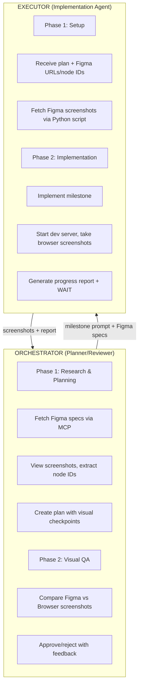

# Figma Visual QA Orchestrator Workflow (v1)

## Overview

A **specialized two-agent workflow** for implementing UI components/pages from Figma designs with visual quality assurance. Enables **automated visual comparison** between Figma designs and browser implementation.

---

## Agent Capabilities Matrix

| Capability | Orchestrator (This Session) | Executor (External Session) |
|------------|----------------------------|----------------------------|
| **Figma MCP Access** | ✅ Get specs, screenshots, variables | ❌ No MCP access |
| **Bash Commands** | ✅ Limited (no browser) | ✅ Full access |
| **Browser Interaction** | ❌ Cannot open/control browser | ✅ Can open, interact, screenshot |
| **View Images** | ✅ Can view/analyze images | ✅ Can view/save screenshots |
| **Save Files** | ✅ Can save files | ✅ Can save files |

---

## Core Workflow



---

## Prerequisites

### Orchestrator Setup
1. ✅ Authenticated with Figma MCP (`/mcp` → authenticate figma-remote-mcp)
2. ✅ Access to project codebase
3. ✅ Can read/write to `screenshots/` directory

### Executor Setup (One-time)
1. **Install Python dependencies:**
   ```bash
   pip install requests
   ```

2. **Get Figma Personal Access Token:**
   - Go to https://www.figma.com/settings
   - Create personal access token
   - Set environment variable:
     ```bash
     export FIGMA_ACCESS_TOKEN="figd_your_token_here"
     ```

3. **Install browser automation tools** (choose one):
   ```bash
   # Option 1: Playwright (recommended)
   npm install -D playwright
   npx playwright install chromium

   # Option 2: Puppeteer
   npm install -D puppeteer
   ```

4. **Create screenshots directory:**
   ```bash
   mkdir -p screenshots/figma screenshots/browser
   ```

---

## Phase 1: Orchestrator Planning

### Step 1: Explore Figma Design

```bash
# Get metadata to understand structure
mcp__figma-remote-mcp__get_metadata(
  fileKey="48MKltwBC6tZxu251lhpVU",
  nodeId="0:1"  # Page level
)

# Get specific component details
mcp__figma-remote-mcp__get_design_context(
  fileKey="48MKltwBC6tZxu251lhpVU",
  nodeId="1-9366"  # Swap page
)

# Get design variables (colors, spacing tokens)
mcp__figma-remote-mcp__get_variable_defs(
  fileKey="48MKltwBC6tZxu251lhpVU",
  nodeId="1-9366"
)

# View screenshot
mcp__figma-remote-mcp__get_screenshot(
  fileKey="48MKltwBC6tZxu251lhpVU",
  nodeId="1-9366"
)
```

### Step 2: Create Implementation Plan

**Template: `docs/{feature}/DOC_{feature}_figma_plan.md`**

```markdown
# {Feature Name} - Figma Implementation Plan

## 1. Overview
[What component/page and why - 2-3 sentences]

## 2. Figma Design Reference

### 2.1 Figma Links
| Component | Figma URL | Node ID | Viewport |
|-----------|-----------|---------|----------|
| Main Page | https://figma.com/design/FILE_KEY/name?node-id=1-9366 | 1-9366 | 390x780 |
| Header | https://figma.com/design/FILE_KEY/name?node-id=1-9368 | 1-9368 | 390x72 |
| From Card | https://figma.com/design/FILE_KEY/name?node-id=1-9385 | 1-9385 | 358x167 |

### 2.2 Design Specs (from Figma MCP)
```json
{
  "layout": {
    "width": "390px",
    "height": "780px",
    "padding": "16px"
  },
  "colors": {
    "primary": "#EB5017",
    "background": "#FFFFFF",
    "text": "#000000"
  },
  "spacing": {
    "header-height": "72.8px",
    "card-gap": "16px"
  }
}
```

### 2.3 Components Structure
```
Swap Page (1:9366)
├── Header (1:9368)
│   ├── Back Button (1:9369)
│   ├── Buy Crypto Button (1:9373)
│   └── Action Button (1:9378)
├── Heading (1:9383)
├── From Card (1:9385)
│   ├── Asset Selector (1:9387)
│   └── Amount Input (1:9393)
├── Swap Direction Button (1:9418)
├── To Card (1:9400)
└── Preview Button (1:9416)
```

## 3. Milestones (with Visual Checkpoints)

### M1: Base Layout & Header ⛔ VISUAL CHECKPOINT
**Tasks:**
- Create page structure (390px mobile viewport)
- Implement header with buttons
- Add base styling

**Visual Checkpoints:**
- Screenshot: `screenshots/browser/milestone-1-layout-390w.png`
- Compare against: Figma node 1-9368 (Header)
- Check: Header height (72.8px), button positions, spacing

**Deliverables:**
- [ ] Files created/modified
- [ ] Browser screenshot saved
- [ ] Tests passing

### M2: From Card Component ⛔ VISUAL CHECKPOINT
**Tasks:**
- Build asset selector combobox
- Implement amount input
- Add balance/min/max labels

**Visual Checkpoints:**
- Screenshot: `screenshots/browser/milestone-2-from-card-390w.png`
- Compare against: Figma node 1-9385 (From Card)
- Check: Card dimensions (358x167px), input alignment, label spacing

**Deliverables:**
- [ ] Component implemented
- [ ] Browser screenshot saved
- [ ] Interactive states working

### M3: To Card & Swap Button ⛔ VISUAL CHECKPOINT
**Tasks:**
- Implement To card
- Add swap direction button
- Wire up interaction

**Visual Checkpoints:**
- Screenshot: `screenshots/browser/milestone-3-complete-390w.png`
- Compare against: Figma node 1-9366 (Full page)
- Check: Vertical spacing between cards, button position, overall layout

### M4: Polish & Responsive ⛔ FINAL CHECKPOINT
**Tasks:**
- Add preview button
- Test all breakpoints
- Final styling polish

**Visual Checkpoints:**
- Screenshots: Multiple states (empty, filled, error)
- Compare: Full interaction flow
- Check: Pixel-perfect match at 390w

## 4. Executor Setup Instructions

### 4.1 Fetch Figma Screenshots
```bash
# Fetch main page design
python CLAUDE_fetch_figma_screenshot.py \
  --url "https://figma.com/design/FILE_KEY/name?node-id=1-9366" \
  --output screenshots/figma/swap-page-mobile-390w.png

# Fetch header component
python CLAUDE_fetch_figma_screenshot.py \
  --file-key FILE_KEY \
  --node-id 1-9368 \
  --output screenshots/figma/header-component.png

# Fetch From card
python CLAUDE_fetch_figma_screenshot.py \
  --file-key FILE_KEY \
  --node-id 1-9385 \
  --output screenshots/figma/from-card.png
```

### 4.2 Take Browser Screenshots
```bash
# Start dev server on unused port
PORT=3001 npm run dev &
DEV_PID=$!

# Wait for server ready
sleep 5

# Take screenshot using Playwright
npx playwright screenshot \
  http://localhost:3001/swap \
  screenshots/browser/milestone-1-layout-390w.png \
  --viewport-size=390,844

# Stop dev server
kill $DEV_PID
```

## 5. Anti-Patterns

### ❌ Don't:
- Hardcode `localhost:3000` (may be in use)
- Leave dev server running after milestone
- Take screenshots at wrong viewport size
- Skip intermediate visual checkpoints

### ✅ Do:
- Use dynamic port or check availability
- Always stop dev server in cleanup
- Match exact Figma viewport (390x780)
- Include screenshots in every milestone report
```

### Step 3: Write Orchestrator Prompt for Executor

Save to: `docs/{feature}/ORCH_{feature}_prompt.md`

```markdown
## Agent Task: {Feature Name} from Figma Design

### Objective
Implement {component/page} pixel-perfect to Figma design with visual validation.

### Prerequisites
1. ✅ Set FIGMA_ACCESS_TOKEN environment variable
2. ✅ Install: `pip install requests`
3. ✅ Install: `npm install -D playwright && npx playwright install chromium`
4. ✅ Create directories: `mkdir -p screenshots/figma screenshots/browser`

### Workflow Instructions
This task has **{N} milestones** with visual checkpoints. After each:
1. **STOP** and generate progress report with screenshot paths
2. **WAIT** for visual approval from Orchestrator
3. **DO NOT** proceed until explicitly approved

---

## Milestone 1: {Name} ⛔ VISUAL CHECKPOINT

### Tasks
1. Fetch Figma design reference:
   ```bash
   python CLAUDE_fetch_figma_screenshot.py \
     --url "{FIGMA_URL}" \
     --output screenshots/figma/{component}-{viewport}.png
   ```

2. Implement {tasks}

3. Take browser screenshot:
   ```bash
   PORT=3001 npm run dev &
   DEV_PID=$!
   sleep 5
   npx playwright screenshot \
     http://localhost:3001/{route} \
     screenshots/browser/milestone-1-{name}-{viewport}.png \
     --viewport-size=390,844
   kill $DEV_PID
   ```

### Visual Checkpoints
- **Figma reference**: screenshots/figma/{component}.png
- **Browser output**: screenshots/browser/milestone-1-{name}.png
- **Check**: {specific measurements, colors, spacing}

### Deliverables
- [ ] Figma screenshots fetched and saved
- [ ] Implementation complete
- [ ] Browser screenshots saved to correct paths
- [ ] Dev server stopped (no zombie processes)
- [ ] Tests passing

**⛔ STOP - Generate progress report with screenshot paths, wait for approval**

---

[Repeat for each milestone...]
```

---

## Phase 2: Executor Implementation

### Milestone Execution Steps

1. **Fetch Figma Reference**
   ```bash
   python scripts/fetch_figma_screenshot.py \
     --url "{from_orchestrator}" \
     --output screenshots/figma/{component}.png
   ```

2. **Implement Code**
   - Follow implementation plan
   - Reference Figma screenshot
   - Match design specs exactly

3. **Start Dev Server (Dynamic Port)**
   ```bash
   # Option 1: Auto-select available port
   PORT=0 npm run dev > server.log 2>&1 &
   DEV_PID=$!

   # Parse actual port from logs
   sleep 3
   ACTUAL_PORT=$(grep -oP "localhost:\K\d+" server.log | head -1)
   echo "Server running on port: $ACTUAL_PORT"

   # Option 2: Use specific port
   PORT=3001 npm run dev &
   DEV_PID=$!
   ACTUAL_PORT=3001
   ```

4. **Take Browser Screenshots**
   ```bash
   # Wait for server to be ready
   sleep 5

   # Screenshot using Playwright
   npx playwright screenshot \
     "http://localhost:${ACTUAL_PORT}/swap" \
     screenshots/browser/milestone-1-swap-initial-390w.png \
     --viewport-size=390,844

   # Multiple states if needed
   npx playwright screenshot \
     "http://localhost:${ACTUAL_PORT}/swap?filled=true" \
     screenshots/browser/milestone-1-swap-filled-390w.png \
     --viewport-size=390,844
   ```

5. **Cleanup & Stop Server**
   ```bash
   # Kill dev server
   kill $DEV_PID

   # Verify port released
   lsof -ti:${ACTUAL_PORT} || echo "Port ${ACTUAL_PORT} released ✅"

   # Clean up logs
   rm server.log
   ```

6. **Generate Progress Report**

---

## Progress Report Template (Executor)

```markdown
## Milestone {N}: {Name} - COMPLETED

### Files Created/Modified:
- src/app/(private)/swap/page.tsx (modified)
- src/components/swap/SwapFromCard.tsx (created)
- src/components/swap/SwapHeader.tsx (created)

### Figma Screenshots Fetched:
- screenshots/figma/swap-page-mobile-390w.png ✅
- screenshots/figma/swap-header.png ✅
- screenshots/figma/from-card.png ✅

### Browser Screenshots Taken:
- screenshots/browser/milestone-1-layout-initial-390w.png ✅
- screenshots/browser/milestone-1-layout-header-only-390w.png ✅

### Server Management:
- Started dev server on port: 3001
- Screenshots taken from: http://localhost:3001/swap
- Server stopped: ✅ (PID 45123 terminated)
- Port released: ✅

### Visual Checkpoints:
| Component | Figma Reference | Browser Output | Notes |
|-----------|----------------|----------------|-------|
| Header | screenshots/figma/swap-header.png | screenshots/browser/milestone-1-layout-header-only-390w.png | Implemented at 390px viewport |
| Full Layout | screenshots/figma/swap-page-mobile-390w.png | screenshots/browser/milestone-1-layout-initial-390w.png | Base structure complete |

### Test Results:
```
PASS src/components/swap/__tests__/SwapHeader.test.tsx
  ✓ renders header with back button
  ✓ renders buy crypto button

Test Suites: 1 passed, 1 total
Tests:       2 passed, 2 total
```

### Notes/Issues:
- Implemented basic structure
- Used NextUI components for buttons
- Ready for visual QA comparison

### Ready for Review: YES ⛔
**Awaiting Orchestrator visual approval before proceeding to Milestone 2**
```

---

## Phase 3: Orchestrator Visual QA Review

### Review Checklist

1. **Read Executor's Report**
   ```bash
   # Check which screenshots were submitted
   ls -lh screenshots/browser/milestone-*.png
   ```

2. **Fetch Fresh Figma Screenshots** (for comparison)
   ```bash
   # Use MCP to view latest Figma design
   mcp__figma-remote-mcp__get_screenshot(
     fileKey="...",
     nodeId="1-9366"
   )
   ```

3. **Read Browser Screenshots**
   ```bash
   # Read and view browser screenshots
   Read tool: screenshots/browser/milestone-1-layout-390w.png
   ```

4. **Visual Comparison Checklist**

   | Check | Figma | Browser | Match? | Notes |
   |-------|-------|---------|--------|-------|
   | **Layout** |
   | Viewport width | 390px | ? | ☐ | |
   | Header height | 72.8px | ? | ☐ | |
   | Card width | 358.4px | ? | ☐ | |
   | Vertical spacing | 16px gaps | ? | ☐ | |
   | **Colors** |
   | Primary button | #EB5017 | ? | ☐ | |
   | Background | #FFFFFF | ? | ☐ | |
   | Text color | #000000 | ? | ☐ | |
   | **Typography** |
   | Heading size | 32px | ? | ☐ | |
   | Body text | 16px | ? | ☐ | |
   | Font weight | 600 | ? | ☐ | |
   | **Spacing** |
   | Padding | 16px | ? | ☐ | |
   | Button gaps | 8px | ? | ☐ | |
   | **Interactive** |
   | Button hover | Check | ? | ☐ | |
   | Input focus | Check | ? | ☐ | |

5. **Generate Feedback**

### Approval Response Templates

#### ✅ **Approved**
```markdown
Milestone {N} approved.

**Visual QA Results:**
✅ Layout matches Figma specs (390px viewport)
✅ Header height correct (72.8px)
✅ Spacing between elements accurate
✅ Colors match design tokens
✅ Typography sizes correct

**Minor notes for future milestones:**
- Consider adding hover states animation
- Check focus states on inputs

Proceed to Milestone {N+1}.
```

#### ⚠️ **Approved with Changes**
```markdown
Milestone {N} approved with notes.

**Visual QA Results:**
✅ Overall layout structure correct
⚠️ Minor spacing issue: Card padding should be 20.8px not 20px
⚠️ Color slightly off: Primary button using #EB5117 instead of #EB5017

**Action items for next milestone:**
- Fix card padding in next iteration
- Update button color to exact hex

These are minor - proceed to Milestone {N+1}, but address in polish phase.
```

#### ❌ **Changes Needed**
```markdown
Milestone {N} needs changes.

**Visual QA Issues:**
❌ Critical: Header height is 80px but should be 72.8px (see screenshots/figma/swap-header.png)
❌ Critical: Card width is 360px but should be 358.4px
❌ Layout: Vertical gap between cards is 24px but Figma shows 16px
⚠️ Minor: Font weight on heading looks lighter than Figma (should be 600)

**Comparison:**
- Figma: screenshots/figma/swap-page-mobile-390w.png
- Browser: screenshots/browser/milestone-1-layout-390w.png

**Required fixes:**
1. Update header height to 72.8px (check src/components/swap/SwapHeader.tsx)
2. Fix card container width to 358.4px
3. Reduce vertical gap between From/To cards from 24px to 16px
4. Increase heading font-weight to 600

Fix these issues and regenerate report with updated screenshots.
```

---

## Server Management Rules (Executor)

### ✅ DO:
```bash
# Use dynamic port
PORT=0 npm run dev &

# Or check if port is available
lsof -ti:3000 && PORT=3001 || PORT=3000
npm run dev --port $PORT &

# Store PID
DEV_PID=$!

# Always kill when done
kill $DEV_PID
```

### ❌ DON'T:
```bash
# Don't hardcode port without checking
npm run dev  # Assumes 3000 is free

# Don't leave server running
# (missing kill command)

# Don't use & without storing PID
npm run dev &
# (can't kill later)
```

---

## Common Issues & Solutions

### Issue: "Port 3000 already in use"
**Solution:**
```bash
# Find and kill process on port
lsof -ti:3000 | xargs kill -9

# Or use different port
PORT=3001 npm run dev
```

### Issue: "FIGMA_ACCESS_TOKEN not set"
**Solution:**
```bash
# Check if set
echo $FIGMA_ACCESS_TOKEN

# Set it
export FIGMA_ACCESS_TOKEN="figd_your_token"

# Add to ~/.zshrc for persistence
echo 'export FIGMA_ACCESS_TOKEN="figd_your_token"' >> ~/.zshrc
```

### Issue: "Screenshot doesn't match viewport"
**Solution:**
```bash
# Check Figma design dimensions first
# Then match exactly in playwright
npx playwright screenshot URL OUTPUT \
  --viewport-size=390,844  # Exact Figma size
```

### Issue: "Can't compare colors accurately"
**Solution:**
```bash
# Use Figma variable definitions
mcp__figma-remote-mcp__get_variable_defs(...)

# Extract exact hex values
# Use browser dev tools color picker on screenshot
```

---

## Example: Complete Workflow

### Orchestrator Creates Plan
```markdown
Feature: Mobile Swap Page
Figma: https://figma.com/design/48MKltwBC6tZxu251lhpVU/coinsher-exchange-mobile-app?node-id=1-9366
Milestones: 4
Visual Checkpoints: Each milestone
```

### Executor Milestone 1
```bash
# Fetch design
python CLAUDE_fetch_figma_screenshot.py \
  --url "https://figma.com/design/48MKltwBC6tZxu251lhpVU/name?node-id=1-9366" \
  --output screenshots/figma/swap-page-mobile.png

# Implement...

# Screenshot
PORT=3001 npm run dev &
DEV_PID=$!
sleep 5
npx playwright screenshot \
  http://localhost:3001/swap \
  screenshots/browser/milestone-1-swap-layout.png \
  --viewport-size=390,844
kill $DEV_PID

# Report with paths
```

### Orchestrator Reviews
```bash
# View Figma
mcp__figma-remote-mcp__get_screenshot(fileKey="...", nodeId="1-9366")

# Read browser screenshot
Read: screenshots/browser/milestone-1-swap-layout.png

# Compare side-by-side
# Approve/reject with specific feedback
```

---

## Version History

| Version | Date | Changes |
|---------|------|---------|
| 1.0 | 2025-12-08 | Initial Figma Visual QA workflow with Python script solution |
